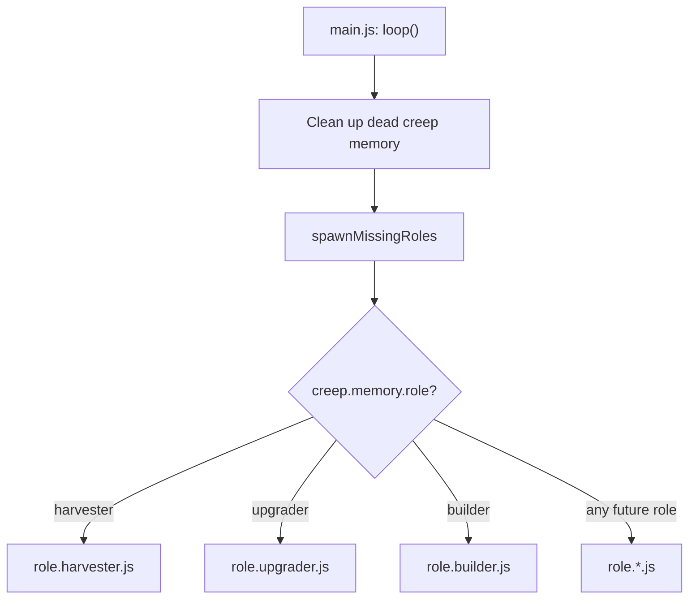

# Core Loop and Roles

The single hardcoded harvester from the quickstart breaks the moment you add a second creep — both will pick the same source, pile up, and waste half their throughput. Everything in this file exists to fix that, permanently, in a way that scales to any number of creeps and jobs.

## Source Assignment (Stop Creeps From Fighting Over One Source)

Assign each creep a source once, store it in `Memory`, and balance new assignments against what's already claimed:

```js
function getAssignedSource(creep) {
  if (!creep.memory.sourceId) {
    const sources = creep.room.find(FIND_SOURCES);
    const claimCounts = {};
    sources.forEach((source) => { claimCounts[source.id] = 0; });

    for (const name in Game.creeps) {
      const assignedId = Game.creeps[name].memory.sourceId;
      if (assignedId && assignedId in claimCounts) {
        claimCounts[assignedId] += 1;
      }
    }

    sources.sort((a, b) => claimCounts[a.id] - claimCounts[b.id]);
    creep.memory.sourceId = sources[0].id;
  }
  return Game.getObjectById(creep.memory.sourceId);
}
```

This assigns once and remembers — it doesn't recompute the best source every tick, which matters once CPU becomes a constraint (see `03-infrastructure-and-scaling.md`).

## The Role Pattern

One script that branches on every possible job doesn't scale. Give every job its own file, exporting a `run(creep)` function, and dispatch by `creep.memory.role`.

**`role.harvester.js`** — general-purpose, harvest-and-deliver:

```js
const roleHarvester = {
  run(creep) {
    if (creep.store.getFreeCapacity() > 0) {
      const source = this.getAssignedSource(creep);
      if (creep.harvest(source) === ERR_NOT_IN_RANGE) {
        creep.moveTo(source, { visualizePathStyle: { stroke: '#ffaa00' } });
      }
      return;
    }
    const spawn = Game.spawns.Spawn1;
    if (creep.transfer(spawn, RESOURCE_ENERGY) === ERR_NOT_IN_RANGE) {
      creep.moveTo(spawn, { visualizePathStyle: { stroke: '#ffffff' } });
    }
  },
  getAssignedSource(creep) { /* see above */ },
};
module.exports = roleHarvester;
```

**`role.upgrader.js`** — feeds the controller, toggles between harvesting and upgrading:

```js
const roleUpgrader = {
  run(creep) {
    if (creep.memory.upgrading && creep.store[RESOURCE_ENERGY] === 0) {
      creep.memory.upgrading = false;
    }
    if (!creep.memory.upgrading && creep.store.getFreeCapacity() === 0) {
      creep.memory.upgrading = true;
    }

    if (creep.memory.upgrading) {
      const controller = creep.room.controller;
      if (creep.upgradeController(controller) === ERR_NOT_IN_RANGE) {
        creep.moveTo(controller, { visualizePathStyle: { stroke: '#ffffff' } });
      }
      return;
    }

    const source = creep.room.find(FIND_SOURCES)[0];
    if (creep.harvest(source) === ERR_NOT_IN_RANGE) {
      creep.moveTo(source, { visualizePathStyle: { stroke: '#ffaa00' } });
    }
  },
};
module.exports = roleUpgrader;
```

**`role.builder.js`** — completes construction sites, falls back to repair, then to harvesting:

```js
const roleBuilder = {
  run(creep) {
    if (creep.memory.building && creep.store[RESOURCE_ENERGY] === 0) {
      creep.memory.building = false;
    }
    if (!creep.memory.building && creep.store.getFreeCapacity() === 0) {
      creep.memory.building = true;
    }

    if (creep.memory.building) {
      const site = creep.pos.findClosestByPath(FIND_CONSTRUCTION_SITES);
      if (site) {
        if (creep.build(site) === ERR_NOT_IN_RANGE) {
          creep.moveTo(site, { visualizePathStyle: { stroke: '#ffffff' } });
        }
        return;
      }
      const damaged = creep.pos.findClosestByPath(FIND_STRUCTURES, {
        filter: (s) => s.hits < s.hitsMax && s.structureType !== STRUCTURE_WALL,
      });
      if (damaged && creep.repair(damaged) === ERR_NOT_IN_RANGE) {
        creep.moveTo(damaged, { visualizePathStyle: { stroke: '#ffffff' } });
      }
      return;
    }

    const source = creep.room.find(FIND_SOURCES)[0];
    if (creep.harvest(source) === ERR_NOT_IN_RANGE) {
      creep.moveTo(source, { visualizePathStyle: { stroke: '#ffaa00' } });
    }
  },
};
module.exports = roleBuilder;
```

Exclude `STRUCTURE_WALL` from repair targets on purpose — walls have hit-point maximums in the hundreds of millions, and a builder that tries to top one off will never do anything else again.



`main.js` never contains behavior itself, only dispatch. Adding a role later means a new file, one line in `ROLE_BODIES`/`POPULATION`, one `else if`.

## Population-Based Spawning

Stop hardcoding creep names. Spawn by role count, with a body suited to each job:

```js
const roleHarvester = require('role.harvester');
const roleUpgrader = require('role.upgrader');
const roleBuilder = require('role.builder');

const ROLE_BODIES = {
  harvester: [WORK, CARRY, MOVE],
  upgrader: [WORK, CARRY, MOVE],
  builder: [WORK, CARRY, MOVE],
};

const POPULATION = {
  harvester: 2,
  upgrader: 1,
  builder: 1,
};

module.exports.loop = function () {
  for (const name in Memory.creeps) {
    if (!Game.creeps[name]) delete Memory.creeps[name];
  }

  spawnMissingRoles();

  for (const name in Game.creeps) {
    const creep = Game.creeps[name];
    if (creep.memory.role === 'harvester') roleHarvester.run(creep);
    else if (creep.memory.role === 'upgrader') roleUpgrader.run(creep);
    else if (creep.memory.role === 'builder') roleBuilder.run(creep);
  }
};

function spawnMissingRoles() {
  const spawn = Game.spawns.Spawn1;
  if (spawn.spawning) return;

  for (const role in POPULATION) {
    const currentCount = _.filter(Game.creeps, (c) => c.memory.role === role).length;
    if (currentCount < POPULATION[role]) {
      const name = `${role}${Game.time}`;
      spawn.spawnCreep(ROLE_BODIES[role], name, { memory: { role } });
      break;
    }
  }
}
```

`_` is lodash, available globally in the Screeps runtime — no `require` needed.

## RCL and What It Unlocks

Reaching a controller level only unlocks the *allowance* to build something — you still have to place and complete the construction site.

| RCL | Extensions Allowed | Notable Unlock |
| --- | --- | --- |
| 1 | 0 | Spawn only |
| 2 | 5 | Extensions, ramparts, walls |
| 3 | 10 | Towers |
| 4 | 20 | Storage |
| 5 | 30 | Links |
| 6 | 40 | Terminal, labs, extractor |
| 7 | 50 | Second spawn, factory |
| 8 | 60 | Third spawn, observer, power spawn, nuker |

Check current level: `Game.spawns.Spawn1.room.controller.level`. Check available spawn capacity (base 300 + 50 per completed extension): `Game.spawns.Spawn1.room.energyCapacityAvailable`.

Next: `03-infrastructure-and-scaling.md`.
