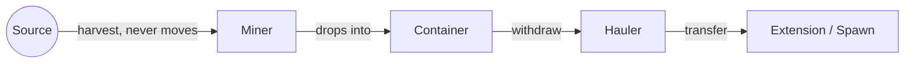
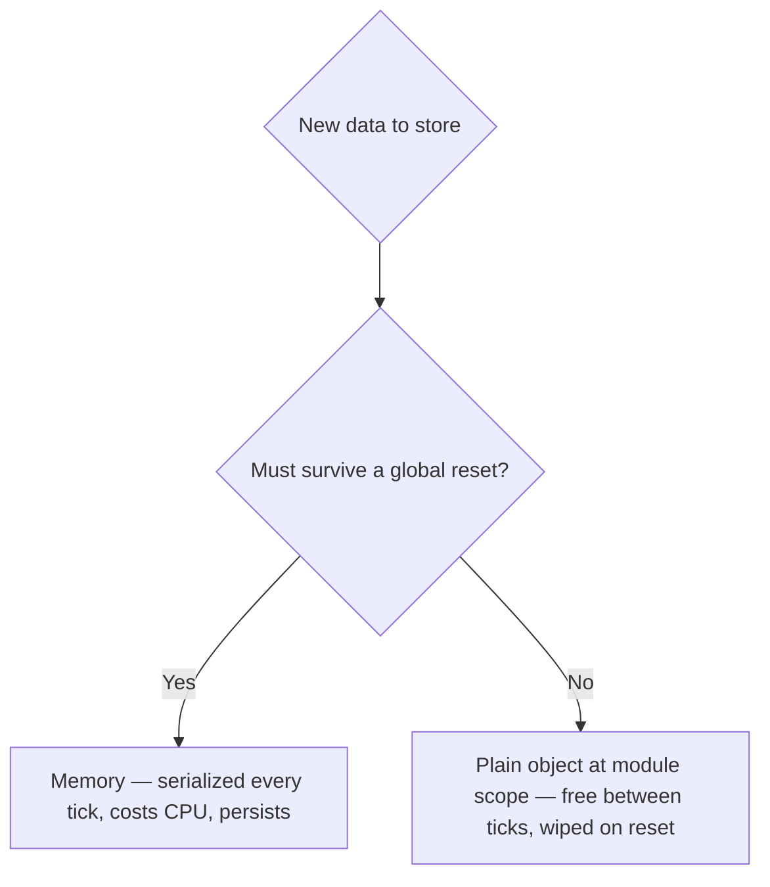

# Infrastructure and Scaling

Once the role pattern is running, the next bottleneck is always the same: creeps spending more time walking than working. This file covers the fixes, in the order they usually start mattering.

## Roads

Plan roads along the path creeps are already walking, instead of guessing:

```js
function planRoadsTo(room, targetPos) {
  const spawn = Game.spawns.Spawn1;
  const path = room.findPath(spawn.pos, targetPos, { ignoreCreeps: true, swampCost: 2 });
  for (const step of path) {
    room.createConstructionSite(step.x, step.y, STRUCTURE_ROAD);
  }
}

const room = Game.spawns.Spawn1.room;
room.find(FIND_SOURCES).forEach((source) => planRoadsTo(room, source.pos));
```

A road costs `1` movement point per step instead of `2` on plains or `10` on swamp — a one-time build cost for a permanent speed bonus.

## Static Mining + Hauling (The Real Throughput Fix)

Past a certain point, a general-purpose harvester (harvest + walk + deliver) is slower than splitting the job. A `WORK`-heavy creep plants itself on a source and never moves; a `CARRY`-heavy creep does nothing but ferry energy.

Five `WORK` parts harvest `10` energy/tick — matching a source's average regeneration rate exactly, so nothing goes to waste:

```js
// role.miner.js — stand on a container tile adjacent to the source, harvest forever
const roleMiner = {
  run(creep) {
    if (!creep.memory.sourceId) creep.memory.sourceId = assignSource(creep);
    const source = Game.getObjectById(creep.memory.sourceId);
    if (creep.harvest(source) === ERR_NOT_IN_RANGE) {
      creep.moveTo(source, { visualizePathStyle: { stroke: '#ffaa00' } });
    }
  },
};
function assignSource(creep) {
  const sources = creep.room.find(FIND_SOURCES);
  const claimed = _.map(Game.creeps, (c) => c.memory.sourceId).filter(Boolean);
  const open = sources.find((s) => !claimed.includes(s.id));
  return (open || sources[0]).id;
}
module.exports = roleMiner;
```

A creep with no `CARRY` parts drops harvested energy at its feet. If a container sits under it, the energy goes into the container automatically instead of piling on the ground — build the container first (any RCL, up to 5 per room).

```js
// role.hauler.js — withdraw from containers, deliver to spawn/extensions
const roleHauler = {
  run(creep) {
    if (creep.memory.hauling && creep.store[RESOURCE_ENERGY] === 0) creep.memory.hauling = false;
    if (!creep.memory.hauling && creep.store.getFreeCapacity() === 0) creep.memory.hauling = true;

    if (creep.memory.hauling) {
      const target = creep.pos.findClosestByPath(FIND_STRUCTURES, {
        filter: (s) => (s.structureType === STRUCTURE_EXTENSION || s.structureType === STRUCTURE_SPAWN)
          && s.store.getFreeCapacity(RESOURCE_ENERGY) > 0,
      });
      if (target && creep.transfer(target, RESOURCE_ENERGY) === ERR_NOT_IN_RANGE) {
        creep.moveTo(target, { visualizePathStyle: { stroke: '#ffffff' } });
      }
      return;
    }

    const container = creep.pos.findClosestByPath(FIND_STRUCTURES, {
      filter: (s) => s.structureType === STRUCTURE_CONTAINER && s.store[RESOURCE_ENERGY] > 0,
    });
    if (container && creep.withdraw(container, RESOURCE_ENERGY) === ERR_NOT_IN_RANGE) {
      creep.moveTo(container, { visualizePathStyle: { stroke: '#ffaa00' } });
    }
  },
};
module.exports = roleHauler;
```

Body suggestions: miner `[WORK, WORK, WORK, WORK, WORK, MOVE]` (550 energy), hauler `[CARRY, CARRY, CARRY, CARRY, MOVE, MOVE, MOVE, MOVE]` (400 energy).



Compare to one general-purpose creep doing all four steps itself, walking the whole time — same total work, split so harvesting never stops to let a creep walk anywhere.

## CPU and Memory Discipline

`room.find()` scans every object of that type; `findClosestByPath` runs real pathfinding. Both are cheap at three creeps and expensive at fifteen.

Check your actual cost:

```js
Game.cpu.getUsed()   // this tick's usage so far
Game.cpu.limit       // per-tick budget
Game.cpu.bucket      // banked unused CPU from previous ticks
```

Cache anything that doesn't change tick to tick in a plain object at module scope — not in `Memory`, which gets fully serialized every tick regardless of whether you touched it:

```js
const cache = {};

function getSources(room) {
  cache.sources = cache.sources || {};
  if (!cache.sources[room.name]) {
    cache.sources[room.name] = room.find(FIND_SOURCES).map((s) => s.id);
  }
  return cache.sources[room.name].map((id) => Game.getObjectById(id));
}
module.exports = { getSources };
```

A plain object like this resets itself harmlessly on a global reset (a code push, an uncaught exception, a periodic engine refresh) — the next call just recomputes it once. Anything that *must* survive a reset (like `creep.memory.sourceId`) belongs in `Memory` instead.



## Multi-Room Basics

**Reserve, don't claim, for remote mining.** Claiming a controller costs a permanent slot against your Global Control Level (GCL) — usually `1` for a new account, already spent on your home room. Reserving grants your creeps working rights in a room without taking ownership or costing GCL.

```js
// role.reserver.js — needs a CLAIM part (600 energy on its own, 650 with MOVE)
const roleReserver = {
  run(creep) {
    const targetRoom = Memory.remoteRoom;
    if (creep.room.name !== targetRoom) {
      creep.moveTo(new RoomPosition(25, 25, targetRoom));
      return;
    }
    if (creep.reserveController(creep.room.controller) === ERR_NOT_IN_RANGE) {
      creep.moveTo(creep.room.controller, { visualizePathStyle: { stroke: '#ffffff' } });
    }
  },
};
module.exports = roleReserver;
```

`reserveController` has to be called every tick the creep is in range — a single reserver camped on the controller holds it indefinitely. List your exits with `Game.map.describeExits(roomName)` and check a target isn't already owned or reserved before committing creeps to it.

Next: `04-combat-and-competing.md`.
