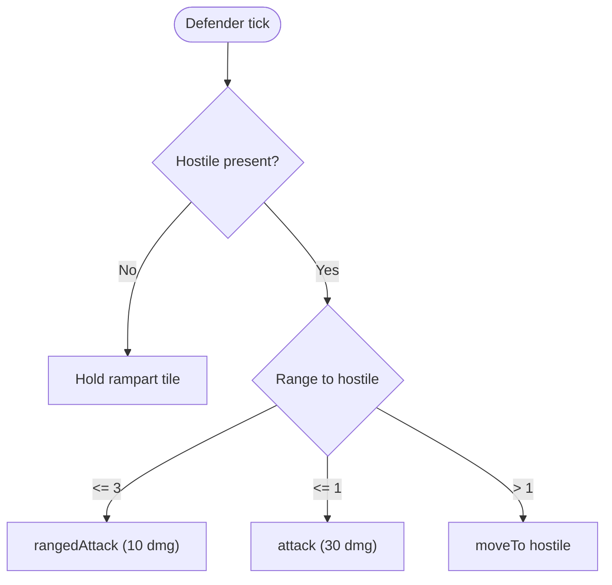

# Combat and Competing

This is the "get good enough to fight" file. It covers passive defense, the actual combat math, a working defender, and — the part most guides skip — how to test any of this against real NPCs on your own machine before you ever risk it against another player.

## Towers (Passive Defense That Needs Active Code)

A tower does nothing on its own. Every attack, heal, or repair has to come from your code, every tick:

```js
function runTowers() {
  const towers = Game.spawns.Spawn1.room.find(FIND_MY_STRUCTURES, {
    filter: { structureType: STRUCTURE_TOWER },
  });

  towers.forEach((tower) => {
    const hostile = tower.pos.findClosestByRange(FIND_HOSTILE_CREEPS);
    if (hostile) { tower.attack(hostile); return; }

    const damaged = tower.pos.findClosestByRange(FIND_MY_STRUCTURES, {
      filter: (s) => s.hits < s.hitsMax,
    });
    if (damaged) tower.repair(damaged);
  });
}
```

Call `runTowers()` once per tick from your main loop. Requires RCL3. Keep it fueled — route a hauler to top it off whenever its energy drops below half, ahead of extensions if it's actively firing.

## Rampart Tanking

A creep standing *on top of* your own rampart can't be damaged from outside until the rampart's own hit points hit zero first. The rampart absorbs the hit; the creep underneath takes nothing. A freshly built rampart starts with barely any hit points — it protects nothing until something repairs it up. Build ramparts over your spawn and tower, then keep a builder or dedicated repairer feeding them energy.

## The Real Combat Numbers

Every combat body part has a fixed, non-negotiable effect per tick:

| Part | Action | Effect |
| --- | --- | --- |
| `ATTACK` | `creep.attack(target)` | 30 damage, melee range (1 tile) |
| `RANGED_ATTACK` | `creep.rangedAttack(target)` | 10 damage, range 3 |
| `HEAL` | `creep.heal(target)` | 12 hp restored, melee range |
| `HEAL` | `creep.rangedHeal(target)` | 4 hp restored, range 3 |
| `TOUGH` | none | No action — 100 hp of buffer per part, its only job is to die last |

`ATTACK` hits harder per part than `RANGED_ATTACK`, but only at range 1 — a melee attacker eats ranged damage the whole way in. Neither part is strictly better; the tradeoff is the whole mechanic.

## A Working Defender

```js
const roleDefender = {
  run(creep) {
    const hostile = creep.room.find(FIND_HOSTILE_CREEPS)[0];

    if (!hostile) {
      const rampart = creep.room.find(FIND_MY_STRUCTURES, { filter: { structureType: STRUCTURE_RAMPART } })[0];
      if (rampart && !creep.pos.isEqualTo(rampart.pos)) {
        creep.moveTo(rampart, { visualizePathStyle: { stroke: '#ff0000' } });
      }
      return;
    }

    const range = creep.pos.getRangeTo(hostile);
    if (creep.getActiveBodyparts(RANGED_ATTACK) > 0 && range <= 3) creep.rangedAttack(hostile);
    if (creep.getActiveBodyparts(ATTACK) > 0 && range <= 1) creep.attack(hostile);
    if (range > 1) creep.moveTo(hostile, { visualizePathStyle: { stroke: '#ff0000' } });
  },
};
module.exports = roleDefender;
```

Suggested body: `[TOUGH, TOUGH, ATTACK, ATTACK, RANGED_ATTACK, MOVE, MOVE, MOVE, MOVE]` (530 energy). Both ranged and melee checks run independently — not `else if` — because a creep with both parts can land both hits in the same tick once it closes to range 1.



Make the population reactive instead of running a standing army against nothing:

```js
function getPopulationTargets(room) {
  const hostileCount = room.find(FIND_HOSTILE_CREEPS).length;
  return Object.assign({}, POPULATION, { defender: hostileCount > 0 ? 2 : 0 });
}
```

## Testing Against Real NPCs, Locally, No Internet Required

This is the part most guides can't give you, because it depends on infrastructure most setups don't have. This repo ships two ways to get real hostile contact without touching another player's colony.

**On-demand waves.** A local mod (`screeps-server/mods/sparring-ground.js`) exposes an HTTP endpoint that triggers the server's own invader-generation system:

```sh
curl -X POST http://localhost:21025/local/api/sparring/wave \
  -H 'Content-Type: application/json' \
  -d '{"room": "<your-room-name>"}'
```

Run it as many times as you want. `scripts/sparring-loop.sh <room> <waves> <delay>` automates a repeated training loop — throw five waves at your colony ten seconds apart and see exactly where your defense breaks.

**A standing rival colony.** `screeps-server/config.yml` registers two real bot AIs (`screepsbot-zeswarm` and `screeps-bot-tooangel` — the latter has documented automatic-attack behavior). Place one into a room:

```sh
docker exec -it autonate-screeps screeps-launcher cli
```
```js
bots.spawn('tooangel', '<unowned-room-name>')
```

That gives you a real, persistent, autonomously-playing opponent — not a scripted wave, an actual colony making its own decisions nearby. Full details on both tools: `docs/local-screeps.md`.

## Scouting Before You Commit

Send a cheap `[MOVE]`-only creep to visit candidate rooms and record what it finds, so you're deciding from data instead of a single glance:

```js
function recordIntel(room) {
  Memory.rooms = Memory.rooms || {};
  Memory.rooms[room.name] = {
    lastSeen: Game.time,
    owner: room.controller && room.controller.owner ? room.controller.owner.username : null,
    reserved: room.controller && room.controller.reservation ? room.controller.reservation.username : null,
    sources: room.find(FIND_SOURCES).length,
    hostileCount: room.find(FIND_HOSTILE_CREEPS).length,
  };
}
```

Treat old entries as suspect, not certain — `Game.time - Memory.rooms[name].lastSeen` tells you how stale a given snapshot is.

Next: `05-cheatsheet.md`.
