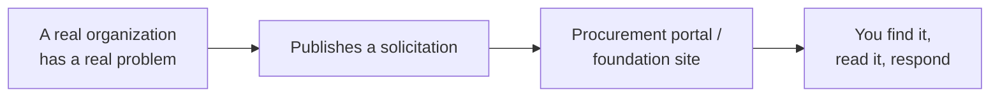
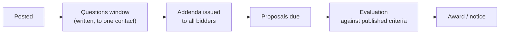

# Past the Walls: Zooming Out to the City

Nate builds things. Kai reads the documents nobody else will read. They met a year ago at the Founders Table — a monthly builder meetup that runs out of the back room of Grindstone Coffee in Fairview — where she showed up with an idea she couldn't build and he showed up with a laptop full of projects nobody was waiting on. This pack is the one where that stops being a bit.

It's a Thursday, a little after nine, and they've got the corner table because they always get the corner table. Nate is eating a breakfast burrito at an hour that is not breakfast and narrating a branch he named `uppercut` for reasons he does not feel he needs to defend. Kai is doing the thing she does most nights without really deciding to: scrolling a city procurement page. It's a leftover reflex from her old life — grant writing and program coordination, close enough to city hall to know where everything is filed, far enough out to never have any real say in it. She checks Fairview's open solicitations the way other people check the weather.

Then she stops scrolling.

Nate notices the silence before he notices anything on the screen. Kai is not a quiet person. Kai is a person who says "where's that from?" roughly nine times an hour.

She turns the laptop around.

**RFP 26-118 — Youth Recreation Program Registration & Waitlist Management System.** City of Fairview, Parks and Recreation Department, issued through the Purchasing Division. Forty-three pages. A seal on the cover. A deadline.

"Okay," Nate says, chewing. "What's an RFP."

She doesn't answer that yet. She scrolls to page six, Statement of Need, and reads a sentence out loud in a flat voice: *"Staff maintain program waitlists manually across multiple spreadsheets; families are contacted as spots open in no consistent order."*

"That's bad," Nate says.

"I wrote that sentence."

He stops chewing.

Three years ago Kai wrote a grant for the Summer Access Program — fee-waived summer rec spots for families who couldn't otherwise afford them. It got funded. That was supposed to be the win. What actually happened is that the program's entire operational system turned out to be a shared spreadsheet called `SUMMER_ACCESS_FINAL_v4_USE THIS ONE.xlsx`, which broke roughly every third week, and which Kai personally repaired at eleven at night more times than she has ever told anyone. She wrote up the problem in a program report at the end of that first season. Nobody in that building could build the fix. Nobody with software skills was in the room. That was the whole wound, and it's the exact idea she brought to a coffee shop back room a year ago and couldn't do anything with.

Now the city has put a budget behind it and published it to the entire world, and somewhere in the drafting, her own words got copied out of a staff report and into a document with a seal on the front.

"So it's the thing," Nate says. "From the first night. That thing."

"It's the thing."

He looks at the deadline. Then he looks at her. Nate has shipped, by honest count, zero projects that ever had a user who could be disappointed in him. That is the actual reason he's never finished anything: nothing he built was ever load-bearing for anybody. He's been waiting a year to be wrong about that, and here is forty-three pages of somebody's real problem with a date on it.

"Okay," he says. "Teach me what this is."

That's this pack. Four chapters of Kai translating the language of public procurement for Nate — which is, if you've been reading in order, precisely backwards from how this started — and Nate turning what they find into a system. If this is the first thing of theirs you've read, none of the history is required. You just need a document and a willingness to open it.

## Coder's Corner: What Is an RFP

An **RFP** — Request for Proposal — is a document an organization publishes when it has a real problem and wants outside parties to propose a solution. It isn't a job posting and it isn't a shopping list. It's a public statement of "here's what's broken, here's what we need, tell us how you'd approach it and what it would cost," evaluated on more than just price.

Terms worth knowing cold before you open your first one:

- The **issuing organization** is whoever published it — a parks department, a school district, a community foundation, a transit authority. They have the problem and the money.
- The **scope of work** is the actual description of what has to get built or done. It's the meat, and it's usually several pages in, past the boilerplate.
- **Deliverables** are the specific things the winning proposal has to hand over: working software, documentation, training, a defined support period.
- **Eligibility** is who's allowed to submit at all — sometimes wide open, sometimes limited to vendors who meet insurance, registration, or certification requirements.
- The **due date** is when proposals are due, and it is not a suggestion. Late is not "late." Late is not accepted.
- **Procurement** is the whole formal process a public body has to follow to spend public money fairly. That's why these documents read the way they do. The stiffness isn't the organization being difficult — it's the rules that exist so nobody can accuse them of handing a contract to a friend.

Kai also draws a quick family tree on a napkin, because "RFP" gets used as a catch-all and it shouldn't be:

- **RFP** — Request for Proposal. You propose an *approach*. Evaluated on technical merit, experience, and cost together.
- **IFB / ITB** — Invitation (or Invitation to) Bid. Sealed bids, awarded to the lowest bidder who meets the specs. Used when the thing being bought is already fully specified — paving, road salt, a fleet of mowers.
- **RFI** — Request for Information. Market research. Nobody wins an RFI; the agency is figuring out what's even possible, often before writing the real solicitation.
- **RFQ** — usually Request for Quote, for smaller or simpler purchases. Confusingly, in some jurisdictions it means Request for **Qualifications**, which is a completely different thing. Kai's rule: never assume which one you're looking at, read the document's own definitions section.

"That's four acronyms that all mean 'we want to buy something,'" Nate says.

"They mean four different ways of buying something, and if you respond to the wrong one with the wrong document, you get thrown out before anybody reads your idea."

## 1. Find Where the Problems Get Published

Real solicitations aren't hidden. Public bodies are generally required to advertise them — a government spending public money has to show its work. Where they actually live:

```bash
agent run "find open solicitations posted by the City of Fairview this month"
```

- **City and county sites** almost always have a page called "Bids," "Solicitations," "Open Procurement," or "Doing Business With Us," usually under Finance or Purchasing — not under the department that has the problem.
- **SAM.gov** carries federal *contract* opportunities (it absorbed the old FedBizOpps). **Grants.gov** carries federal *grants*. Those are different money with different rules, and people mix them up constantly.
- **State procurement portals** exist in every state, and many small cities piggyback on them rather than running their own.
- **Shared e-procurement platforms** — BidNet, DemandStar, Bonfire, OpenGov, Periscope and others — host solicitations for lots of small jurisdictions at once. A single city's page can look empty while its actual postings sit on a platform.
- **Community foundations and nonprofits** post open calls directly, usually under "Grants" or "RFPs."

One move that's worth more than any amount of scrolling: most portals let you register as a vendor and subscribe to notifications by category — often keyed to **NIGP commodity codes**, the standard classification system public buyers use. Register once under the codes that match what you do, and the openings come to your inbox instead of you refreshing a page at nine at night like a person who used to work there.



## 2. Learn the Shape of the Timeline

An RFP isn't a document that sits still. It has a lifecycle, and the parts in the middle are where most first-timers get burned.



Two things on that diagram Kai makes Nate repeat back to her:

**Addenda** are official amendments to the solicitation after it's posted. They can change the deadline, add a requirement, or answer questions in writing for everyone at once. They are part of the document. Many RFPs require you to formally acknowledge each addendum in your submission, and failing to is a paperwork technicality that can get an otherwise excellent proposal tossed.

**The questions window** is the one legitimate channel for asking the issuing organization anything, and it closes well before the due date. Which leads to the thing Nate was about to do wrong roughly forty seconds later — but that's the next chapter's problem, and then the one after that's.

## 3. Do a Real Bid / No-Bid Gut Check

Before falling in love with a document, check whether you could actually respond to it. Look for the eligibility and administrative requirements — vendor registration, a W-9, certificates of insurance at stated coverage levels, sometimes references from similar past work. None of that is a reason to walk away automatically, but all of it takes real time, and it's better to find out in week one than the night before submission.

Then the honest question, the one that isn't in the document: do we understand this problem well enough to be useful to the people stuck living inside it?

Kai, at the corner table, with the burrito wrapper being folded into a small aggressive square across from her: yes. Unfortunately, extremely yes.

## 4. Sanity Checks

- If a city's site has no obvious bids page: search `site:cityname.gov RFP`, check the county, and check whether they post through a shared e-procurement platform instead.
- If you can't tell what kind of solicitation you're holding: read its own definitions and submission-requirements sections before assuming. RFQ in particular means two different things in two different places.
- If a document feels impossible: skim only Scope of Work, Requirements, Evaluation Criteria, and the due date on the first pass. The rest is boilerplate you can come back to.
- If the deadline has passed: read it anyway, for practice. Closed solicitations are free training material and nobody minds.
- If you find one that matches something you've actually lived: pay attention. That's not a coincidence you should talk yourself out of. Domain knowledge is the part that can't be downloaded.

Nate closed the laptop lid halfway and looked at her over it. "Alright. What's it actually going to take."

"About four weeks, and you're going to have to learn to read like a bureaucrat."

"I've read worse."

"You have not read worse."

Next: `01-what-is-an-agentic-system.md` — why they don't just ask an AI one question and call it done.
