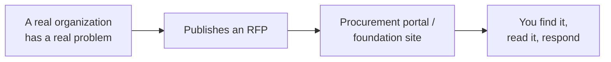

# Past the Walls: Zooming Out to the City

AutoNate was still riding the high off a Virtual Battle Bot League win, scrolling the AutoNateAI Discord half paying attention, when a pinned message stopped his thumb cold: *This Tuesday — live build, straight from a real RFP. No lecturing, just building.* He read it three times. He knew every word in that sentence except one. RFP. Not a Screeps term, not a JavaScript term, not anything he'd typed into a search bar before. And for the first time in months, that didn't make him feel behind — it made him curious. A year ago an unfamiliar acronym would've made him close the tab. Now his first instinct was to go find out.

If you've been riding with AutoNate since his first `console.log`: he's come a long way from there. He beat first contact in Screeps and built a colony that holds its own in the League. He learned to direct an AI agent well instead of just poking at it and hoping — that's a skill, not a fluke, and it took real repetition to earn. He built himself a real tracking database, `colonies.db`, so his builds and match results stop living in his memory and start living somewhere that can answer him back. Three real skills, not game skills pretending to be real ones. If this is the first time you're meeting him, none of that backstory is required to follow along here — but those packs are free, and they're where all of this came from.

He clicked the pinned message. It linked to a city government's website, a page titled "Open Solicitations," and a PDF twelve pages long with a seal on the front and language that read like it was written by a lawyer who'd never met a normal sentence. Somewhere in there, underneath the formatting, was a real problem a real city government actually had. And the Discord was telling him: this is where the team builds real systems, twice a week, out loud. Not practice problems. Not toy apps. This.

That's what this whole pack is about — AutoNate stepping past the walls of a game room and finding out the same instincts that built his colony apply to something with actual stakes. This file is where he learns what an RFP even is, and where the real ones live.

## Coder's Corner: What Is an RFP

An **RFP** — Request for Proposal — is a document a city, a foundation, a nonprofit, or a company publishes when it has a real problem and wants someone to propose a way to solve it. It's not a job posting and it's not a product listing. It's closer to a public "here's what's broken, here's what we need, tell us how you'd fix it and what it'll cost."

A few terms worth knowing cold before you open your first one:

- The **issuing organization** is whoever published it — a city parks department, a school district, a community foundation. They're the ones with the problem and the budget.
- The **scope of work** is the actual description of what needs to get built or done — the meat of the document, usually buried a few pages in past the legal boilerplate.
- **Deliverables** are the specific, concrete things the winning proposal has to hand over — a working system, documentation, training, a support period.
- The **deadline** is when proposals are due. Miss it and it doesn't matter how good your idea was.
- **Procurement** is the whole formal process a public organization has to follow to spend money fairly and transparently — it's why these documents read stiff. That stiffness isn't the organization being difficult. It's the rules they're required to follow so nobody can accuse them of playing favorites.

None of that is complicated once you've seen it labeled. It just looks intimidating the first time, the same way a Screeps API reference looked intimidating before you knew what `ERR_NOT_IN_RANGE` meant.

## 1. Find Where the Problems Get Published

Real RFPs aren't hidden. They're public by law, most of the time — a government spending money has to show its work. A few places they actually live:

```bash
agent run "find open RFPs posted by the City of Fairview this month"
```

- City and county government sites almost always have a page called something like "Bids," "Solicitations," or "Open Procurement" — usually under a Finance or Purchasing department.
- **grants.gov** and **SAM.gov** carry federal opportunities, including plenty aimed at small teams and community organizations, not just giant contractors.
- Community foundations and nonprofits post open calls directly on their own sites, often under "Grants" or "RFPs."
- Some regions run a shared county-level portal where multiple small cities post together, which is worth knowing since a single city's page might look empty on any given week.



That whole chain is just the public version of a Screeps room existing whether or not you've claimed it. The problems are sitting there, published, waiting on someone willing to actually read them.

## 2. Open One and Just Read It

Don't try to understand every clause the first time. Skim for three things: what they're asking for, who's asking, and when it's due. That's it. You're not writing a proposal yet — you're just proving to yourself you can open one of these documents without flinching.

AutoNate picked one from Fairview, a mid-size city he'd never thought about once in his life before that Tuesday: a Parks and Recreation department looking for help with youth program registration. He didn't understand half of it on the first pass. He kept reading anyway.

## 3. Sanity Checks

- If a city's site has no obvious "bids" or "solicitations" page: search `site:cityname.gov RFP` or check if the county runs a shared portal instead.
- If a document feels impossible to parse: skim only the sections labeled "Scope of Work," "Requirements," and "Submission Deadline" first — the rest is boilerplate you can come back to.
- If you can't tell whether an RFP is still open: check the deadline date first, before reading anything else. A closed RFP is still worth reading for practice, just not for response.
- If this all still feels abstract: it stops being abstract the moment you find one with a problem you actually understand — which is exactly what the rest of this pack walks through.

AutoNate had the Fairview PDF open in one tab and the Discord announcement open in another, and for the first time the two didn't feel like different worlds. Same instincts. Bigger room.

Next: `01-what-is-an-agentic-system.md` — why the team doesn't just ask an AI one question and call it done.
