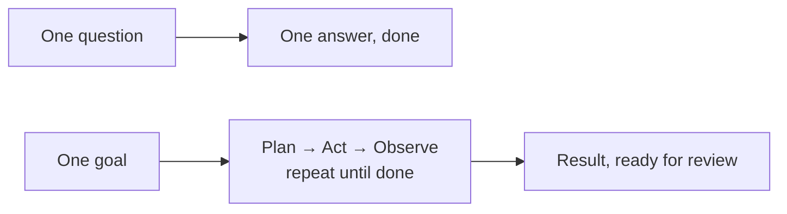
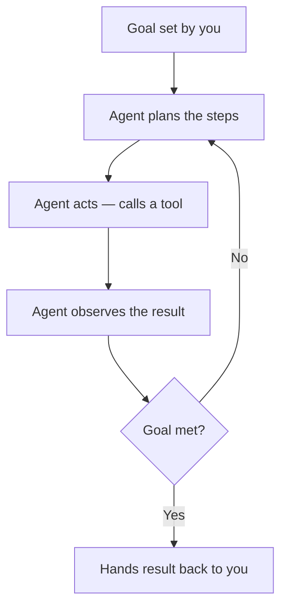

# Not Just a Chatbot: What Is an Agentic System

AutoNate had used an AI agent plenty by now — that's half of what made his colony code and his database possible. But every time before this, the shape was the same: he'd ask something, it would answer, and then he'd read the answer and decide what to do next himself. Ask, answer, his move. Ask, answer, his move. It worked. It also meant he was the one doing every bit of the actual work of moving a project forward, one exchange at a time, forever.

Then he watched the Discord announcement's linked clip of a past Tuesday build, and something looked different. Somebody typed one instruction — something like "read this RFP and pull out every requirement" — and then just... waited. No follow-up question after every line. No copy-pasting the next chunk in by hand. The agent kept working, checked its own output, and came back with a finished list. One instruction. Many steps. Nobody babysitting it between them.

That's the line this chapter draws, and it's a real one, not a marketing word. Everything AutoNate had done with AI up to now was a single-shot exchange — smart, useful, but bounded to one question and one answer. What he was looking at now was something else: a system that could take a goal, break it into steps, use tools to act on those steps, check its own results, and keep going without him re-prompting it at every turn. That's what an **agentic system** is. Understanding the difference is the whole hinge this pack swings on.

## Coder's Corner: Agent vs. Single-Shot Prompt

A **single-shot prompt** is one question in, one answer out. You ask "what does RCL mean in Screeps," it tells you, done. The thinking about what to do with that answer is entirely on you.

An **agent** is different in three specific ways:

- **Planning** — given a goal instead of a single question, an agent breaks it into a sequence of smaller steps on its own, instead of waiting for you to hand it the steps one at a time.
- **Tool use** — an agent isn't limited to generating text. It can call real tools: read a file, run a search, write a document, query a database. The text it generates becomes actions it can actually take.
- **Multi-step autonomy** — after each action, an agent observes what happened and decides the next move itself, looping through plan-act-observe until the goal is met, instead of stopping to ask you after every single step.

None of that means unsupervised. It means the loop between steps doesn't require you standing there refilling the prompt box every ten seconds. You set the goal and the guardrails. It does the repetitive middle part.



Same starting move — you telling the AI what you want — but a completely different shape of what happens after you hit enter.

## 1. Spot the Difference Between a Question and a Goal

"What's the deadline on this RFP?" is a question. One answer ends it. "Read this RFP and tell me everything a proposal would need to include, with sources for each claim" is a goal — it requires finding information, organizing it, and checking it, which is naturally several steps, not one. If what you're asking for can't be answered in a single sentence without more digging first, you're handing over a goal, not a question, whether you meant to or not.

## 2. Give the Agent Tools, Not Just Words

An agent without tools is just a single-shot prompt wearing a longer explanation. The actual power shows up when it can act — read a real file, run a real search, write a real output — instead of only generating a description of what it *would* do.

```js
// rfp-agent.js — one goal, not one question
const result = await agent.run({
  goal: "Read fairview-rfp.txt, list every requirement, and flag anything unclear.",
  tools: [readFile, writeNotes],
});
```

That `tools` array is the whole difference. Take the tools away and you've got a chatbot describing a plan instead of one carrying it out.



Follow that loop and you'll notice the human — you — only shows up twice: setting the goal, and reviewing what comes back. Everything in the middle runs on its own.

## 3. Let It Check Its Own Work, Then You Check It Too

A good agent doesn't just act once and stop — it re-reads its own output against the goal before calling itself done. That's part of the loop, not a separate step. But "the agent checked itself" is not the same as "it's correct." An agent that misreads a requirement will confidently misreport it, in complete sentences, with total conviction. Directing an agent well — which AutoNate already learned the hard way — means the loop ends with you, reviewing the result against the actual source document, every time. Autonomy inside the loop. Accountability outside it.

## 4. Sanity Checks

- If an agent stops after one step and waits for you to prompt it again: you likely gave it a question, not a goal — reframe what you asked for as an outcome, not a single fact.
- If the output looks complete but something feels off: check it against the original source directly. An agent that sounds confident isn't automatically an agent that's correct.
- If you're not sure whether a task needs an agent or a single prompt: ask whether it requires more than one real step to finish. One step, use a question. Several connected steps, hand it a goal.
- If this still feels theoretical: it stops being theoretical the moment you actually hand an agent a real RFP and watch it work through one — which is exactly what's next.

AutoNate reread that clip one more time. Not because he still didn't get it — because he finally did, and he wanted to watch it again knowing what he was looking at.

Next: `02-reading-an-rfp-with-ai.md` — pointing that exact loop at the Fairview document he'd only skimmed so far.
