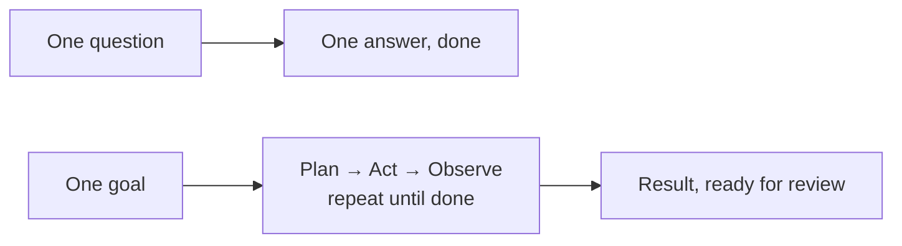
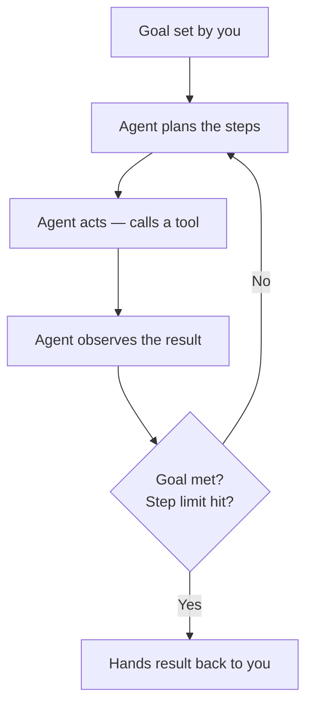

# Not Just a Chatbot: What Is an Agentic System

Nate and Kai run a two-person studio called AutoNateAI, which is a name Kai approved only after vetoing "Nate & Kai's House of Code," "Burrito Logic," and one option Nate still insists was good. Last chapter they found a live City of Fairview solicitation — RFP 26-118, a youth program registration and waitlist system — that happens to be the exact problem Kai spent a year of her old job losing sleep over. Forty-three pages. Real deadline. This chapter is the part where they figure out what kind of tool they're actually going to point at it.

Sunday morning, same corner table. Nate has a laptop open, a file already created, and the specific energy of a man who started building before he finished reading.

"Okay okay okay. Watch this. One agent. I give it the PDF, I give it the internet, I say 'win us this contract,' and I go make coffee."

"What does it do when it's wrong on step two?"

Nate's hands stop over the keyboard.

"Because it's going to be wrong on step two," Kai says, not unkindly. "Every document like this has a sentence in it that means the opposite of what it looks like it means. If it's wrong on step two and you're at the espresso machine, then steps three through nine are wrong in a way that looks completely finished."

This is the whole hinge of the chapter, and it isn't a knock on agents. It's the difference between *what an agentic system is* and *what people sell it as*. Both of them had used AI plenty by now — most of what their studio runs on got built with an agent's help. But almost all of that had been the same shape: ask a thing, read the answer, decide the next move yourself. Ask, answer, your move. Ask, answer, your move. It works, and it means you are personally the connective tissue between every single step, forever.

What they needed here was different, and it has a real definition, not a marketing one.

## Coder's Corner: Agent vs. Single-Shot Prompt

A **single-shot prompt** is one question in, one answer out. "What's the submission deadline on this RFP?" It answers. Done. Whatever you do with that answer is entirely on you.

An **agent** differs in three specific, checkable ways:

- **Planning** — given a goal instead of a single question, it decomposes that goal into a sequence of smaller steps itself, rather than waiting for you to feed it the steps one at a time.
- **Tool use** — it isn't limited to producing text. It can call real capabilities: read a file, run a search, write a document, query a database. Its output becomes actions that change something outside the conversation.
- **Multi-step autonomy** — after each action it *observes* the result and decides the next move, looping through plan → act → observe until the goal is met or a stopping condition fires.

"Agentic" does not mean unsupervised, and it does not mean smart. It means the loop between steps doesn't require a human refilling the prompt box every ten seconds. You set the goal, the tools, and the guardrails. It does the repetitive middle.



Same opening move — you saying what you want — completely different shape to what happens after you hit enter.

## 1. Tell a Question and a Goal Apart

"What's the deadline on this RFP?" is a question. One lookup ends it.

"Read this RFP and every addendum, list everything a proposal has to include, mark which items are mandatory, and cite the page for each one" is a goal. It requires finding things, organizing them, and checking them — several connected steps, not one.

The test is mechanical: if answering requires digging first, and the digging changes what you dig for next, you've handed over a goal whether you meant to or not. One step, ask a question. Several dependent steps, set a goal.

## 2. Give It Tools, Not Just Words

An agent with no tools is a single-shot prompt wearing a longer explanation. The power shows up when it can act on real things instead of describing what it *would* do.

```js
// rfp-agent.js — one goal, not one question
const result = await agent.run({
  goal: "Read fairview-rfp.txt, list every requirement, and flag anything unclear.",
  tools: [readFile, writeNotes],
  maxSteps: 25,
});
```

Nate had originally saved this file as `birria.js`, after lunch. It is now `rfp-agent.js`, after a short discussion.

The exact API differs by framework — different SDKs spell this differently — but the shape is the same everywhere: a goal, a set of tools, and limits. A tool itself is just a function plus a description the model can actually understand:

```js
const readFile = {
  name: "read_file",
  description: "Read a UTF-8 text file from the project directory and return its contents.",
  parameters: { path: "string" },
  run: async ({ path }) => fs.readFile(resolveInsideProject(path), "utf8"),
};
```

Two things in that snippet matter more than they look:

The **description** is not a comment. It's the only thing the model has to decide *when* to reach for this tool. A vague description produces an agent that reaches for the wrong thing at the wrong time and then reasons confidently about the result.

The `resolveInsideProject` wrapper is a **guardrail**. Give an agent a file-reading tool that can read anything on your disk, or a writing tool that can overwrite anything, and you have not built an assistant — you've built a very fast, very sincere intern with root access. Scope tools to the narrowest thing that does the job. Read-only where read-only is enough.



Follow that loop and notice where the human appears: setting the goal, and reviewing what comes back. Everything between runs on its own.

## 3. Every Loop Needs a Way to Stop

That `maxSteps: 25` isn't decoration. A loop that decides its own next move can also decide, quite reasonably, to keep going — re-reading, re-checking, refining a list that was fine four steps ago. Three things end a loop properly:

- **A clear success condition.** "Produce a JSON file with these five keys" is checkable. "Understand the RFP" is not, and an agent handed an uncheckable goal will circle it.
- **A step or iteration cap**, so a stuck loop fails fast and visibly instead of quietly grinding.
- **A budget.** Every step is another model call, which is real tokens, real latency, and real money. Multi-step autonomy is genuinely more expensive than one prompt, and the tradeoff is usually worth it — but it should be a decision, not a surprise on an invoice.

"So it's a `while` loop with a break condition," Nate says.

"Is it?"

"It's a `while` loop with a break condition and a personality."

"Write the break condition first, then."

## 4. It Checks Its Own Work. Then You Check It.

A well-built agent re-reads its own output against the goal before declaring itself done. That self-check is part of the loop and it genuinely catches things.

It is also not the same as being correct.

An agent that misreads a requirement will misreport it confidently, in complete sentences, with citations formatted beautifully. This is the failure mode that has burned both of them before — Kai by taking a fluent answer at face value because it *sounded* like it came from somewhere, Nate by refusing to check something he was sure he already knew. The habit that came out of it is one line long and it's the studio's whole engineering discipline: **where's that from?**

So the loop ends with a person. Autonomy inside the loop, accountability outside it. That's not a limitation you tolerate — on a document where a misread sentence costs a real department a real year, it's the entire reason the thing is trustworthy at all.

## 5. Sanity Checks

- If the agent stops after one step and waits: you gave it a question, not a goal. Restate what you want as an outcome, not a fact.
- If it never stops: your success condition isn't checkable. Rewrite the goal so a machine can tell when it's met, and set a step cap.
- If it used the wrong tool at the wrong time: fix the tool *description* before you touch the prompt. That's usually where the confusion lives.
- If a tool can do more than the job needs: narrow it. Read-only beats read-write, one directory beats the whole disk.
- If the output looks complete but something feels off: check it against the source directly. Confidence is a writing style, not evidence.
- If you're not sure whether this needs an agent at all: count the dependent steps. One, prompt it. Several, build the loop.

Nate deleted the "win us this contract" goal and typed a much more boring one about reading a file and listing requirements with page citations. It was, objectively, a less cool sentence. It was also the first thing he'd built in a year that somebody outside the room was going to depend on.

Next: `02-reading-an-rfp-with-ai.md` — pointing that loop at forty-three pages of language Nate cannot read yet.
