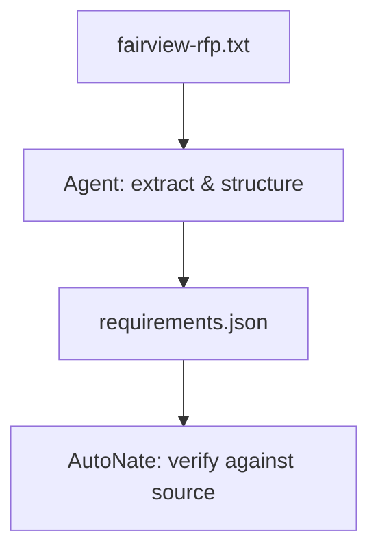

# The Fine Print: Reading an RFP with AI

AutoNate had the Fairview RFP open again — "Youth Recreation Program Registration & Waitlist System," twelve pages, city seal on the front. He'd skimmed it once already and understood the shape: parks department, registration problem, some kind of system needed. What he didn't have was the actual list. What exactly did they need built. What would disqualify a proposal outright. What the budget ceiling was. What day it was due. All of that was in there, technically, buried in formatting that looked like it was fighting him on purpose.

Old AutoNate would've read all twelve pages top to bottom, highlighter in hand, and hoped he didn't miss anything in paragraph nine while he was busy paying attention to paragraph three. That's not a knock on him — that's just what reading a dense document by hand actually costs. But he'd just spent a whole chapter learning what an agent with a goal and real tools could do that a single question couldn't. This was the first real chance to point that at something that mattered.

## Coder's Corner: Requirements vs. Constraints

Before handing the document to an agent, it helps to know what you're actually asking it to pull out, because "summarize this" is too vague to be useful.

- A **requirement** is something the system has to do — "the system must let a parent register a child for a program online." Requirements describe function.
- A **constraint** is a boundary the proposal has to stay inside — a budget ceiling, a technology restriction, an accessibility standard, a deadline. Constraints don't describe what the system does; they describe what any valid answer is allowed to look like.
- **Deliverables** are the concrete things handed over at the end — working software, documentation, a training session, a support window.
- **Eligibility** is who's even allowed to submit a proposal in the first place — sometimes wide open, sometimes restricted to certain kinds of vendors.

Mixing these up is an easy way to build something technically impressive that still gets tossed for missing a budget cap or an accessibility standard buried on page eight.

## 1. Get the Document Somewhere the Agent Can Actually Read It

Save the RFP as plain text or keep the PDF local — either way, the agent needs direct access to the actual source, not your memory of skimming it once.

```bash
agent run "load fairview-rfp.txt and confirm it's readable before we go further"
```

Small step, easy to skip, and skipping it is exactly how you end up debugging a summary of a document the agent never actually opened.

## 2. Hand It a Goal, Not a Vague "Summarize This"

"Summarize this" produces a summary. It doesn't produce something you can act on. Ask for structure instead — requirements, constraints, deliverables, deadline, each one labeled, each one traceable back to where it came from in the document.

```js
// rfp-extract.js — structure, not just a paragraph
const extract = await agent.run({
  goal: `Read fairview-rfp.txt and produce structured JSON with:
    requirements (what the system must do),
    constraints (budget, tech, deadline, accessibility),
    deliverables, and eligibility.
    Cite the page or section for each item.`,
  tools: [readFile, writeJson],
});
```

Output that comes back might look something like this:

```json
{
  "requirements": [
    "Parents register children for programs online",
    "System shows real-time capacity per program",
    "Waitlist auto-fills open spots in submission order"
  ],
  "constraints": [
    "Budget ceiling: $45,000",
    "Must meet WCAG 2.1 AA accessibility",
    "Proposals due by the stated deadline, no extensions"
  ],
  "deliverables": [
    "Working system",
    "90-day post-launch support",
    "Staff training session"
  ]
}
```

That's not the document rewritten shorter. That's the document turned into something you can actually build a proposal against, and — down the line — a database schema against too.



## 3. Verify the Extraction Against the Actual Source

This is the part that doesn't get to be optional. An agent that misreads "budget not to exceed $45,000" as a target instead of a ceiling will say it just as confidently either way. AutoNate learned this the expensive way back when he was first directing an agent on his colony code — confidence in the output was never proof the output was right. Pull up the source page for every item in that JSON at least once and check it says what the agent claims it says. Ten minutes of checking now beats a proposal built on a misread constraint later.

## 4. Flag What's Actually Unclear

A good extraction doesn't pretend the document is cleaner than it is. Some RFPs genuinely leave things ambiguous — a requirement that contradicts a budget line, a deadline stated two different ways in two different sections. Ask the agent to flag anything like that explicitly instead of quietly picking one interpretation and moving on. Those flags become real questions, and real questions are exactly what a proposal's clarification period exists for.

## 5. Sanity Checks

- If the extracted JSON looks suspiciously clean and has zero flagged ambiguities: that's a reason to check closer, not a reason to relax — real RFPs almost always have at least one rough edge.
- If a requirement and a constraint got mixed into the same list: split them back out by hand — the distinction matters once you're actually designing against them.
- If you can't find where in the source document a claimed item came from: don't trust it until you do. No citation, no confidence.
- If the whole document still feels overwhelming even after extraction: that's normal for a first RFP — the extraction doesn't remove the reading, it removes the *re-reading*.

AutoNate had a document now instead of a wall of text — twelve pages compressed into a list he could actually work from, every line traceable back to where it came from. He still didn't know one thing, though: who Fairview Parks and Rec actually was, and what was really driving this ask.

Next: `03-researching-the-room.md` — finding out who's actually on the other side of the document.
