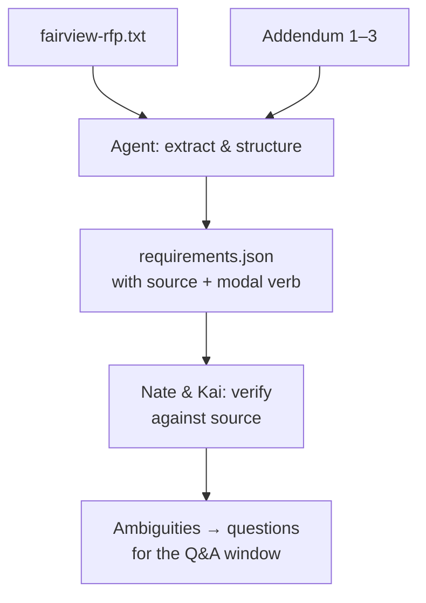

# The Fine Print: Reading an RFP with AI

An **RFP** is a Request for Proposal — a document an organization publishes when it has a real problem, real money, and wants outside parties to propose how they'd solve it. Nate and Kai, who run a two-person studio called AutoNateAI, are looking at one: RFP 26-118, City of Fairview, a registration and waitlist system for youth recreation programs. Forty-three pages, a seal on the cover, and a deadline that is not moving.

Nate has read the first four pages twice and understood approximately none of them.

"Okay, this sentence. *'The Contractor shall provide, at minimum, a web-based registration interface accessible to the public, and may propose additional modalities.'* What is that. What is happening in that sentence."

"That sentence is doing three separate things," Kai says. "It's telling you one thing you have to build, it's telling you that building only that is acceptable, and it's telling you that anything extra is your idea and your risk."

"How is it doing all that. Which word is doing that."

"'Shall.' 'At minimum.' 'May.'"

Nate sits back. "So 'shall' is a required parameter, 'may' is optional with a default, and 'at minimum' is the floor of the valid range."

Kai looks at him for a second. "...Yes. Annoyingly, yes."

"See, you should've led with that."

"You did this for me, you know." She says it to the laptop, not to him. "The first time you explained a `for` loop. You said 'it's just do this again until the list runs out,' and I remember thinking you were dumbing it down for me. You weren't. That's actually what it is. That's actually all it is."

"So this is my for loop."

"This is your for loop. Take notes, it gets worse."

Here's the shape of the problem: buried in those forty-three pages is a finite, knowable list — exactly what they need built, exactly what would disqualify a submission, exactly what the budget ceiling is, exactly when it's due. Reading it top to bottom with a highlighter *works*, and it costs an entire evening and a real risk of missing paragraph nine because you were concentrating on paragraph three. They had an agent loop from the last chapter. This was the first thing worth pointing it at.

## Coder's Corner: The Four Buckets, and the Words That Sort Them

Before you hand a document to an agent, you have to know what you're asking it to pull out, because "summarize this" produces a summary, and a summary is not something you can build against.

- A **requirement** is something the system has to *do*. "The system must allow a parent to register a child for a program online." Requirements describe function.
- A **constraint** is a boundary any valid proposal has to stay inside — a budget ceiling, a technology restriction, an accessibility standard, a due date, a data-ownership clause. Constraints don't describe what the system does; they describe what any acceptable answer is allowed to look like.
- **Deliverables** are the concrete things handed over: working software, documentation, a training session, a defined support window.
- **Eligibility and administrative requirements** are what it takes to be allowed to submit at all — vendor registration, insurance certificates, references, required forms.

And then the thing Kai says matters more than all four: **the modal verbs sort them.**

Public-sector documents use a small, load-bearing vocabulary, and it is not decorative:

- **Shall** and **must** are mandatory. Miss one and your proposal can be ruled non-responsive — thrown out on compliance, before anyone evaluates whether your idea was good.
- **Will** usually describes what the *issuing organization* is committing to do, not you. Worth tracking separately; it's often where you learn what support you'll actually get.
- **Should** is advisory. Recommended, not required. Skipping it may cost you points; it won't disqualify you.
- **May** is permissive and optional — usually an invitation to differentiate yourself, occasionally a trap where the "optional" thing is what the evaluation criteria actually reward.

"So when I read this," Nate says slowly, "I'm not reading for meaning. I'm reading for verbs."

"You're reading for meaning *encoded in* verbs. Welcome. It's very boring here and I've been living here for six years."

Two more terms that sit underneath everything:

**Responsive** means your submission conforms to what the solicitation asked for — right forms, right format, all mandatory items addressed, submitted on time. **Responsible** means you're a vendor actually capable of doing the work — capacity, references, insurance, financial standing. You can be the most responsible team in the state and get eliminated for being non-responsive because you forgot to acknowledge an addendum. The two words sound like a compliment and they are actually a checklist.

## 1. Get the Complete Document Set — All of It

Nate saved the PDF, converted it to text, and started typing a goal.

"Where's Addendum Two?"

"There's an addendum two?"

There were three. Addendum No. 1 was a clarification about file formats. Addendum No. 2 moved the submission deadline four business days *earlier* and added a requirement that the system support Spanish-language registration. Addendum No. 3 was the written Q&A — every question any vendor had asked, answered in writing, published to everybody at once.

An addendum is an official amendment to the solicitation. It is not supplementary reading. It is part of the document, it supersedes what it changes, and most RFPs require you to formally acknowledge each one in your submission. An extraction run against the base RFP alone would have produced a clean, confident, well-cited list of requirements that was missing an entire language and pointed at a dead date.

"That's a whole feature," Nate said.

"That's a whole feature and four fewer days."

Assemble the full set first — base document plus every addendum, in order — and give the agent all of it.

```bash
agent run "load rfp/ and confirm every file in it is readable, then list them with dates"
```

Small step. Easy to skip. Skipping it is exactly how you end up carefully verifying a summary of a document that no longer exists.

## 2. Hand It a Goal, Not "Summarize This"

Ask for structure, labeled, with the modal verb preserved and a citation for every single item.

```js
// rfp-extract.js — structure, not prose
const extract = await agent.run({
  goal: `Read every file in rfp/ (base RFP plus addenda, addenda supersede the base).
    Produce structured JSON with:
      requirements   (what the system must do),
      constraints    (budget, technology, accessibility, dates, data ownership),
      deliverables,
      eligibility    (forms, registration, insurance, references),
      evaluation     (scoring criteria and point weights, if published),
      ambiguities    (anything contradictory or unclear).
    For each item record: the exact source sentence, the file and page,
    and whether the language is mandatory (shall/must) or advisory (should/may).
    Do not resolve contradictions yourself — report them.`,
  tools: [readFile, writeJson],
  maxSteps: 40,
});
```

That last line is Kai's, and she added it with the expression of someone who has watched a document quietly pick a winner between two conflicting sentences before. An agent asked to produce a clean list will produce a clean list. Ask it to preserve the mess.

What comes back looks something like:

```json
{
  "requirements": [
    {
      "item": "Parents register children for programs online",
      "language": "mandatory",
      "source": "RFP 26-118 §3.1, p.9",
      "quote": "The Contractor shall provide a web-based registration interface..."
    },
    {
      "item": "Registration available in Spanish",
      "language": "mandatory",
      "source": "Addendum No. 2, §2, p.1",
      "quote": "Section 3.1 is amended to require Spanish-language support..."
    },
    {
      "item": "Waitlist fills open spots in documented order",
      "language": "mandatory",
      "source": "RFP 26-118 §3.4, p.11"
    }
  ],
  "constraints": [
    { "item": "Budget not to exceed $45,000", "source": "§5.2, p.19" },
    { "item": "WCAG 2.1 AA conformance", "language": "mandatory", "source": "§4.6, p.16" },
    { "item": "City retains ownership of all program and registrant data", "source": "§7.3, p.28" }
  ],
  "evaluation": [
    { "criterion": "Technical approach", "points": 40 },
    { "criterion": "Relevant experience", "points": 25 },
    { "criterion": "Cost", "points": 20 },
    { "criterion": "Implementation timeline", "points": 15 }
  ],
  "ambiguities": [
    "§3.4 requires waitlist order be 'documented and consistent' but does not define the ordering rule."
  ]
}
```

That's not the document made shorter. That's the document turned into something you can design against — and, later, turn into an actual schema.



## 3. Read the Evaluation Criteria Like They're the Real Assignment

This is the part Kai insists most people skip, and it's the part that decides who wins.

Most public RFPs publish how proposals will be scored, often with explicit point weights. That table tells you what the organization actually values, which is frequently *not* what the scope of work spends the most pages on. Forty points on technical approach and twenty on cost means this is not a lowest-bidder contract — a thoughtful, well-argued approach can beat a cheaper one. Flip those numbers and the entire strategy changes.

"So the rubric is published," Nate said. "They just... tell you the rubric."

"They're required to. Fairness. And every year people write beautiful proposals that ignore it completely."

Structure your response to mirror the criteria, in the criteria's own order and language. Evaluators are frequently scoring a stack of submissions against a form. Make it easy to find where you earned each point.

## 4. Verify Every Extracted Item Against the Source

This is not optional and it does not get delegated.

An agent that reads "budget not to exceed $45,000" and records it as a target instead of a ceiling will say it with identical confidence either way. Pull up the cited page for every item in that JSON — every one, once — and confirm the source says what the extraction claims. It is boring. It takes maybe forty minutes. It is dramatically cheaper than designing a system against a constraint that isn't real.

Nate got to page six, Statement of Need, and stopped on the quoted sentence about staff maintaining waitlists manually across multiple spreadsheets. He checked it against the source like every other line. It was accurate. He didn't say anything about it, and neither did she.

## 5. Turn Ambiguities Into Actual Questions

Real RFPs contradict themselves. A requirement that can't be met inside the budget line. A date stated two different ways in two different sections. An ordering rule described as "consistent" and never defined.

Don't let the agent quietly pick an interpretation, and don't quietly pick one yourself. Write them as plain questions and submit them through the designated contact before the questions window closes. The answers get published to every bidder as an addendum, which means asking a good question genuinely helps your competitors — and also means the answer becomes part of the official record you get to build against instead of guessing.

Their first question was about §3.4: *Does the City require waitlist offers be made in strict submission order, or may priority rules (e.g., Summer Access participants, siblings already enrolled) be applied?*

Kai typed that one from memory. She did not need to look up why it mattered.

## 6. Sanity Checks

- If the extraction is suspiciously clean with zero flagged ambiguities: check harder. Real solicitations always have a rough edge, and a tidy list usually means one got smoothed over.
- If you can't find where a claimed item came from: don't trust it until you can. No citation, no confidence.
- If requirements and constraints landed in the same bucket: split them by hand. The distinction drives the design later.
- If you haven't confirmed you have every addendum: stop and confirm. This is the single most common unforced error in a first response.
- If you're about to skip the evaluation criteria because the scope of work is more interesting: that's the rubric. Read the rubric.
- If a question you want to ask feels too basic: ask it. Everyone gets the answer, including you, and "we assumed" is not a defense after award.

Twelve hours of reading compressed into a list, every line traceable, three questions submitted, one language nearly missed. What neither of them could answer yet was the thing that actually decides whether a proposal is any good: *why now.* Why this department, this year, badly enough to put $45,000 behind it.

Next: `03-researching-the-room.md` — finding out who's actually on the other side of the document.
