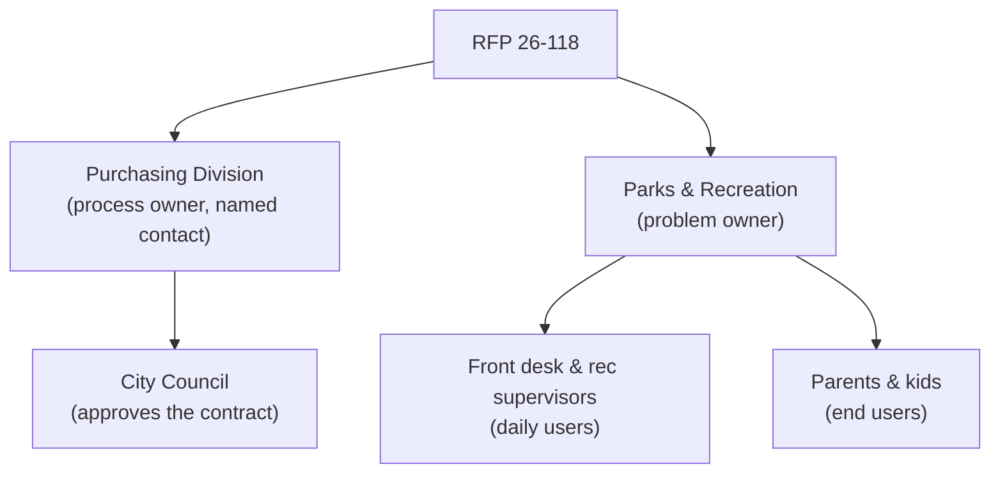

# Know Who You're Talking To: Researching the Room

Nate and Kai are two people with a studio, AutoNateAI, and one live City of Fairview solicitation — RFP 26-118, a registration and waitlist system for youth recreation programs. They've got a clean extraction now: every requirement, every constraint, every mandatory "shall," each one traceable to a page. What they don't have is the answer to the only question a proposal actually has to answer well.

"Why now," Kai says. "Why this year. Forty-three pages and it never says."

"Does it ever say?"

"It never says. It's not allowed to say. The document tells you what they're asking for. It doesn't tell you what they're tired of."

Nate pushes his chair back. "So how'd you used to figure it out?"

And here's the thing she's actually good at, the part that isn't in any of the packs he taught her:

"Every grant I ever got funded, I read the funder's last three awards before I read their guidelines. Not their mission statement — their awards. Who they gave money to, how much, and for what. The guidelines tell you what an organization is *allowed to say* it wants. The award history tells you what it actually funds. Those are almost never the same document and they are almost never the same answer."

Nate turns that over for a second. "So it's like — you don't cook off the recipe card. You find out who's eating first. Who's allergic, who's actually going to reheat it on Tuesday, whether anybody at that table has ever eaten a poblano in their life."

"Sure," Kai says. "If that's what gets it in there, yes."

"It's a good one. That's a good analogy."

"It's fine. Open the budget documents."

That's this chapter. The document is the recipe card. The organization behind it is the table. In civic work the phrase for this is **reading the room**, and the room here is a mid-size city's parks department, a purchasing division, a council that approves the money, a front desk that lives with whatever gets built, and several hundred families who don't know any of this is happening and will feel all of it.

## Coder's Corner: Stakeholders, Not Just the Signature

The organization that publishes an RFP is rarely the only party with a stake in the outcome, and treating it like it is produces a technically compliant proposal that misses what actually matters.

- A **stakeholder** is anyone with a real interest in how this turns out — not just whoever signed. A department issues the solicitation. Front-desk staff live with the system every day. Parents and kids are the ones who feel whether it works.
- A **decision-maker** is whoever actually chooses. Sometimes the named contact, more often an evaluation committee you will never meet, and above a certain dollar threshold, an elected council that has to approve the contract in a public meeting.
- An **end user** is whoever touches the finished thing daily — usually the person furthest from the signature, and the one who determines whether the system works or merely ships.
- A **primary source** is information straight from the organization: its own site, its own budget, its own adopted plans, its own meeting minutes. A **secondary source** is everyone else talking about them — local news, other cities' postmortems, public comment. Primary sources tell you what they say about themselves. Secondary sources tell you what's true when those two diverge.

One more, and it's the one that makes all of this possible: in the United States, public bodies operate under **open records law**. At the federal level that's FOIA; every state has its own equivalent statute for state and local government, with its own name and its own rules. Budgets, adopted plans, meeting agendas and minutes, and awarded contracts are typically published proactively — you don't have to ask. When something isn't published, a formal records request is a real, ordinary option, though it's usually slower than an RFP timeline allows.

## 1. Point the Agent at the Organization Itself

Start with what the department says about itself: mission, current program listings, adopted master plan, recent budget documents.

```bash
agent run "research Fairview Parks and Recreation: mission, current programs, adopted plans, recent budget notes"
```

```js
// org-research.js — build a picture, not a vibe
const profile = await agent.run({
  goal: `Research the City of Fairview Parks and Recreation Department using public sources.
    Summarize: mission and adopted plans, current program offerings, recent budget
    changes affecting recreation programs, and anything referencing registration,
    waitlists, or staffing capacity.
    Separate primary sources (city-published) from secondary (news, third parties).
    Cite a URL for every claim. If a claim appears in only one place, mark it unconfirmed.`,
  tools: [webSearch, readPage, writeNotes],
  maxSteps: 40,
});
```

A department that used the phrase "modernize manual intake processes" in a budget narrative eighteen months before publishing this RFP is not asking for a nice-to-have. That's an organization describing something it has been actively tired of.

## 2. Read the Paper Trail

This is where the "last three awards" instinct becomes concrete moves:

- **The adopted budget.** Not the summary press release — the actual line items and department narratives. Budgets are the most honest documents a government produces, because they're the ones with consequences. Look for what got funded, what got cut, and what got described as a problem in the justification text.
- **Council agendas and minutes.** Most cities publish these through a public meeting portal — Legistar, Granicus, CivicClerk and similar platforms are common — and many are full-text searchable. Search the department name, "registration," "waitlist," and the program names. Public comment sections are gold: that's residents describing the current process in their own words, on the record.
- **Awarded contracts and prior solicitations.** Many jurisdictions publish award notices. If this department bought a scheduling system four years ago and is now issuing an RFP for a registration system, that history matters enormously — it tells you what they already own, what didn't work, and what integrating with the existing stack actually means.
- **Adopted plans.** Parks master plans, strategic plans, ADA transition plans. These are multi-year commitments, and RFPs are frequently just a plan's line item finally reaching the top of the list.

Nate found the November minutes from three years back. Summer Access Program, year-end report, presented to council by the Program Coordinator — and he read the name out loud before he'd processed whose it was.

Kai didn't look up. "Yeah."

"You presented this."

"I presented that. I also wrote the report it came from, and the sentence out of that report is on page six of the thing we're responding to." She finally looked up. "It's been three years. That's how long it takes for a spreadsheet everybody knows is broken to become a line item. That's not a scandal, that's just the speed. It's why I stopped."

Nate didn't say anything for a second. Then: "So we're not researching them. You're researching a room you were in."

"I'm researching a room I was in and didn't have you for."

## 3. Find the People Behind the Front Desk

The RFP names a contact for questions. That person is procurement, not the problem. The people who live with the system are almost never named in the document at all.

For a registration system: front-desk staff doing waitlist math by hand, a recreation supervisor fielding calls from parents, and families whose actual experience is a Saturday-morning scramble on a signup morning. Ask the agent to find anything describing the *current* process, even secondhand — local coverage of registration day, a neighborhood forum thread about a signup that filled in nine minutes, a council public-comment transcript where a parent explained exactly what happened to them.



Every layer down is a step further from the signature and a step closer to whether what you propose actually helps anyone.

## 4. The One Rule That Will Get You Disqualified

Nate, an hour later, cheerful: "Okay, the rec supervisor's email is right on the department page. I'll just ask her what the current process actually —"

"No."

"It's one email."

"It's one email and we're out." Kai closed his laptop lid two inches, which is her version of shouting. "Once a solicitation is open, most jurisdictions restrict contact to the designated procurement contact, in writing, through the questions process. Some call it a blackout period, some call it a cone of silence, and the rule is in the document — ours is §2.4. Contacting department staff or evaluators outside that channel can get a proposal rejected, and it should, because the whole point is that everyone bidding gets the same information at the same time."

"That's — okay. That's actually fair."

"It's extremely fair. It's also the single easiest way for a first-time vendor to blow up a month of work."

To be precise, because the distinction matters: **researching public records is completely fine.** Budgets, minutes, plans, awards, news coverage — all public, all fair game, read as much as you want. What's restricted is *contact*. Anything you want to ask a human goes through the named contact, in writing, before the questions window closes, and the answer gets published to everybody.

## 5. Check How Comparable Places Solved It

Fairview is very unlikely to be the first city that ever needed this. Other municipalities have published similar solicitations, hired vendors, and either succeeded or failed in ways that are also public record.

```js
const comparables = await agent.run({
  goal: `Find three other municipal parks departments that procured youth program
    registration or waitlist systems in the last five years. For each: what they
    bought, roughly what it cost, and any public evidence of how it went —
    council follow-ups, audits, news coverage, or a later re-procurement.
    Cite sources; mark anything you can't confirm.`,
  tools: [webSearch, writeNotes],
  maxSteps: 30,
});
```

A city that re-procured the same system three years later is telling you something. So is a budget for $180,000 in a city twice Fairview's size, which is a useful reality check on what $45,000 can honestly buy.

And set a timer before you start. Research is genuinely fun and genuinely infinite. It supports the proposal; it does not write it.

## 6. Sanity Checks

- If research turns up nothing past the RFP itself: you haven't checked budget narratives and meeting minutes yet. Department pain shows up there long before it shows up in a formal ask.
- If a claim appears in exactly one place: unconfirmed until a second, independent source backs it. Mark it that way in your notes so you don't launder it into a fact later.
- If you can only find the department and never the end users: write that down as an open question, don't assume your way past it. It may be worth asking in the questions window.
- If you're about to email anyone at the organization: reread the contact-restriction section first. Every time. It's usually in the first few pages.
- If research is producing more tabs than notes: your timebox expired a while ago.

By the end of the night they had a department that had been describing this problem in its own budget documents for two budget cycles, a front desk doing waitlist order by hand on a clipboard, a council that had heard about it in public comment twice, and roughly four hundred families who'd never heard of RFP 26-118 and would notice immediately if it worked.

That's not paperwork. That's a room, with people in it.

Next: `04-from-insight-to-system.md` — turning all of that into something you could actually hand somebody.
