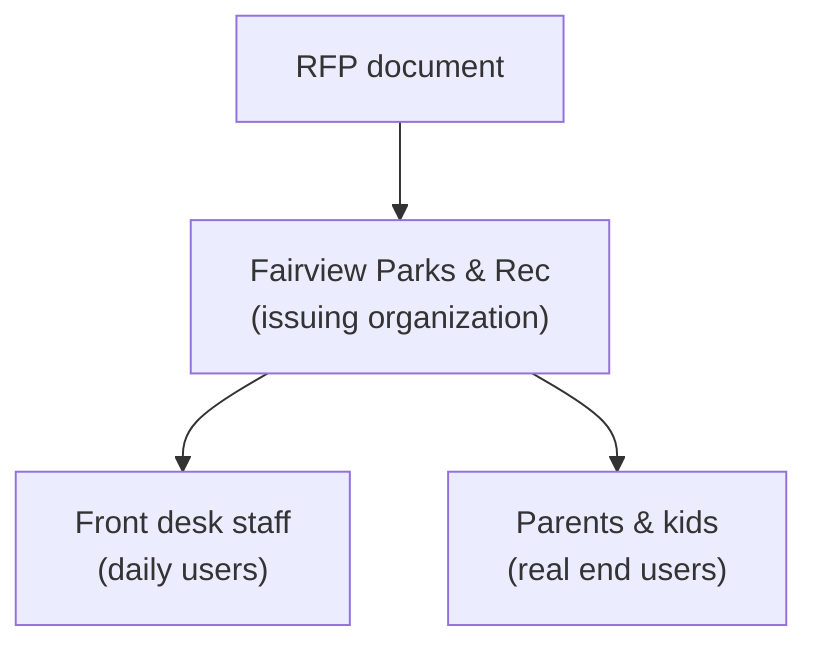

# Know Who You're Talking To: Researching the Room

AutoNate had his requirements list, clean and structured, every line traceable back to a page in the Fairview RFP. And he realized, staring at it, that he still couldn't answer the most basic question a proposal actually needs answered: why does this department want this, right now, badly enough to put a budget behind it? The document told him *what* Fairview Parks and Recreation was asking for. It said almost nothing about the actual people who'd typed it up, or the actual families who'd be stuck using whatever got built.

That gap has a name in Screeps, of all places, even if he'd never connected it before. Before a match, you don't just look at an opponent's colony from a distance and guess. You scout — you look at what they've actually built, how they actually play, what they're actually vulnerable to. Reading the RFP was like glancing at a colony from across the map. This chapter is the scouting report. In civic work, people call it **reading the room** — and it's not a coincidence that the word for a claimed territory in Screeps and the phrase for understanding who's actually in front of you happen to be the same word. AutoNate's spent this whole arc learning to read rooms. Turns out that skill was never just about the game.

## Coder's Corner: Stakeholders, Not Just the Signature

The organization that publishes an RFP is rarely the only party with a stake in the outcome, and treating it like it is leads to a technically correct proposal that misses what actually matters to the people using the thing.

- A **stakeholder** is anyone with a real interest in how this turns out — not just whoever signed the document. A parks department signs an RFP. Front-desk staff live with the system daily. Parents and kids are the ones actually affected by whether it works.
- A **decision-maker** is whoever actually chooses which proposal wins — sometimes the person named as the contact, sometimes a committee you'll never directly reach, sometimes an elected body that has to approve the budget line.
- An **end user** is whoever actually uses the finished thing day to day — often the person furthest from the signature on the document, and the one whose experience determines whether the system actually works or just technically ships.
- A **primary source** is information straight from the organization itself — their own site, their own budget documents, their own public meeting minutes. A **secondary source** is everything else talking about them — local news, other cities' case studies, public commentary. Both matter. Primary sources tell you what they say about themselves. Secondary sources tell you what's actually true when those don't match.

## 1. Point the Agent at the Organization Itself

Start with what Fairview Parks and Recreation says about itself — mission statements, program listings, budget summaries, public meeting notes if the city publishes them.

```bash
agent run "research Fairview Parks and Recreation Department: mission, current programs, recent budget notes"
```

```js
// org-research.js — build a real picture, not a guess
const profile = await agent.run({
  goal: `Research Fairview Parks and Recreation Department using public sources.
    Summarize their mission, current programs, budget context, and any
    recent news mentioning registration or waitlist problems. Cite every claim.`,
  tools: [webSearch, readPage, writeNotes],
});
```

A department that mentions "modernizing outdated paper processes" in a budget note three sentences before the RFP's registration ask isn't asking for a nice-to-have. That's a department describing a problem they're actually tired of living with.

## 2. Find the People Behind the Front Desk

The RFP names a contact for proposal questions — that's a decision-maker, or close to one. But the actual daily users are almost never named in the document at all. For a registration system, that's front-desk staff manually tracking waitlists, and parents currently doing... whatever the current broken process actually is. Ask the agent to look for anything describing the current process, even secondhand — local news coverage of long lines, a community forum post complaining about a paper sign-up sheet, a city council meeting transcript where a resident brought it up during public comment.



Every layer down that diagram is a step further from the signature on the document, and a step closer to whether the system you'd propose actually helps anybody.

## 3. Check How Other Cities Solved the Same Problem

Fairview is very unlikely to be the first city that's ever needed a program registration and waitlist system. Other municipalities have published similar RFPs, hired vendors, and either succeeded or very publicly didn't. A quick pass over comparable case studies tells you what's already been tried, what tends to go wrong, and what a realistic scope actually looks like for a budget this size.

```js
const comparables = await agent.run({
  goal: "Find two or three other city parks departments that ran similar registration system projects. Note what worked and what didn't.",
  tools: [webSearch, writeNotes],
});
```

## 4. Sanity Checks

- If research surfaces nothing beyond the RFP itself: that's a signal, not a dead end — check budget meeting minutes and local news specifically, since department pain points often show up there before they show up in a formal ask.
- If a claim about the organization only appears in one place: treat it as unconfirmed until a second, independent source backs it up.
- If you can't find anything about the actual end users, only the department: that gap belongs in your notes explicitly — it's a real open question worth asking during the clarification period, not something to quietly assume your way past.
- If research starts feeling like a rabbit hole with no end: set a real time box before you start, and stop when it's up — research supports the proposal, it doesn't replace writing one.

AutoNate had a name and a title on the RFP contact line. Now he had a department tired of paper sign-up sheets, a front desk drowning in manual waitlist math, and families who probably had no idea a whole formal process was even underway to fix their Saturday-morning scramble. That's not paperwork anymore. That's a real problem, with real people standing behind it.

Next: `04-from-insight-to-system.md` — turning all of that into an actual proposed system.
