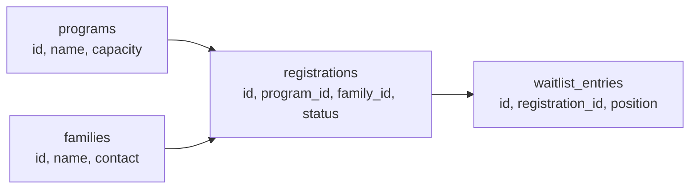
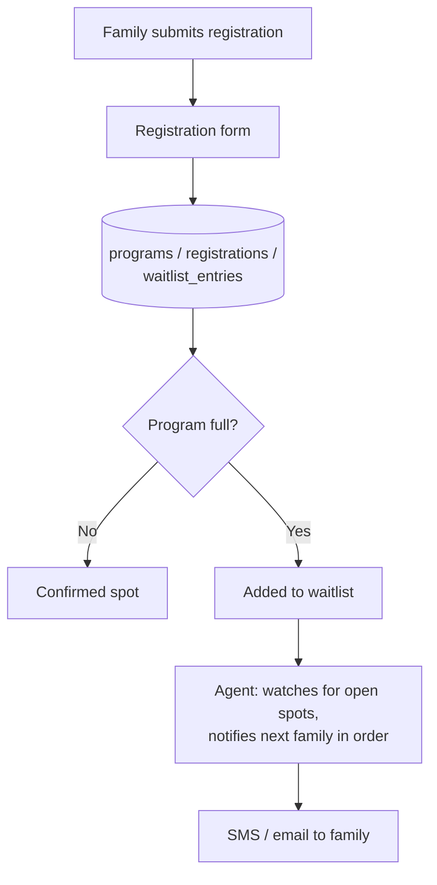

# The Sketch on the Napkin: From Insight to System

AutoNate had three things on the table now: a structured list of requirements pulled straight from the RFP, a set of hard constraints — budget, accessibility, deadline — and a real picture of who was actually behind the ask and who'd actually be stuck using it. Three separate pieces of paper, in a sense, none of them a system yet. Just insight. The kind of insight that feels good to have and useless if it never turns into something you could actually hand somebody.

He thought about the moment, chapters ago in his colony, when three role files and a dispatcher stopped feeling like following steps and started feeling like actually designing something. Nobody had told him the word "architecture" applied to what he was doing back then — he just noticed the code stopped fighting him once the shape was right. This was the exact same feeling, aimed at something real for the first time. He wasn't writing a Screeps role anymore. He was sketching a system for actual families trying to sign a kid up for summer basketball. Different stakes. Same instinct.

## Coder's Corner: What "System Architecture" Actually Means Here

A **system architecture** is the shape of how a piece of software is put together — not the code itself, but the map of its pieces and how they connect. Same idea as the role-and-dispatcher diagram from the colony work, just pointed at a bigger kind of building.

- The **data model** is what gets stored and how the pieces relate — this is exactly the relational thinking from `colonies.db`, just applied to programs and families instead of colonies and matches.
- A **pipeline** is the path information travels through the system, step by step, from where it enters to where it ends up.
- An **interface** is wherever a human actually touches the system — a registration form, a staff dashboard, a text message.
- An **agent's role in a system** isn't always the whole system — often it's one piece, doing one job well, like triaging a waitlist, the same way a miner or hauler role does one job well inside a bigger colony.

None of this requires you to actually build the thing yet. It requires you to be able to draw it clearly enough that someone else could look at the sketch and understand exactly what you're proposing.

## 1. Map the Data Model First

Before anything else, figure out what the system actually needs to remember — the same question that opened the database pack, just aimed at Fairview instead of a colony. A program has sessions and a capacity. A family registers for a program. If a program's full, that registration becomes a waitlist entry instead. Sound familiar? It's the same one-to-many shape as `colonies` → `matches` → `roles`, just wearing different names.



Read it the same way as any colony diagram: follow the arrows and you can answer real questions — which families are waitlisted for which program, in what order — without a human doing the counting by hand.

## 2. Map the Pipeline, Including Where an Agent Actually Fits

A data model on its own doesn't do anything. The pipeline is what moves information through it — and this is where the agentic piece from earlier chapters earns its spot, doing one specific job instead of being a vague "AI-powered" bullet point on a slide.



That agent box is doing exactly one job: watching the waitlist and the registration table, and when a spot opens up, notifying the next family in line without a staff member manually checking a spreadsheet every morning. That's the actual pain point AutoNate found back in the research chapter, solved by one clearly-scoped piece, not a vague promise that "AI will handle it."

## 3. Write the One-Page Sketch

A proposal doesn't need to be the whole system, built. It needs to be a clear enough sketch that Fairview can look at it and trust the team behind it understands the actual problem. One page: the data model, the pipeline, which pieces are automated and which involve a human, and a plain-language note on how it respects the budget ceiling and the accessibility constraint from the RFP.

```js
// proposal-outline.js — insight becomes a document, not just a diagram
const outline = await agent.run({
  goal: `Using requirements.json, org-research.md, and the sketched data model,
    draft a one-page proposal outline: problem statement, proposed system,
    data model summary, what's automated vs. manual, and cost estimate
    within the stated budget ceiling.`,
  tools: [readFile, writeDoc],
});
```

That's not the finished proposal. It's the sketch on the napkin, typed up clean enough to hand to someone. Which is exactly the artifact a live Tuesday or Thursday build session in the Discord starts from — a real RFP, read, researched, and sketched, ready to actually build against, out loud, together.

## 4. Sanity Checks

- If the data model has a table for every single field instead of grouping related facts: step back and ask what actually repeats — that's the test that separates a real table from a column that belongs somewhere else.
- If the pipeline diagram has an agent box doing five different vague things: split it — a clear system has agents doing one well-defined job each, not one agent quietly doing everything.
- If the sketch doesn't obviously respect the budget or accessibility constraints from the RFP: that's not a detail to fix later, that's a proposal that gets tossed before anyone reads the good parts.
- If it still feels like a lot to hold at once: it is, the first time — that's exactly why this gets built live, with a team, instead of alone in a tab at 11pm.

Three chapters of reading, researching, and now this — a real sketch, for a real department, built out of skills that started with a struggling harvester and a `console.log`. AutoNate looked at the diagram on his screen and, for the first time all pack, didn't feel like a kid pretending to understand something. He understood it.

Next: `05-cheatsheet.md` — the vocabulary and the checklist, so the next real RFP doesn't start from zero.
