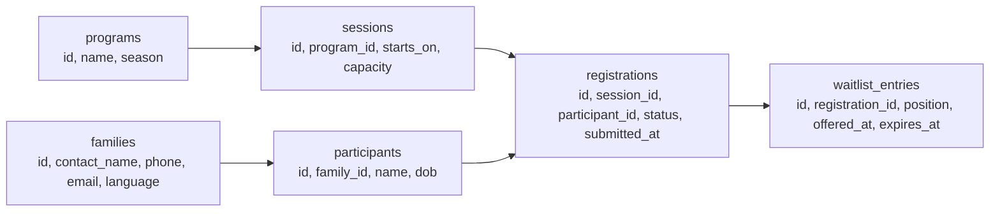
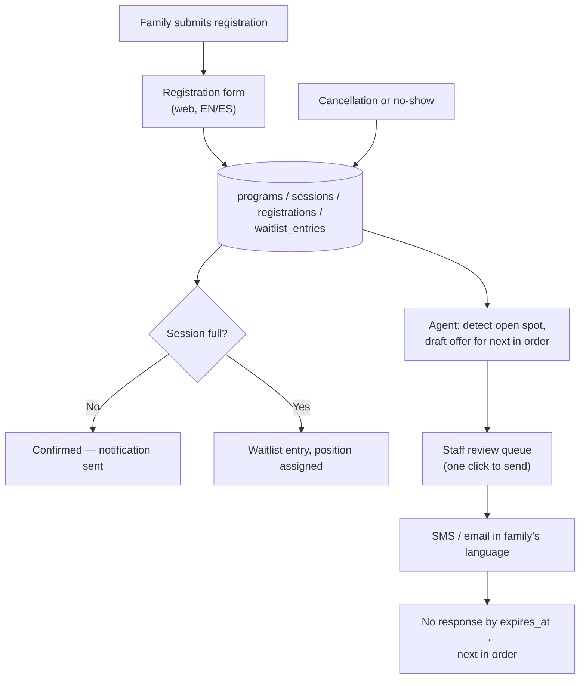

# The Sketch on the Napkin: From Insight to System

Nate and Kai run a two-person studio called AutoNateAI, and they are four weeks and one real deadline into responding to a City of Fairview solicitation for a youth program registration and waitlist system. They've got three things on the table. A structured list of requirements pulled from the RFP and its addenda, each traceable to a page. A set of hard constraints — $45,000 ceiling, WCAG 2.1 AA, Spanish-language support, city owns the data. And a real picture of the room: a department that's been describing this problem in its own budget documents for two cycles, a front desk doing waitlist order on a clipboard, and several hundred families who've never heard of any of this.

Three piles of insight. Zero systems. Insight is the thing that feels like progress and isn't, right up until you turn it into something a stranger could look at and understand.

It's a Sunday morning at Lightwell and there is an actual napkin involved, because Nate insists the first draft of anything be disposable.

Kai starts listing. Registration, waitlist, notifications, fee-waiver eligibility so Summer Access families get flagged automatically, attendance tracking so staff stop reconciling two systems, sibling matching so a parent doesn't get one kid into a session and one kid onto a list, a staff-side view for —

"No," Nate says.

She keeps going for about four more words before it registers. "No what?"

"No to like half of that." He's drawing on the napkin. "Budget's forty-five. Timeline's fifteen points on the rubric. And every single thing you just said is a thing you personally got burned by three years ago, which — yeah. Fair. But you're not scoping a system right now, you're settling a score."

Kai's jaw sets. "Where's that from."

"Me." He doesn't look up from the napkin. "That's from me. I've built twelve things that were going to be everything. You know how many had a person using them? Zero. Every one of them died the week it stopped being fun, and none of them died because I aimed too low." He turns the napkin around. Three boxes. "Nothing gets used until something gets finished. That's the entire thing I know. That's my whole contribution to this partnership."

There's a pause where it could go either way.

"Phase it," Kai says finally. "Put fee-waiver flagging in the proposal as a named phase two with its own line, so they can see we understand it exists and we're not pretending we can do it for the money."

"Yeah. That's better than mine."

"Obviously."

## Coder's Corner: What "System Architecture" Actually Means Here

A **system architecture** is the shape of how software is put together — not the code, the map. The pieces and how they connect, clear enough that someone who's never met you can look at it and know what you're proposing.

- The **data model** is what gets stored and how the pieces relate. Entities and their relationships, before any screens exist.
- A **pipeline** is the path information travels, step by step, from where it enters to where it lands.
- An **interface** is anywhere a human touches the system — a registration form, a staff dashboard, a text message.
- **An agent's role in a system is a job, not a layer.** The strongest use of an agent is almost always one clearly-bounded task inside a larger, ordinary, deterministic system — not a mysterious box labeled "AI-powered" sitting in the middle of the diagram absorbing responsibility.

None of this requires building anything yet. It requires being able to draw it.

## 1. Map the Data Model First

Before pipelines, before screens: what does this system have to remember, and how do the pieces relate?

A program has sessions and a capacity. A family registers a participant for a session. If the session is full, that registration becomes a waitlist entry with a position. When a spot opens, an offer goes out and has to be accepted within some window, or it moves down the line.



Read it by following the arrows. That shape can answer real questions without a human counting anything: which participants are waitlisted for which session, in what order, and which offers are about to expire.

Two details in there that came directly out of the research, not out of the RFP: `language` on the family record, because Addendum No. 2 requires Spanish registration and a system that can't remember which language you used is going to text you in the wrong one. And `expires_at` on the offer, because a waitlist offer with no expiry isn't a waitlist — it's a spot held indefinitely by whoever didn't check their phone.

## 2. Map the Pipeline, and Give the Agent Exactly One Job



That agent box does exactly one job: watch for a spot opening, identify who's next by the documented rule, and draft the offer. It does not decide who deserves a spot. It does not silently reorder anything. It does not send anything on its own.

"Why's the staff box there," Nate asked, when Kai added it. "That's a click. That's the whole thing we're removing."

"That's a click on a system that just told them who's next, instead of forty minutes with a clipboard. And it's the click that means a human is accountable for who got called." She tapped the diagram. "The day this goes wrong — and something will go wrong — somebody's going to stand up in public comment and ask who decided their kid didn't get a spot. 'The system did it' is not an answer a city can give."

## 3. Know What You're Not Allowed to Automate

This is the part that separates civic software from a side project, and it's worth stating plainly: **the waitlist order is not a technical decision. It's a fairness decision, and it belongs to the city.**

Recall that §3.4 required the order be "documented and consistent" and never defined the rule. That ambiguity went into their questions during the Q&A window, and the answer came back as an addendum: strict submission order, with a documented exception for participants already enrolled in a sibling's session. Fine. Now it's a rule, in writing, published to everyone.

So the design encodes *that rule*, visibly, in a way staff can explain to a parent on the phone. Not a model deciding. Not a scoring heuristic nobody can reconstruct six months later. An agent is excellent at the tedious detection work — noticing the cancellation at 6:40am, finding who's next, drafting the message in the right language. It is the wrong tool for a decision the public has a right to have explained to them.

The general version, worth writing on your own napkin: **automate the detection and the drafting; keep the deciding and the sending where a person's name is on it.**

## 4. Map Every Constraint to a Design Decision

A constraint you can't point to in the diagram is a constraint you're about to violate. Go through them one at a time:

- **WCAG 2.1 AA** → server-rendered HTML forms that work without JavaScript, real `<label>` elements, keyboard-navigable, tested with a screen reader, contrast checked. And the practical corollary for this population specifically: it has to work on a five-year-old phone on a bad connection at 7am on registration day. Accessibility here is not a checkbox at the end; it's a decision about how the front end is built at the beginning.
- **Spanish-language support** → translated by a human, stored per family, applied to every outbound message and not just the signup page. A confirmation flow that switches back to English halfway through is worse than not offering it.
- **$45,000 ceiling** → boring, proven components. Not a custom mobile app. Not a bespoke identity system. The cost narrative in the proposal should show the reasoning, because "we scoped to the budget deliberately" reads very differently from "we didn't notice."
- **City owns all data (§7.3)** → a documented schema, a working export, no proprietary format, and an honest answer to "what happens if you disappear." Say it out loud in the proposal. Public buyers have been burned by lock-in and they notice when a vendor addresses it unprompted.
- **Children's personal information** → collect the minimum that the program actually needs, define who can see what, and ask whether the city's records-retention schedule applies to registration records. Most local governments have one, and "we'll figure out retention later" is not a thing you want to say to a public agency about data on minors.

## 5. Write the One-Page Sketch

A proposal doesn't need the system built. It needs a sketch clear enough that the evaluation committee can see you understand the actual problem — and organized to mirror the published evaluation criteria, in their order, in their language.

```js
// proposal-outline.js — insight becomes a document
const outline = await agent.run({
  goal: `Using requirements.json, org-research.md, and system-sketch.md, draft a
    one-page proposal outline organized to match the RFP's evaluation criteria
    in their published order: technical approach, relevant experience, cost,
    implementation timeline.
    Include: problem statement in the department's own language, proposed system,
    data model summary, what is automated vs. human-reviewed, how each constraint
    (§4.6 accessibility, Addendum 2 Spanish, §5.2 budget, §7.3 data ownership)
    is met, and phase two scoped separately and priced separately.
    Every factual claim about the department must cite org-research.md.`,
  tools: [readFile, writeDoc],
  maxSteps: 30,
});
```

Then read every line of what comes back against the source, the way you did with the extraction. A drafting agent will happily produce a confident sentence about a department's priorities that nobody ever verified. Your name goes on this one.

## 6. Sanity Checks

- If the data model has a table for every field: step back and ask what actually repeats. Repetition makes a table; a single fact makes a column.
- If the agent box in your pipeline is doing five vague things: split it, then check whether any of the pieces are decisions that shouldn't be automated at all.
- If a constraint from the RFP doesn't appear anywhere in your design: it's not a detail for later, it's the thing that gets you ruled non-responsive before anyone reads the good part.
- If the scope has quietly grown past the budget: name the extra work as a separate, separately-priced phase. That reads as judgment. Silently over-promising reads as inexperience.
- If your proposal's structure doesn't match the published evaluation criteria: restructure it. Make the points easy to find.
- If it feels like a lot to hold at once: it is, the first time. Which is exactly why the next one gets built out loud, with other people watching, instead of alone in a tab at eleven at night.

The napkin got photographed and thrown away. The diagram went into a real document. Kai read the problem statement paragraph twice and didn't change a word of it, which from her is roughly a standing ovation.

Then Nate said the thing he'd apparently been sitting on for a week: "What if we build the first version of it live. In the Discord. Out loud, from the actual RFP, in front of whoever shows up."

Kai looked at him. "People will watch us be wrong."

"Yeah."

"...Okay."

Next: `05-cheatsheet.md` — the vocabulary and the checklist, so the next one doesn't start from zero.
