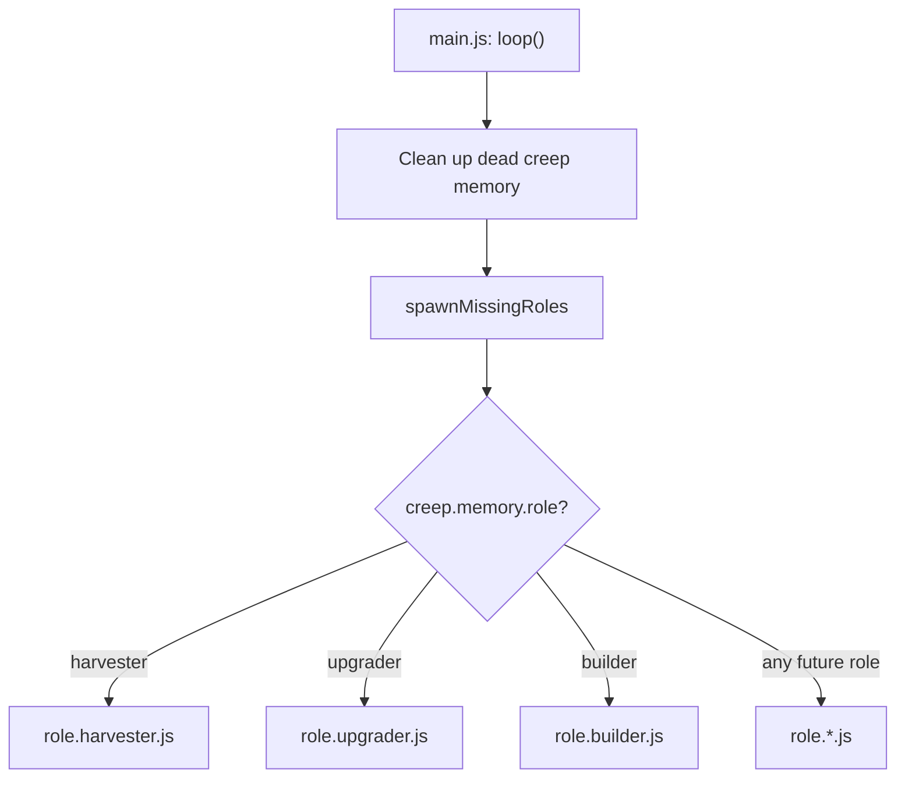

# Core Loop and Roles

AutoNate spawned a second creep feeling good about himself, and within about four ticks both of them were standing on top of the same source, elbowing each other out like it's the last open pump at a gas station on empty. Nothing was actually broken — the code ran fine, no errors, no red text. It was just dumb. Two creeps, one source, half the energy either of them could've been pulling if they'd split up. That's a special kind of frustrating: the thing works exactly as written, and "as written" just wasn't smart enough.

This is the first real wall everybody hits, and it's a good one, because the fix isn't a trick — it's an actual architecture decision. The single hardcoded harvester from the quickstart breaks the moment you add a second creep — both will pick the same source, pile up, and waste half their throughput. Everything in this file exists to fix that, permanently, in a way that scales to any number of creeps and jobs.

## Source Assignment (Stop Creeps From Fighting Over One Source)

Assign each creep a source once, store it in `Memory`, and balance new assignments against what's already claimed:

```js
function getAssignedSource(creep) {
  if (!creep.memory.sourceId) {
    const sources = creep.room.find(FIND_SOURCES);
    const claimCounts = {};
    sources.forEach((source) => { claimCounts[source.id] = 0; });

    for (const name in Game.creeps) {
      const assignedId = Game.creeps[name].memory.sourceId;
      if (assignedId && assignedId in claimCounts) {
        claimCounts[assignedId] += 1;
      }
    }

    sources.sort((a, b) => claimCounts[a.id] - claimCounts[b.id]);
    creep.memory.sourceId = sources[0].id;
  }
  return Game.getObjectById(creep.memory.sourceId);
}
```

This assigns once and remembers — it doesn't recompute the best source every tick, which matters once CPU becomes a constraint (see `03-infrastructure-and-scaling.md`).

## The Role Pattern

Sources sorted, gas station beef resolved. Next problem: every creep AutoNate spawns needs a job, and cramming "if it's a harvester do this, if it's an upgrader do that, if it's a builder do the other thing" into one giant script is exactly the kind of thing that feels fine at three creeps and turns into a nightmare at fifteen. This is the same lesson functions taught — one clean, trustworthy piece of logic you can call by name — just scaled up to entire jobs instead of single moves. One script that branches on every possible job doesn't scale. Give every job its own file, exporting a `run(creep)` function, and dispatch by `creep.memory.role`.

**`role.harvester.js`** — general-purpose, harvest-and-deliver:

```js
const roleHarvester = {
  run(creep) {
    if (creep.store.getFreeCapacity() > 0) {
      const source = this.getAssignedSource(creep);
      if (creep.harvest(source) === ERR_NOT_IN_RANGE) {
        creep.moveTo(source, { visualizePathStyle: { stroke: '#ffaa00' } });
      }
      return;
    }
    const spawn = Game.spawns.Spawn1;
    if (creep.transfer(spawn, RESOURCE_ENERGY) === ERR_NOT_IN_RANGE) {
      creep.moveTo(spawn, { visualizePathStyle: { stroke: '#ffffff' } });
    }
  },
  getAssignedSource(creep) { /* see above */ },
};
module.exports = roleHarvester;
```

**`role.upgrader.js`** — feeds the controller, toggles between harvesting and upgrading:

```js
const roleUpgrader = {
  run(creep) {
    if (creep.memory.upgrading && creep.store[RESOURCE_ENERGY] === 0) {
      creep.memory.upgrading = false;
    }
    if (!creep.memory.upgrading && creep.store.getFreeCapacity() === 0) {
      creep.memory.upgrading = true;
    }

    if (creep.memory.upgrading) {
      const controller = creep.room.controller;
      if (creep.upgradeController(controller) === ERR_NOT_IN_RANGE) {
        creep.moveTo(controller, { visualizePathStyle: { stroke: '#ffffff' } });
      }
      return;
    }

    const source = creep.room.find(FIND_SOURCES)[0];
    if (creep.harvest(source) === ERR_NOT_IN_RANGE) {
      creep.moveTo(source, { visualizePathStyle: { stroke: '#ffaa00' } });
    }
  },
};
module.exports = roleUpgrader;
```

**`role.builder.js`** — completes construction sites, falls back to repair, then to harvesting:

```js
const roleBuilder = {
  run(creep) {
    if (creep.memory.building && creep.store[RESOURCE_ENERGY] === 0) {
      creep.memory.building = false;
    }
    if (!creep.memory.building && creep.store.getFreeCapacity() === 0) {
      creep.memory.building = true;
    }

    if (creep.memory.building) {
      const site = creep.pos.findClosestByPath(FIND_CONSTRUCTION_SITES);
      if (site) {
        if (creep.build(site) === ERR_NOT_IN_RANGE) {
          creep.moveTo(site, { visualizePathStyle: { stroke: '#ffffff' } });
        }
        return;
      }
      const damaged = creep.pos.findClosestByPath(FIND_STRUCTURES, {
        filter: (s) => s.hits < s.hitsMax && s.structureType !== STRUCTURE_WALL,
      });
      if (damaged && creep.repair(damaged) === ERR_NOT_IN_RANGE) {
        creep.moveTo(damaged, { visualizePathStyle: { stroke: '#ffffff' } });
      }
      return;
    }

    const source = creep.room.find(FIND_SOURCES)[0];
    if (creep.harvest(source) === ERR_NOT_IN_RANGE) {
      creep.moveTo(source, { visualizePathStyle: { stroke: '#ffaa00' } });
    }
  },
};
module.exports = roleBuilder;
```

Exclude `STRUCTURE_WALL` from repair targets on purpose — walls have hit-point maximums in the hundreds of millions, and a builder that tries to top one off will never do anything else again.



`main.js` never contains behavior itself, only dispatch. Adding a role later means a new file, one line in `ROLE_BODIES`/`POPULATION`, one `else if`.

This is the moment it stopped feeling like AutoNate was just following steps in a guide and started feeling like he was actually designing something. Three role files, one dispatcher that doesn't care how many roles exist, a diagram he could draw on a napkin and hand to somebody else and they'd get it immediately. That's architecture. Nobody told him that word applied to him yet — he just noticed the code stopped fighting him.

## Population-Based Spawning

Naming creeps by hand gets old around creep number four, and manually typing `spawnCreep` every time one dies is a full-time job nobody's signing up for. Stop hardcoding creep names. Spawn by role count, with a body suited to each job:

```js
const roleHarvester = require('role.harvester');
const roleUpgrader = require('role.upgrader');
const roleBuilder = require('role.builder');

const ROLE_BODIES = {
  harvester: [WORK, CARRY, MOVE],
  upgrader: [WORK, CARRY, MOVE],
  builder: [WORK, CARRY, MOVE],
};

const POPULATION = {
  harvester: 2,
  upgrader: 1,
  builder: 1,
};

module.exports.loop = function () {
  for (const name in Memory.creeps) {
    if (!Game.creeps[name]) delete Memory.creeps[name];
  }

  spawnMissingRoles();

  for (const name in Game.creeps) {
    const creep = Game.creeps[name];
    if (creep.memory.role === 'harvester') roleHarvester.run(creep);
    else if (creep.memory.role === 'upgrader') roleUpgrader.run(creep);
    else if (creep.memory.role === 'builder') roleBuilder.run(creep);
  }
};

function spawnMissingRoles() {
  const spawn = Game.spawns.Spawn1;
  if (spawn.spawning) return;

  for (const role in POPULATION) {
    const currentCount = _.filter(Game.creeps, (c) => c.memory.role === role).length;
    if (currentCount < POPULATION[role]) {
      const name = `${role}${Game.time}`;
      spawn.spawnCreep(ROLE_BODIES[role], name, { memory: { role } });
      break;
    }
  }
}
```

`_` is lodash, available globally in the Screeps runtime — no `require` needed.

## RCL and What It Unlocks

Reaching a controller level only unlocks the allowance to build something — you still have to place and complete the construction site.

| RCL | Extensions Allowed | Notable Unlock |
| --- | --- | --- |
| 1 | 0 | Spawn only |
| 2 | 5 | Extensions, ramparts, walls |
| 3 | 10 | Towers |
| 4 | 20 | Storage |
| 5 | 30 | Links |
| 6 | 40 | Terminal, labs, extractor |
| 7 | 50 | Second spawn, factory |
| 8 | 60 | Third spawn, observer, power spawn, nuker |

Check current level: `Game.spawns.Spawn1.room.controller.level`. Check available spawn capacity (base 300 + 50 per completed extension): `Game.spawns.Spawn1.room.energyCapacityAvailable`.

Squad's built, roles are clean, spawning handles itself. AutoNate leaned back and thought he was basically done. He was not basically done — his creeps were about to spend more time walking back and forth than actually working, and he had no idea yet.

Next: `03-infrastructure-and-scaling.md`.
