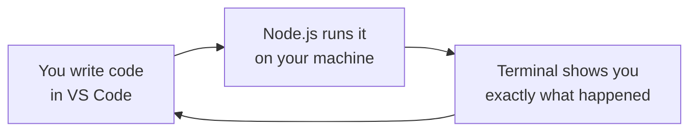

# The Deal: Installing Node.js and VS Code

The Fairview Founders Table meets the last Thursday of every month in the back room of Grindstone Coffee, under a laminated city map left over from when the place was a bike shop. Fourteen people, four folding tables pushed into a rectangle, a whiteboard with the words **IS THIS THING ON?** ghosted permanently into it since sometime around 2019. Nobody knows who wrote it. Nobody has successfully erased it.

This is where Nate and Kai met, and where this whole thing starts.

**Nate** is a self-taught builder. He learned to code the unglamorous way — dumb little automation scripts at 2am because he couldn't stop, not because anyone assigned it. His `~/projects` folder has fourteen directories in it. Eleven are named after food. Zero have ever had a user.

**Kai** does grant writing and program coordination in Fairview — the orbit of city hall without being city hall. She has read more procurement PDFs than anyone should have to, and she is good at it. Two years ago she wrote a proposal that actually got funded, for a program that actually launched, and then watched the "system" for running it turn out to be a shared spreadsheet named `FINAL_v3_USE THIS ONE.xlsx` that broke roughly every six weeks. Nobody with software skills was in the room when it mattered. She has not gotten over it.

She showed up to the Founders Table with the idea and no way to build it. He showed up with the ability to build and nothing worth finishing.

"So what if we just did one," Kai said, mostly as a joke. "One thing. Together. Instead of two half-things separately."

Nate had eaten three of the everything bagels that were meant for the whole table. He put the fourth one down.

"Demo Night's in four weeks," he said. Demo Night is the next Founders Table — eight minutes each, show whatever you've got, no judges, no prizes, and one projector that inexplicably only accepts VGA. "We'd have to show something real."

"I'm aware."

"Okay." He turned her laptop around toward himself. A 2019 ThinkPad with a Fairview Public Library sticker peeling off the lid. "Then you need two things installed tonight, and we start."

She pulled out a yellow legal pad and wrote **Q1** at the top of a fresh page.

"What are you doing?"

"Numbering my questions," Kai said. "I'm going to have a lot of them. It'll go faster if we can refer back."

That's this chapter. Two installs, on a real laptop, that night — and you're doing them right alongside her, because you need the exact same two things.

## Coder's Corner: What You're Actually Installing

Step out of the room for a second, because you deserve to know what you're doing and why, not just "click here, click there."

**Node.js** is a *runtime* — a program that runs JavaScript on your actual computer, outside of a web browser. That distinction matters more than it sounds like it does. JavaScript was born inside browsers, running the buttons and forms on web pages. It could not touch your files, open a server, or do anything outside the tab it lived in. Node.js changed that: it takes the same language and gives it the ability to read files, talk to networks, and run as a normal program on your machine. Installing Node means you can write a line of JavaScript, run it on your own laptop three seconds later, and see exactly what it did. That fast loop is the entire reason this is learnable at all.

**VS Code** (Visual Studio Code) is where you'll write that JavaScript. Technically you could use any plain text editor — Notepad, TextEdit, whatever. Practically, that's like taking notes in a meeting with your eyes closed. VS Code color-codes your code so mistakes jump out, underlines typos before you ever run anything, and has a terminal built into the same window so you're not juggling apps. It's free, and it's what a very large share of working developers use every day.

Two things. One writes, one runs. That's the whole setup.

## 1. Install Node.js

Head to **nodejs.org/en/download**. The page tries to detect your operating system, but check that the dropdowns actually match your machine (Windows, macOS, or Linux).


Grab the **LTS** version. LTS stands for Long-Term Support — it's the release line that gets security fixes for years and that basically every tutorial, library, and tool assumes you're on. There's usually a shinier "Current" build sitting right next to it. Don't take it yet.

> **Q1.** *"Why not the newest one?"* Kai asked. Nate said "because you always want the newest thing," which is not an answer, and he knew it about four seconds after saying it. The actual answer: Current gets the newest language features but also the newest breakage, and libraries lag behind it. LTS is the boring, stable one that everything else is tested against. Newer is not automatically better; *supported* is better. She wrote that down.

Run the installer. Click through it like any other app — the defaults are correct, you don't need to touch anything under "Advanced." When it finishes, **close and reopen any terminal windows you already had open.** A terminal reads your system's list of installed programs when it starts up, so an old window won't know Node exists yet.

## 2. Install VS Code

Head to **code.visualstudio.com/download** and grab the build for your operating system.


Install it the same way — open the file, click through, accept the defaults. Then open VS Code once, just to confirm it launches. You don't need to configure anything, install a theme, or pick extensions yet. Resist. That's a two-hour hole and you have four weeks.

## 3. Verify the Install

This is the step everyone skips and then regrets an hour later. Open a terminal — in VS Code that's **View → Terminal** — or use your system's own Terminal / Command Prompt app. Type these two commands, one at a time:

```bash
node -v
npm -v
```

If both print back a version number, you're set up.


`node -v` confirms the JavaScript runtime is alive. `npm` — Node Package Manager — comes bundled with Node and is how you'll eventually pull in other people's code instead of writing everything yourself. You won't lean on it for a while, but it rides along, so we check it now.

This is where Kai wrote **Q2** and Nate learned something.

Her screen said `v22.14.0` for the first command and `10.9.2` for the second.

"These are different numbers."

"They're — " Nate leaned in. "Huh."

"You said `npm` comes with Node. If it comes with Node, why is it a different version?"

He opened his mouth, closed it, and actually looked it up, which is the correct move and the one most people skip. **They're two separate programs.** Node is the JavaScript runtime. npm is a package manager written *in* JavaScript that happens to be distributed alongside Node as a convenience. Each has its own version history and its own release schedule. A given Node release just bundles whatever npm version was current at the time. So `node -v` and `npm -v` printing wildly different numbers isn't a broken install — it's the normal, expected, correct state of things, and if they ever *did* match it would be a coincidence.

"So 'comes with' means 'shipped in the same box,'" Kai said, "not 'is the same product.'"

"Yeah." Nate wrote it on the ghosted whiteboard, under **IS THIS THING ON?**. "Yeah, that's exactly it."

## 4. Write the First Line

Time to make Node say something. In VS Code, create a new file and save it as `hello-fairview.js`. Type this in:

```js
// hello-fairview.js
// First words. First proof the machine is listening.

console.log("Two builders. Zero product.");
console.log("Demo Night: 4 weeks out.");
```

Save it. Then, in the terminal, navigate to the folder where you saved it and run:

```bash
node hello-fairview.js
```

Two lines print back at you. That's the entire loop, start to finish — you told a machine exactly what to say and it said it. `console.log()` is how JavaScript talks back to you, and you will use it constantly, not to show off but to check your own work. Working professionals still use it every single day. Don't let anyone tell you it's beneath you.



Write it, run it, read what came back, change it. That loop never changes. Not when your code is four lines, not when it's forty thousand.

**Q3** came in while the terminal was still showing the output.

"Does the `.js` at the end actually do anything," Kai asked, "or is it a label for humans?"

"It's a label," Nate said. "Node just reads the file."

Half right, which is the most dangerous kind of right. Two separate things read that extension:

- **VS Code** uses it to decide how to treat the file — JavaScript syntax highlighting, error underlines, autocomplete. Save the exact same text as `hello-fairview.txt` and VS Code stops helping you entirely. It's plain gray text now.
- **Node** uses it to decide *which module system* the file uses. `.mjs` means ES modules (`import`/`export`). `.cjs` means CommonJS (`require`). Plain `.js` means "whatever the nearest `package.json` says, and if there isn't one, CommonJS." You are not using modules yet and don't need to care about the difference today — but the extension is genuinely load-bearing, not decoration.

"So it's not a label."

"It's not a label," Nate agreed.

## Sanity Checks

- **`node -v` says "command not found."** Your terminal was open before the install finished, so it doesn't know Node exists. Close every terminal window and open a fresh one. If it still fails, restart the machine — annoying, occasionally necessary.
- **`node hello-fairview.js` says it can't find the file.** Your terminal isn't sitting in the folder where you saved it. Use `cd` to navigate there, or right-click the folder and look for "Open in Terminal" / "Open in Integrated Terminal."
- **Nothing prints at all.** Check that you saved. VS Code puts a small filled dot on the tab when there are unsaved changes — that dot needs to be gone before you run anything.
- **`node -v` and `npm -v` print different numbers.** Correct. That's expected. See above.
- **You typed the code and it looks gray and lifeless.** Your file probably isn't saved with a `.js` extension yet. Save it properly and the colors show up.

Nate closed the laptop lid halfway. "Okay. So we've got a runtime, an editor, and four weeks."

"And no idea what we're building."

"We have *some* idea what we're building."

"We have my idea," Kai said. "We do not have a plan."

"Details." He picked the fourth bagel back up. "Also I think we should call the company Bagel Logic."

"No."

Next: `01-why-javascript.md` — The Vision.
