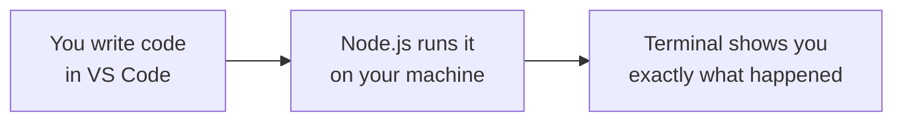

# Suit Up: Installing Node.js and VS Code

AutoNate is eighteen. Grew up two bus transfers from downtown, the kind of neighborhood where the wifi at the corner store was more reliable than the wifi at home, where everybody's got a cousin who's "real good with computers" and nobody's real sure what that means. He's not new to a screen — he's beaten every game worth beating, he's the one who fixes the group chat when it breaks, he's quick. But quick isn't the same as trained. And AutoNate just found out there's a difference.

Last night he was scrolling and landed on a stream he couldn't look away from: the **Virtual Battle Bot League**. Two colonies, built entirely out of code, going room to room — gathering resources, building defenses, making calls under pressure, live, with real stakes. No controller. No joystick. Just people who wrote something smart enough to think for itself and then watched it go to work. The chat was going crazy. The commentary kept saying the same thing over and over: this bot's architecture is clean. AutoNate didn't know exactly what that meant yet. But he knew he wanted to be the one people said it about.

Here's the thing about a goal like that, though — you don't walk into the ring on day one. Every fighter you've ever respected had a first gym, a first pair of wraps, a first coach who made them do the boring fundamentals before they ever threw a real combination. Before AutoNate writes a line of code that does anything, he needs two pieces of gear. Not expensive. Not complicated. But non-negotiable. This chapter is him getting them — and you're getting them right alongside him, because you're going to need the exact same two things.

## Coder's Corner: What You're Actually Installing

Let's step out of the story for a second, because you deserve to know exactly what you're doing and why, not just "click here, click there."

**Node.js** is a runtime — a program that lets JavaScript run on your actual computer, outside of a web browser. Here's why that matters: JavaScript was born inside browsers, running the buttons and forms on websites. But the language grew up. Now it runs servers, powers apps, and — this is the part that matters to you — it's exactly what a Screeps colony runs on. Your Screeps bot isn't executing inside a browser tab. It's a JavaScript program the Screeps servers run for you, tick after tick, the same way Node.js would run it on your machine. Installing Node now means you can write JavaScript, run it instantly on your own laptop, see what it does, and understand it cold before you ever touch the game. It's your training gym before the ring.

**VS Code** (Visual Studio Code) is where you'll actually write that JavaScript. Technically, you could write code in any plain text app. Practically, that's like showing up to a fight with your hands untaped. VS Code color-codes your code so mistakes jump out at you, catches typos before you even run anything, and gives you a built-in terminal so you're not bouncing between five different windows. It's free. It's what a huge share of working developers use every day, including the ones building the tools you'll use for Screeps and beyond. You're not just installing an app — you're stepping into the same gym the pros train in.

## 1. Install Node.js

Head to **nodejs.org/en/download**. The page automatically detects your operating system, but double check the dropdowns match your machine (Windows, macOS, or Linux).


Grab the **LTS** version — that stands for Long-Term Support. Not the newest, flashiest release; the one that's been tested and won't randomly break on you. You want the reliable elder, not the reckless rookie.

Run the installer. Click through it like any other app — the defaults are correct, you don't need to touch anything advanced. When it finishes, close and reopen any terminal windows you had open (Node won't show up in an old one).

## 2. Install VS Code

Head to **code.visualstudio.com/download** and grab the build for your operating system.


Install it the same way — open the file, click through, accept the defaults. When it's done, open VS Code once just to confirm it launches. You don't need to configure anything yet.

## 3. Verify Your Gear

This is the step people skip and then regret. Open a terminal — on VS Code, you can do this with **View → Terminal**, or use your system's own Terminal / Command Prompt app. Type these two commands, one at a time:

```bash
node -v
npm -v
```

If both print back a version number, you're suited up. `node -v` confirms the JavaScript runtime is alive. `npm` — Node Package Manager — rides along with Node and is how you'll eventually pull in other people's code instead of building everything from scratch. You won't need it heavily yet, but it's part of the gear, so we check it now.




That loop — write it, run it, read what came back — is the whole game from here on out. Every lesson in this pack runs through that same loop. Get comfortable with it now, because it never really changes, even once your code gets a hundred times more complex.

## 4. Throw Your First Line

Time to make Node say something. Open VS Code, create a new file, save it as `hello-autonate.js` (the `.js` tells VS Code — and Node — that this is JavaScript). Type this in:

```js
// hello-autonate.js
// First words. First proof the machine is listening.

console.log("AutoNate is in the building.");
console.log("Rookie Division. Eyes on the League.");
```


Save it. Then, in the terminal, navigate to wherever you saved that file and run:

```bash
node hello-autonate.js
```

If you see those two lines print back at you, that's it. That's the whole loop, start to finish. You just told a machine exactly what to say, and it said it. `console.log()` is how JavaScript talks back to you — you'll use it constantly, not just to show off, but to check your own work as you go. Professionals still use it every single day. Don't let anybody tell you it's beneath you.

## 5. Sanity Checks

If `node -v` says "command not found": the installer probably needs a restart of your terminal, or in rare cases your machine, before it recognizes the new install. Close everything and try again.

If `node hello-autonate.js` says it can't find the file: your terminal isn't sitting in the same folder where you saved it. Use `cd` (change directory) to navigate there, or right-click the file's folder and look for an "Open in Terminal" option.

If nothing prints at all: double check you saved the file after typing the code. VS Code shows a small dot on the tab when there are unsaved changes — make sure that dot is gone.

You've got your gear now. Node runs your code. VS Code is where you write it. That's the gym. Next chapter, AutoNate finds out exactly what kind of language he just signed up to learn — and why it's the same one running every bot in the League.

Next: `01-why-javascript.md` — The Vision.
