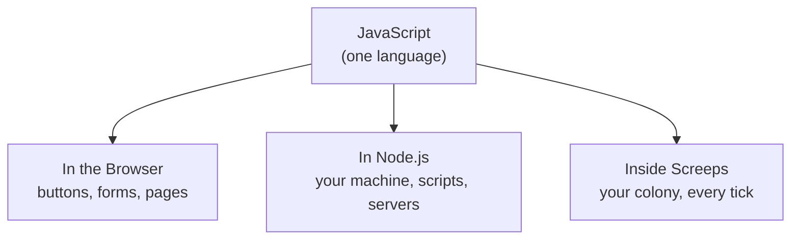

# The Vision: Why JavaScript (and Where It Runs)

Gear's on. Now AutoNate's got a question that's bigger than any install screen: what is he actually learning, and why this and not something else?

He goes back to the stream from last night, this time really watching instead of just hyped. Every bot in the Virtual Battle Bot League is running the same language under the hood: **JavaScript**. Not because it's the only option out there — there's a hundred ways to build software — but because JavaScript is the one language that shows up almost everywhere you look. It's what runs behind nearly every website you've ever opened. It's what runs servers, apps, and — the part that matters most right now — it's exactly what the Virtual Battle Bot League runs on. Learn this one language well, and you're not just learning to play a game. You're learning the language the whole internet runs on.

AutoNate's cousin used to say something that stuck with him: "You don't have to be from money to be from somewhere." Same energy here. You don't need a computer science degree or a fancy laptop to start. You need the willingness to sit with something confusing until it isn't anymore. That's it. That's the actual prerequisite.

## Coder's Corner: One Language, Three Places It Lives

JavaScript runs in three places you'll care about, and it's worth knowing the difference so nothing catches you off guard later.

**In the browser.** This is where JavaScript was born — making buttons click, forms submit, pages update without a full reload. If you've ever seen a website change without the page flashing white and reloading, that's JavaScript at work.

**In Node.js**, which you just installed. This lets JavaScript run directly on your machine, no browser required. That's what you did in the last chapter when you ran `node hello-autonate.js`.

**Inside Screeps**, which is the one you're actually here for. Your Screeps colony is a JavaScript program that the Screeps servers run for you automatically, over and over, forever — once every "tick." You don't click a button to make your colony act. You write code once, and it keeps running, making the same decisions, tick after tick, whether you're watching or asleep.



That last one — "every tick" — is the whole reason this game is such a good teacher. Most code you'll write as a beginner runs once and stops. You run it, it does its thing, it's done. A Screeps colony is different. It runs continuously, over and over, and it has to keep making good decisions without you sitting there holding its hand. That's a completely different kind of thinking, and it's exactly the kind of thinking real software engineers get paid for. You're not just learning to code. You're learning to build things that run on their own.

## Run It and Watch It Talk

Let's prove the "runs on its own, keeps talking to you" idea right now. Create a new file in VS Code called `autonate.js`:

```js
// autonate.js
// AutoNate's first move: check what the system gave him.

const fighter = {
  name: "AutoNate",
  age: 18,
  weightClass: "Rookie Division",
  wins: 0,
  goal: "Virtual Battle Bot League",
};

function announce(fighter) {
  console.log(`${fighter.name}, ${fighter.age}, stepping up from ${fighter.weightClass}.`);
  console.log(`Record: ${fighter.wins} wins. Eyes on: ${fighter.goal}.`);
}

announce(fighter);
```

Don't worry yet about every piece of that — `const`, the curly braces, the backticks. You'll learn every one of those in the next few chapters, piece by piece. Right now, just run it:

```bash
node autonate.js
```


You should see AutoNate's stats print straight back at you. That's a program describing itself, out loud, because you told it to. That's the whole trick behind everything from a Screeps colony announcing "low on energy" to a video game character saying their own name. Somebody wrote a `console.log()` and meant it.

## Try It Yourself

Open `autonate.js` back up and change a few values — the `name`, the `weightClass`, maybe bump `wins` up to `3`. Save it, run `node autonate.js` again, and watch the output change to match. That's the loop: change the code, run it, read what came back. You're going to do that ten thousand times over the course of your career. Might as well get good at it now.

Next chapter, AutoNate learns to actually understand what's sitting in that `fighter` object — what a string is, what a number is, and why the difference matters more than you'd think.

Next: `02-variables-types-and-values.md` — Know Your Pockets.
