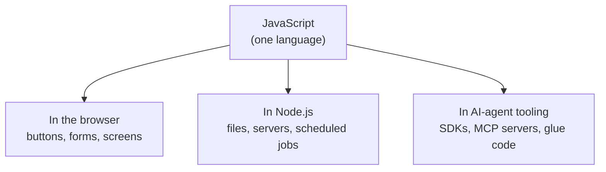

# The Vision: Why JavaScript (and Where It Runs)

Quick catch-up if you're just walking in: **Nate** is a self-taught builder with fourteen unfinished projects and zero users. **Kai** does grant work in Fairview and once watched a program she got funded run on a shared spreadsheet that broke every six weeks. They met at the Fairview Founders Table — a monthly builder meetup in the back room of Grindstone Coffee — and made a deal to build one real thing together instead of two half-things apart. They have four weeks until Demo Night, which is the next Founders Table, eight minutes each, one VGA projector.

Last chapter they installed Node.js and VS Code on Kai's laptop. This chapter is the question she asked in the parking lot afterward, holding the door of her car open, not getting in:

"What am I actually learning? Not 'coding.' Specifically. Which one, and why that one."

Nate said "JavaScript" and she said "why," and he said "because it's what I know," and she looked at him over the top of the car door until he said, "okay, that's not a reason, hang on."

So here's the real reason, which he texted her at 11:40 that night in four messages, and which we're going to unpack properly.

## Coder's Corner: One Language, Three Places It Lives

JavaScript is worth learning first for one specific, unglamorous reason: it is the only language that runs in all three of the places a small team building software today actually needs to work.

**In the browser.** This is where JavaScript was born and where it has no competition. Every dropdown that opens, every form that validates before you hit submit, every page that updates without flashing white and reloading — that's JavaScript. If the thing you're building has a screen someone clicks on, JavaScript is running it. There is no version of this where you pick something else.

**On a server, through Node.js** — the thing you installed last chapter. Node lets the same language run directly on a machine, no browser involved: reading and writing files, handling web requests, talking to a database, running on a schedule at 3am while nobody's watching. Before Node existed you learned one language for the browser and a completely different one for the server. Now you can learn one and work on both ends of a real system.

**In AI-agent tooling.** This is the part that matters most for where Nate and Kai are headed. The overwhelming majority of the tooling for building with AI agents — the SDKs, the MCP servers, the orchestration frameworks, the little glue scripts that make an agent actually useful instead of just impressive — ships in JavaScript/TypeScript first, or exclusively. (TypeScript is JavaScript with a type-checking layer bolted on top; learn JavaScript and you're most of the way there.) Knowing this language is the difference between reading about agent systems and building one.



One language, three rooms. That's the entire pitch. It's not that JavaScript is the most elegant language ever designed — it isn't, and people will tell you so at length. It's that it's the one with a door into every room you need to be in.

## The Question That Broke Nate's Brain a Little

Kai wrote **Q4** on the legal pad the next evening, at her kitchen table, VS Code open.

"You keep saying 'JavaScript' and 'Node' like they're the same word. Are they the same thing?"

"Yeah, Node's just JavaScript."

"Then why does it have a different name?"

Silence. The specific silence of someone realizing they've been using two words interchangeably for six years without ever checking whether that was allowed.

"Okay, actually — let me check that one."

Here's the real answer, and it's worth getting straight now because it prevents about a dozen confusing errors later.

**JavaScript is the language.** The rules of the language — what `const` means, how a `for` loop works, what `+` does — are written down in a formal standard called **ECMAScript**, maintained by a committee, updated once a year. That standard defines the grammar and a small set of built-ins (`Math`, `JSON`, `Array`, and so on). That's it. The standard does not say anything about files, or networks, or web pages.

**A runtime is a program that executes that language and hands it superpowers.** Node.js is a runtime. Chrome is a runtime. Both of them actually use the *same* engine underneath — V8, built by Google — to execute the language part. What differs is what each one hands you on top:

- The browser hands you `document` (the page), `window`, `fetch`, `localStorage`, and the ability to draw things on a screen. It does **not** hand you the ability to read a file off the user's hard drive, on purpose, because that would be a catastrophe.
- Node hands you `fs` (the filesystem), `process`, `http`, and access to the machine it's running on. It does **not** hand you `document`, because there is no page. There's no screen. There's a terminal and a hard drive.

So "JavaScript" is the language and "Node" is one place it runs. They're not synonyms. And you can prove all of this in about fifteen seconds, which is exactly what Kai asked for, because "where's that from?" is not a rhetorical question when she says it.

## Prove It Yourself

Create a new file called `where-it-runs.js`:

```js
// where-it-runs.js
// Same language. Different room. Different furniture.

console.log("--- what this runtime gave me ---");

// Part of the LANGUAGE. Exists literally everywhere JavaScript runs.
console.log("Math:", typeof Math);
console.log("JSON:", typeof JSON);

// Given to you by the BROWSER. Not by the language.
console.log("document:", typeof document);
console.log("window:", typeof window);

// Given to you by NODE. Not by the language.
console.log("process:", typeof process);
console.log("Node version:", process.version);
```

Run it:

```bash
node where-it-runs.js
```

You'll get something very close to this:

```
--- what this runtime gave me ---
Math: object
JSON: object
document: undefined
window: undefined
process: object
Node version: v22.14.0
```

Read that output slowly, because it's the whole lesson in six lines. `Math` and `JSON` are there — they're part of the language, so they come with you everywhere. `document` and `window` are `undefined` — not an error, not a crash, just *absent*, because there is no web page here and Node was never going to pretend otherwise. And `process` is there, because Node is running on a real machine and is happy to tell you about it.

If you pasted the identical file into a browser's developer console, you'd get the exact mirror image: `document` and `window` would be objects, and `process` would be `undefined`. Same language. Different furniture.

> **`typeof` on an undefined name doesn't crash.** This is a genuine quirk worth knowing: normally, referencing a variable that doesn't exist throws a `ReferenceError`. But `typeof someNameThatDoesNotExist` is special-cased in the language to return the string `"undefined"` instead of blowing up. That's exactly why it's the safe way to ask "do I have this?" — which is what we just did.

Kai underlined `document: undefined` twice. "So when a tutorial online says 'just add this to your page' and it doesn't work in my terminal —"

"— it's because it was written for the browser and you're in Node. Yeah." Nate rubbed his face. "That's like a solid third of everything I struggled with when I started, and I never actually knew why until right now."

## Now Make It Say Something Real

Same loop as last chapter — write it, run it, read it back. Make a file called `project.js`:

```js
// project.js
// What we're building, stated out loud, so it's harder to quietly abandon.

const project = {
  team: ["Nate", "Kai"],
  building: "an idea tracker for the Founders Table",
  language: "JavaScript",
  weeksLeft: 4,
  shipped: false,
};

function statusReport(p) {
  console.log(`${p.team.join(" + ")} are building ${p.building}.`);
  console.log(`Language: ${p.language}. Weeks left: ${p.weeksLeft}.`);
  console.log(`Shipped: ${p.shipped ? "yes" : "not yet"}.`);
}

statusReport(project);
```

```bash
node project.js
```

Don't worry about every piece of that yet — `const`, the curly braces, the backticks, the question mark. You'll learn every single one of those in the next four chapters, in order, on purpose. Right now just notice that it ran, and that the output describes the thing they actually agreed to do.

Which, for the record, was a compromise. Kai's real idea — the one she came in with — was a signup and roster system for Fairview's youth programs, the thing that should have existed instead of `FINAL_v3_USE THIS ONE.xlsx`. Nate did the math out loud on a napkin and said four weeks, two people, one of whom learned what a terminal was on Thursday, was not that. So they scoped down hard: build an **idea tracker for the Founders Table itself** — every idea anyone pitches at the meetup, who pitched it, how many people wanted it. Small. Boring. Finishable.

"It's not the thing," Kai said.

"It's not the thing," Nate agreed. "It's proof we can finish a thing. Then we build the thing."

She wrote that on the legal pad without a question number next to it.

## Try It Yourself

Open `project.js` and change a few values — swap `weeksLeft` down to `3`, flip `shipped` to `true`, add your own name to the `team` array. Save, rerun, watch the output change to match. Then break it on purpose: delete the `p.` in front of `p.language` and run it again. You'll get a `ReferenceError` telling you exactly which name it couldn't find. Read the error. Getting comfortable reading errors instead of flinching at them is worth more than any single piece of syntax in this pack.

## Sanity Checks

- **`process is not defined`.** You ran the file in a browser console instead of Node. Run it with `node where-it-runs.js` in a terminal.
- **`document is not defined`** (a real error, not the string `"undefined"`). You dropped the `typeof` and referenced `document` directly. `typeof document` is safe; bare `document` throws in Node.
- **Your Node version prints something other than v22.** Completely fine. Any current LTS release runs everything in this pack.
- **You get `SyntaxError: Invalid or unexpected token` on the backtick lines.** Backticks (`` ` ``) are not single quotes. They're the key above Tab on most keyboards. Template literals only work with backticks.
- **The output prints but the values look wrong.** Confirm you saved the file first. Node runs what's on disk, not what's on your screen.

Nate's last text that night, at 11:52: *ok so if we're doing this for real we need a name. thinking Nitrocold. like nitro cold brew. because we move fast and we're*

Kai's reply, at 11:53: *No. It sounds like a decongestant.*

Next chapter, Kai finds out what's actually inside that `project` object — and finds a bug in Nate's vote-counting code that he'd been staring at for twenty minutes.

Next: `02-variables-types-and-values.md` — Know Your Pockets.
