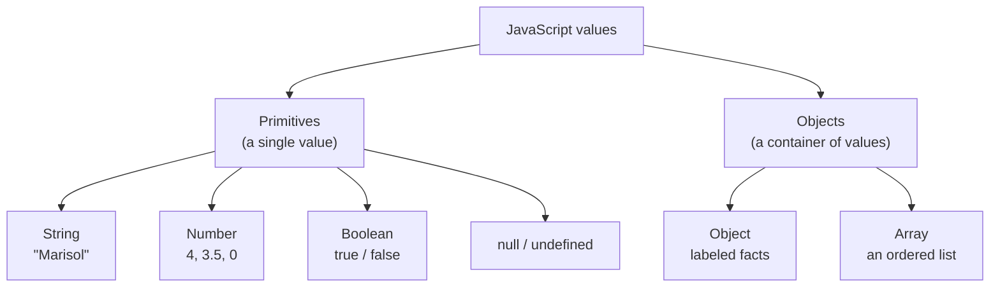

# Know Your Pockets: Variables, Types, and Values

If you're just joining: **Nate** is a self-taught builder with a folder of fourteen abandoned side projects. **Kai** writes grants in Fairview and has never written a line of code before this month. They met at the Fairview Founders Table — a monthly builder meetup in the back of Grindstone Coffee — and agreed to build one real thing together: a tracker for every idea people pitch at that meetup. They have three and a half weeks until Demo Night.

Saturday morning, back room, ten a.m. Nate had brought a jar of chili crisp and was putting it on a breakfast sandwich the coffee shop had not designed for that. Kai had the sticky notes from the last meetup spread across the table in five rows — every idea anyone pitched, and a hand-drawn tally of who said they'd use it.

Nate had already typed the counts into a file. He had also been staring at that file for twenty minutes with an expression Kai would later describe as "a man being lied to by furniture."

"The total is coming out wrong."

"How wrong?"

"It says forty-three."

Kai looked at the sticky notes. Four votes on hers. Three on Marisol's. "It says forty-three."

"It says forty-three."

We'll get to why in a minute. First, the thing that has to be true before that sentence makes any sense.

## Coder's Corner: Variables

Before your program can do anything useful, it needs somewhere to hold information — a name, a count, a decision it made two lines ago that it needs to remember now. That "somewhere" is a **variable**.

You create one with `const` or `let`:

- `const` means **this name will always point at this value.** You can't reassign it.
- `let` means **this name is allowed to point at something else later.**

```js
const meetup = "Fairview Founders Table";  // never changing
let weeksLeft = 4;                          // definitely changing
weeksLeft = 3;                              // fine — that's what let is for
```

Use `const` by default. Only reach for `let` when you genuinely know the value is going to be reassigned — a countdown, a running total, a flag that flips. This isn't pedantry: every `const` is a promise to your future self that this name can't quietly become something else forty lines down. Fewer moving parts, fewer surprises.

There's an older keyword, `var`, that you'll see in old tutorials and old code. It has scoping behavior that causes real bugs (we'll hit that in chapter 04). You never need it. Use `const` and `let`.

## The Core Types

A variable holds a **value**, and every value in JavaScript has a **type** — what kind of thing it is, which determines what you're allowed to do with it. Here's the working lineup:

- **String** — text, always in quotes. `"Marisol"`, `'tool library'`
- **Number** — any number, whole or decimal, no quotes. `4`, `3.5`, `0`
- **Boolean** — exactly `true` or `false`. A yes-or-no switch.
- **Array** — an ordered list of values, in square brackets. `["Nate", "Kai"]`
- **Object** — grouped, labeled facts, in curly braces. `{ votes: 4, owner: "Kai" }`
- **`null`** — deliberately empty. "There is no value here, and I meant that."
- **`undefined`** — not set. "Nobody put anything here yet."



Notice the split in that diagram, because it's the real organizing idea. **Primitives** are single, indivisible values. **Objects** are containers that hold other values — and arrays are a specialized kind of object, which is going to matter in about ninety seconds.

Here's the backlog, typed out properly:

```js
// backlog.js
// What's actually in our pockets.

const meetup = "Fairview Founders Table";   // string
const ideaCount = 5;                         // number
const readyForDemo = false;                  // boolean
const founders = ["Nate", "Kai"];            // array
const topIdea = {                            // object
  title: "Youth program signups that aren't a spreadsheet",
  owner: "Kai",
  votes: 4,
  builtBy: null,                             // nobody yet, and we know it
};

console.log(meetup, ideaCount, readyForDemo);
console.log(founders[0]);
console.log(topIdea.title);
console.log(topIdea.votes);
```

```bash
node backlog.js
```

Two things worth pointing at. `founders[0]` grabs the **first** item — counting starts at zero, not one. It feels wrong for about a week and then feels normal forever. And `topIdea.title` reaches into the object with a dot and the exact label you want. That dot is you saying "open that container, hand me the thing labeled `title`."

Also notice `builtBy: null`. That is not a placeholder to clean up later. It's the code honestly saying "nobody is building this yet," which is real information a real system needs. Empty and unknown are different states, and `null` is how you say the first one on purpose.

## Checking What You've Got

Sometimes you don't know what type a value is — it came from somewhere else, or from a file, or from a person. `typeof` tells you:

```js
console.log(typeof meetup);        // "string"
console.log(typeof ideaCount);     // "number"
console.log(typeof readyForDemo);  // "boolean"
console.log(typeof topIdea);       // "object"
console.log(typeof founders);      // ...
```

Kai ran it, got to the last line, and stopped. **Q7.**

"It says `founders` is an object."

"It says what?"

"`typeof founders` returns `"object"`. Not `"array"`. You told me array was one of the types." She turned the laptop. "Where's that from?"

Nate looked at it for a while.

This one is real, and Nate had genuinely never thought about it, and the honest answer is: **arrays are objects.** JavaScript has exactly seven primitive types — string, number, boolean, `null`, `undefined`, plus two you won't touch for a long time (`bigint` and `symbol`) — and then *everything else* is an object. Arrays are objects with numeric keys and a `length` property and a pile of useful methods bolted on. Functions are objects too. So `typeof` can't distinguish an array from a plain object, because at the level `typeof` operates, there's nothing to distinguish.

The way you actually check:

```js
console.log(Array.isArray(founders));   // true
console.log(Array.isArray(topIdea));    // false
```

`Array.isArray()` exists precisely because `typeof` can't do this job. Use it when you need to know.

And while we're in here, one more piece of genuine JavaScript wreckage worth knowing before it confuses you at midnight:

```js
console.log(typeof null);   // "object"  ← this is a bug. From 1995. It's never being fixed.
```

`null` is a primitive. `typeof null` returning `"object"` is a mistake in the original implementation that shipped, got depended on, and can now never be changed without breaking the web. It is not you. It has never been you.

"So the type list you gave me was simplified," Kai said.

"The type list I gave you was simplified," Nate said. "It's the right list to *use*. It's just not the list the language actually has."

She wrote both lists down. Separately.

## The Forty-Three

Now the bug. Here's what Nate had actually typed, because he'd copy-pasted the tallies out of a text message he'd sent himself at the meetup:

```js
// tally.js — the broken version

const kaiVotes = "4";
const marisolVotes = "3";

const total = kaiVotes + marisolVotes;
console.log(`Total votes: ${total}`);   // "Total votes: 43"
```

`"4"` and `"3"` are **strings**. Text. They look like numbers to you because you're a person. To JavaScript they're characters, no different from `"cat"` and `"dog"`.

And the `+` operator does two completely different jobs depending on what you hand it:

- Given two numbers, it adds them. `4 + 3` → `7`
- Given a string on either side, it **concatenates** — glues them end to end. `"4" + "3"` → `"43"`

That's it. That's the whole bug. Nate wasn't adding, he was gluing.

The part that makes this genuinely nasty is that the other math operators don't behave the same way:

```js
console.log("4" + "3");   // "43"    ← string concatenation
console.log("4" - "3");   // 1       ← subtraction; no string meaning, so JS converts
console.log("4" * "3");   // 12      ← same
console.log("10" / "2");  // 5       ← same
```

Only `+` is overloaded, because only `+` has a meaning for text. Every other operator gives up and converts to numbers. So a bug like this can hide for a long time in code that mostly does multiplication and then explodes the first time someone adds something up.

**Q8**, immediately: "Then how do you know when a number is a real number?"

Ask:

```js
console.log(typeof kaiVotes);   // "string"  ← there it is
```

And convert on the way in:

```js
// tally.js — fixed

const kaiVotes = Number("4");
const marisolVotes = Number("3");

console.log(typeof kaiVotes);            // "number"
console.log(kaiVotes + marisolVotes);    // 7
```

`Number()` takes a value and converts it to a number. Its close cousin `parseInt()` does something slightly different, and the difference matters:

```js
console.log(Number("4"));          // 4
console.log(Number("4 votes"));    // NaN   ← the whole string has to be a number
console.log(parseInt("4 votes", 10)); // 4  ← reads from the front, stops at garbage
console.log(Number(""));           // 0     ← careful. empty string becomes zero.
console.log(Number("  7  "));      // 7     ← whitespace is fine
```

`Number()` is strict: the entire string has to look like a number or you get `NaN`. `parseInt()` is forgiving: it reads digits off the front and quits when it hits something that isn't one. That second argument, `10`, is the **radix** — the number base. Modern JavaScript defaults to base 10 for you, but passing it explicitly is a habit worth building, and every linter will ask you for it.

Watch out for `Number("")` returning `0`. An empty input silently becoming zero is the source of a real category of bugs — a blank form field that turns into a legitimate-looking count.

And then there's `NaN`, which stands for Not a Number, and which is — obviously —

```js
console.log(typeof NaN);        // "number"
console.log(NaN === NaN);       // false  ← NaN is not equal to itself
console.log(Number.isNaN(NaN)); // true   ← this is how you actually check
```

`NaN` is the value you get when a numeric operation fails. It's *typed* as a number because it's the result of number math that didn't work out. And it is famously not equal to itself, which is why comparing against it never works and `Number.isNaN()` exists.

"This language has a lot of scar tissue," Kai said.

"It's thirty years old and it can't break anything anyone already shipped." Nate scraped the last of the chili crisp out of the jar. "Every weird thing in it is somebody's decision from 1997 that got permanent."

## The Other Thing const Doesn't Do

**Q9**, later that afternoon, and this one caught Nate flat.

Kai had been editing the backlog object:

```js
const topIdea = {
  title: "Youth program signups that aren't a spreadsheet",
  owner: "Kai",
  votes: 4,
};

topIdea.votes = 5;
console.log(topIdea.votes);   // 5
```

"You said `const` means it can't change."

"It — yeah."

"It changed."

Nate stared at it. Then said the sentence that makes him worth learning from: "Okay, actually, let me check that one."

**`const` prevents reassignment of the name. It does not freeze the value.**

```js
const topIdea = { votes: 4 };

topIdea.votes = 5;      // ✅ fine — changing what's INSIDE the object
topIdea = { votes: 5 }; // ❌ TypeError: Assignment to constant variable.
```

Think of `const` as a label welded onto a specific box. You can't move the label to a different box. Nobody said anything about what's in the box.

For primitives this distinction never comes up, because there's nothing inside a `4` to change — which is exactly why it's so easy to hold the wrong mental model for years without getting caught. It only shows up the moment you `const` an object or an array:

```js
const founders = ["Nate", "Kai"];
founders.push("Marisol");   // ✅ fine — the array is still the same array
console.log(founders);      // ["Nate", "Kai", "Marisol"]
```

If you genuinely need the contents locked too, that's a separate tool:

```js
const locked = Object.freeze({ votes: 4 });
locked.votes = 99;
console.log(locked.votes);   // 4 — the change silently did nothing
```

(Silently. In non-strict mode it fails without complaining, which is its own small horror. You will rarely need `Object.freeze`. Know it exists.)

Kai wrote it as one line on the legal pad and read it back out loud: *"const locks the name, not the contents."*

"That's better than how I've ever said it," Nate admitted.

## Try It Yourself

Open `backlog.js` and add a second idea object — Marisol's tool library checkout system, three votes, owner `"Marisol"`. Then:

1. `console.log` the sum of both ideas' votes and confirm you get `7` and not `"43"`.
2. Deliberately break it: wrap one of the vote counts in quotes, rerun, and watch the total go wrong.
3. Add `console.log(typeof idea.votes)` to find the broken one without guessing.

That third step is the actual skill. Not "avoid the bug" — you won't — but "locate the bug in one line instead of twenty minutes."

## Sanity Checks

- **Your total is a glued-together string.** At least one operand is a string. Run `typeof` on each one; wrap the culprit in `Number()`.
- **`TypeError: Assignment to constant variable.`** You tried to reassign a `const` name. Either you meant to change a property (`obj.thing = x`, no error) or you meant `let`.
- **`typeof myArray` says `"object"`.** Correct and expected. Use `Array.isArray()`.
- **Something is `NaN` and you can't figure out where it started.** `console.log` each input's `typeof` before the math. `NaN` propagates — once it enters a chain of arithmetic, every result downstream is also `NaN`, so the first `NaN` is rarely where the symptom shows up.
- **A value is `undefined` and you expected data.** You asked an object for a label it doesn't have. `topIdea.vote` (no `s`) returns `undefined` rather than erroring, which is why typos in property names are so quiet. Check your spelling against the object.

Nate wiped down the table and stacked the sticky notes. "New name idea. Chili Crisp Labs."

"You cannot name a company after a condiment."

"People name companies after fruit."

"That's *one* company," Kai said, "and they didn't mean it."

Next chapter: five ideas, three and a half weeks, and no way to decide what to build first — so they teach the program to triage.

Next: `03-control-flow.md` — Reading the Room.
