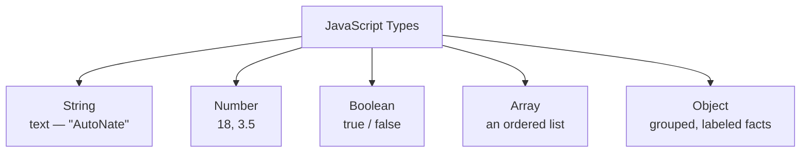

# Know Your Pockets: Variables, Types, and Values

Before you step to anybody — before a fight, before a deal, before a match — you check what you're carrying. AutoNate learned that from his moms, actually, not from a game: "Know what's in your pockets before you leave the house." Cash, keys, phone, ID. You don't leave without checking. You definitely don't get into something serious without checking.

Code works the same way. Before your program can do anything useful, it needs somewhere to hold onto information — a name, a score, a decision it made a second ago that it needs to remember three lines later. In JavaScript, that "somewhere to hold information" is called a **variable**. And just like you'd never confuse your car keys for your ID, JavaScript needs to know what kind of information it's holding, too. That's called a **type**. Mix those up, and things break in ways that are confusing until suddenly they're not.

This chapter, AutoNate learns to check his pockets.

## Coder's Corner: Declaring a Variable

You create a variable with `const` or `let`. Here's the difference, and it matters:

- `const` means "this value doesn't change." Once you set it, it's locked in.
- `let` means "this value is allowed to change later."

Use `const` by default. Only reach for `let` when you actually know the value is going to update — like a score that goes up, or energy that drains over time. Locking things down with `const` when you can isn't being lazy — it's being disciplined. Fewer things that can quietly change on you means fewer surprises later.

```js
const name = "AutoNate";  // this never changes
let wins = 0;             // this will change as he keeps winning
```

## The Core Types

JavaScript has a handful of basic types you'll use constantly. Here's the lineup:

- **String** — text, always wrapped in quotes. `"AutoNate"`, `'Rookie Division'`
- **Number** — any number, whole or decimal, no quotes. `18`, `3.5`
- **Boolean** — exactly one of two values: `true` or `false`. A yes-or-no switch.
- **Array** — an ordered list of values, wrapped in square brackets. `["laptop", "notebook", "grit"]`
- **Object** — a group of related facts, wrapped in curly braces, each one labeled. `{ wins: 0, losses: 0 }`



Here's AutoNate checking his own pockets, one type at a time:

```js
// inventory.js
// Know what's in your pockets before you step to anybody.

const name = "AutoNate";       // string  — text
const age = 18;                // number  — counts, math
const isRookie = true;         // boolean — yes or no
const gear = ["laptop", "notebook", "grit"]; // array — a list
const stats = {                // object — grouped facts
  wins: 0,
  losses: 0,
  focus: "Agentic AI systems",
};

console.log(name, age, isRookie);
console.log(gear[0]);
console.log(stats.focus);
```


A couple things worth pointing out. `gear[0]` grabs the **first** item out of the array — in programming, counting starts at zero, not one. It feels wrong for about a week and then it feels completely normal forever. And `stats.focus` reaches inside the object using a dot, followed by the exact label — `focus` — you're asking for. That dot is you saying "open that bag, hand me the thing labeled focus."

Run it the same way you've been running everything:

```bash
node inventory.js
```

You'll see all three console.log lines print, pulling values out of every type you just declared.

## Checking What You've Got

Sometimes you genuinely don't know what type something is — maybe it came from somewhere else in your code, or from user input. JavaScript gives you a tool for exactly that: `typeof`.

```js
console.log(typeof name);      // "string"
console.log(typeof age);       // "number"
console.log(typeof isRookie);  // "boolean"
```

When you're not sure, ask. That's not a beginner move — that's what every developer does, at every level, constantly. The senior engineers just do it faster, because they've built the instinct for where things tend to go sideways.

## Try It Yourself

Open `inventory.js` and add one more line to the `stats` object — maybe `nickname: "The Architect"` or a `rank` field. Then add a `console.log(stats.nickname)` (or whatever you named it) at the bottom and run the file again. If you see your new value print out, you just extended AutoNate's whole profile without breaking anything else. That's the confidence you're building — the ability to touch code and trust that you know exactly what changed.

Next chapter, AutoNate has to actually start making decisions with what's in those pockets — not just holding information, but reacting to it.

Next: `03-control-flow.md` — Reading the Room.
