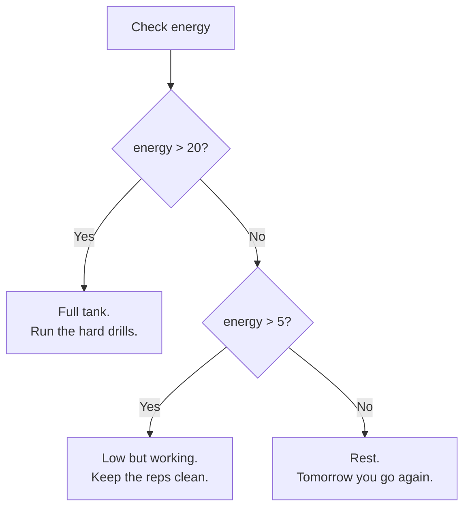

# Reading the Room: Conditionals and Loops

Anybody who's ever walked into a room they didn't fully trust knows the skill AutoNate's about to learn. You don't just react — you read first. Who's here, what's the mood, what's the play. You size it up, and then you move. Somebody who reacts without reading gets caught out. Every time.

Code needs that same instinct. A program that just runs top to bottom, no matter what's going on, isn't smart — it's just fast. What makes it smart is the ability to check something and respond differently depending on what it finds. In JavaScript, that's called a **conditional**. And once you can read the room, the next skill is doing the same drill over and over without getting bored or sloppy — that's a **loop**.

These two ideas — decide, then repeat — are the engine behind almost everything a real program does. A Screeps colony reading its own energy level and deciding whether to build or defend? Conditional. A colony checking every single creep it owns, one after another, to see who needs a new job? Loop. You're about to learn both.

## Coder's Corner: if / else

An `if` statement checks something and only runs its code when that something is true.

```js
const energy = 30;

if (energy > 20) {
  console.log("Full tank. Run the hard drills.");
}
```

That line only prints if `energy` is actually greater than `20`. Change `energy` to `5` and run it again — nothing prints, because the condition failed. The code inside the curly braces `{ }` only runs when the check passes.

Most of the time, you want a plan for when the check doesn't pass, too. That's what `else` — and `else if`, for extra branches — are for:



```js
if (energy > 20) {
  console.log("Full tank. Run the hard drills.");
} else if (energy > 5) {
  console.log("Low but working. Keep the reps clean.");
} else {
  console.log("Rest. Tomorrow you go again.");
}
```

JavaScript checks each condition top to bottom and runs the first branch that matches, then skips the rest entirely. It's not evaluating all three — it's reading the room once and committing to a response.

## Coder's Corner: Loops

A `for` loop runs the same block of code a set number of times. Think of it as your rep counter.

```js
for (let rep = 1; rep <= 5; rep++) {
  console.log(`Rep ${rep}: still standing.`);
}
```

Break that down: `let rep = 1` starts your counter at one. `rep <= 5` is the condition that's checked before every rep — as long as it's true, the loop keeps going. `rep++` bumps the counter up by one after each pass. The loop runs five times, printing "Rep 1," "Rep 2," all the way to "Rep 5," and then stops the instant `rep <= 5` turns false.

Put the whole thing together:

```js
// training.js
// Reading the room, then running the play — over and over.

const energy = 30;

if (energy > 20) {
  console.log("Full tank. Run the hard drills.");
} else if (energy > 5) {
  console.log("Low but working. Keep the reps clean.");
} else {
  console.log("Rest. Tomorrow you go again.");
}

for (let rep = 1; rep <= 5; rep++) {
  console.log(`Rep ${rep}: still standing.`);
}
```


Run it with `node training.js` and you'll see the room get read once, then five reps print in order.

## The One Trap Everyone Falls Into

If your loop's condition never becomes false, it never stops. That's called an **infinite loop**, and it will lock up your program — sometimes your whole terminal — until you force it to quit (usually `Ctrl+C`). It happens to everyone eventually, usually from forgetting the `rep++` step, or writing a condition that can never be satisfied. If you ever run something and it just... doesn't stop, don't panic. Hit `Ctrl+C`, go back, and check that your loop actually has a way to end.

## Try It Yourself

Change the `energy` value in `training.js` to something under `5` and rerun it — confirm you land on the "Rest" branch. Then change the loop to run **8** reps instead of 5 by editing the `rep <= 5` condition. If you see 8 reps print instead of 5, you just controlled exactly how many times your program repeats itself. That's not a small thing. That's the difference between code that runs once and a system — like a Screeps colony — that keeps making the same good decision, tick after tick, for as long as it's alive.

Next chapter, AutoNate stops repeating the same lines by hand and learns to package a move into something he can call by name, whenever he needs it.

Next: `04-functions-and-scope.md` — Signature Moves.
