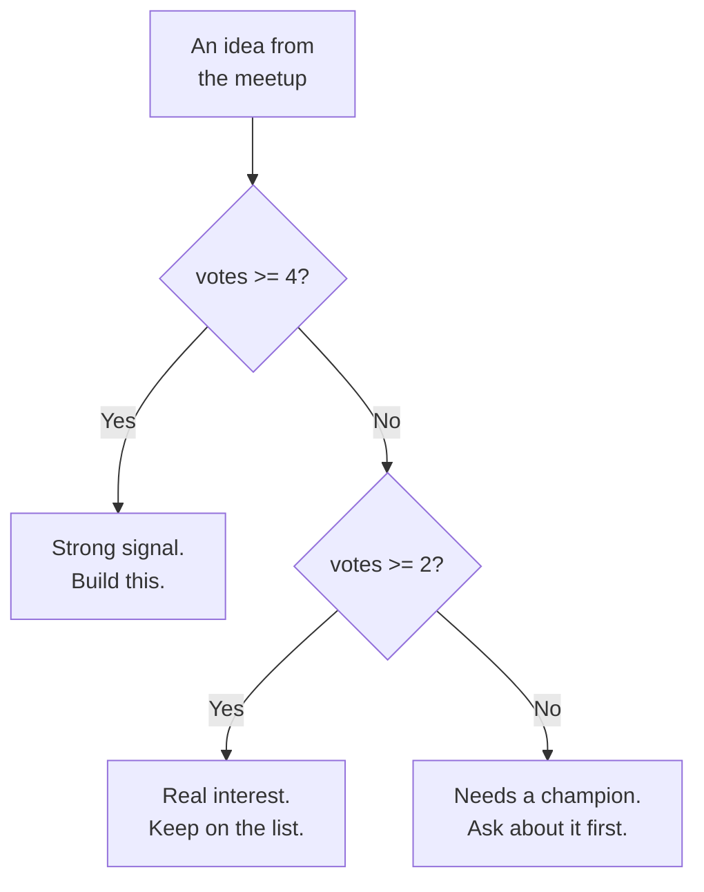

# Reading the Room: Conditionals and Loops

Catching you up: **Nate** is a self-taught builder who has never finished anything anyone else used. **Kai** writes grants in Fairview, started coding three weeks ago, and keeps a numbered list of questions on a legal pad. They met at the Fairview Founders Table — a monthly builder meetup in the back of Grindstone Coffee — and are building an idea tracker for that meetup, to be shown at Demo Night in two and a half weeks.

Wednesday night. Ruthanne, who is retired and comes to the Founders Table mostly for the company, had left half a grocery store sheet cake on the counter that read **HAPPY RETIREMEN** — the T had been cut off with the first slice and nobody had the heart to mention it. Nate was eating it directly off the plastic lid.

On the table: five ideas from last month's meetup, and no agreement about which one they'd actually build a tracker *for* first.

```
Youth program signups that aren't a spreadsheet   Kai       4 votes
Tool library checkout                             Marisol   3 votes
Restaurant supply co-op ordering                  Priya     2 votes
Founders Table RSVP                               Nate      1 vote
Bus route delay text alerts                       Dev       0 votes
```

"We should just sort them," Nate said.

"We should *triage* them," Kai said. "Sorting is a list. Triage is a decision with a rule behind it. If somebody at Demo Night asks why we picked one, 'it was at the top' is not an answer."

Which is how they ended up writing their first conditional.

## Coder's Corner: if / else

An `if` statement checks something and runs its block only when that something is true.

```js
const votes = 4;

if (votes >= 4) {
  console.log("Strong signal. Build this.");
}
```

That prints only when `votes` is 4 or more. Change it to `1`, rerun, nothing happens — the condition failed, so the code inside the curly braces `{ }` was skipped entirely. Not errored. Skipped.

Most of the time you want a plan for the other cases too. That's `else if` and `else`:

```js
if (votes >= 4) {
  console.log("Strong signal. Build this.");
} else if (votes >= 2) {
  console.log("Real interest. Keep on the list.");
} else {
  console.log("Needs a champion. Ask about it first.");
}
```

JavaScript reads those top to bottom, runs the **first** branch that matches, and skips every remaining branch without even evaluating it. It's not scoring all three and picking a winner — it commits to the first true thing it finds and leaves.

That ordering is load-bearing. If you wrote `votes >= 2` first, then `votes >= 4` would be unreachable forever, because 4 is also greater than 2. Broad conditions go last. Always.



The comparison operators you'll use constantly:

```js
votes > 3     // greater than
votes >= 3    // greater than or equal to
votes < 3     // less than
votes <= 3    // less than or equal to
votes === 3   // equal to
votes !== 3   // not equal to
```

And you can combine conditions:

```js
if (votes >= 2 && owner !== "Nate") {
  console.log("Somebody else wants this, which is the point.");
}

if (votes === 0 || owner === undefined) {
  console.log("Something is missing here.");
}

if (!ready) {
  console.log("Not ready.");
}
```

`&&` is AND — both sides must be true. `||` is OR — either side. `!` flips a true to false and back.

## Q11: Why Are There Two Different Equals

Kai spotted it in a Stack Overflow answer Nate had copied a line from.

"You wrote three equals signs. That answer uses two. Which is right?"

"Both work."

"That's not what I asked."

It is genuinely not what she asked, and "both work" is how people ship bugs for years. Here's the real difference:

**`===` (strict equality) compares type *and* value.** If the types differ, it's `false`, end of story.

**`==` (loose equality) converts one side to match the other, then compares.** JavaScript will bend over backwards to find a way to call two things equal.

```js
console.log(3 === 3);       // true
console.log("3" === 3);     // false  ← a string is not a number
console.log("3" == 3);      // true   ← the string got converted first

console.log(0 == "");         // true   ← both convert to 0. yes, really.
console.log(0 == "0");        // true
console.log("" == "0");       // false  ← so equality isn't even transitive here
console.log(null == undefined); // true
console.log(null === undefined); // false
```

Read those last four again. `0 == ""` is true. `0 == "0"` is true. But `"" == "0"` is false. `==` breaks the basic property you'd expect from equality — if A equals B and B equals C, A should equal C. It doesn't, because each comparison converts differently.

**Use `===` and `!==`. Always.** There is one narrow exception some people like — `x == null` as a shorthand for "is it `null` or `undefined`" — and you can just write that out longhand instead. The rule with no exceptions is easier to hold than the rule with one.

"So the answer you copied was wrong?"

"The answer I copied *happened to work* because both sides were already numbers," Nate said. "Which is worse, honestly."

Kai wrote **"`==` works until it doesn't, and then it's a Tuesday"** on the whiteboard, under the permanent ghost of **IS THIS THING ON?**.

## Coder's Corner: Loops

Five ideas. You could write five `if` chains by hand. You should not.

A **`for` loop** runs a block a set number of times:

```js
for (let i = 0; i < 5; i++) {
  console.log(`Pass number ${i}`);
}
```

Three parts, separated by semicolons:

- `let i = 0` — the counter, created once, before anything runs.
- `i < 5` — checked **before every pass**. True, run the block. False, stop.
- `i++` — runs **after every pass**. Adds one to `i`. (`i++` is shorthand for `i = i + 1`.)

It prints `Pass number 0` through `Pass number 4` — five passes, starting at zero, because array indexes start at zero and starting your counter there means `i` lines up with `list[i]`.

When you're walking through an array and don't care about the index number, **`for...of`** is cleaner:

```js
const founders = ["Nate", "Kai"];

for (const person of founders) {
  console.log(`${person} is in this.`);
}
```

Same loop, no counter to get wrong. `const person` is fine there even though it changes each pass — each iteration creates a fresh `person`, it's never reassigned within a pass.

## Putting It Together

Make a file called `triage.js`:

```js
// triage.js
// Five ideas from the Founders Table. One rule, applied to all of them.

const ideas = [
  { title: "Youth program signups", owner: "Kai", votes: 4 },
  { title: "Tool library checkout", owner: "Marisol", votes: 3 },
  { title: "Restaurant supply co-op", owner: "Priya", votes: 2 },
  { title: "Founders Table RSVP", owner: "Nate", votes: 1 },
  { title: "Bus delay text alerts", owner: "Dev", votes: 0 },
];

for (const idea of ideas) {
  if (idea.votes >= 4) {
    console.log(`BUILD    ${idea.title} (${idea.owner}, ${idea.votes})`);
  } else if (idea.votes >= 2) {
    console.log(`SHORTLIST ${idea.title} (${idea.owner}, ${idea.votes})`);
  } else {
    console.log(`ASK      ${idea.title} (${idea.owner}, ${idea.votes})`);
  }
}
```

```bash
node triage.js
```

```
BUILD    Youth program signups (Kai, 4)
SHORTLIST Tool library checkout (Marisol, 3)
SHORTLIST Restaurant supply co-op (Priya, 2)
ASK      Founders Table RSVP (Nate, 1)
ASK      Bus delay text alerts (Dev, 0)
```

Five ideas, one rule, no manual sorting, and a defensible answer if anyone asks why. Add a sixth idea to the array and the rule applies to it automatically — that's the whole reason this is better than doing it by hand.

## Where Dev's Idea Went

Then Nate got clever, which is a thing he does about forty minutes into any session.

"We don't need to print the dead ones. Let's filter first." He rewrote the top of the loop:

```js
for (const idea of ideas) {
  if (idea.votes) {                    // ← the bug
    console.log(`${idea.title}: ${idea.votes}`);
  }
}
```

Output:

```
Youth program signups: 4
Tool library checkout: 3
Restaurant supply co-op: 2
Founders Table RSVP: 1
```

Four lines. Kai counted them twice.

"Where's Dev's?"

"Dev's what?"

"The bus alerts. It's in the array. I watched you type it. Where's that from?"

Nate scrolled up. The object was right there. `{ title: "Bus delay text alerts", owner: "Dev", votes: 0 }`. Present, correct, and invisible.

Here's what happened, and it is one of the most common real bugs in JavaScript.

When you put a value inside `if (...)` that isn't already `true` or `false`, JavaScript converts it to a boolean. Most values become `true`. A short, specific list becomes `false`. Those are called **falsy** values, and there are exactly eight:

```js
false
0
-0
0n         // BigInt zero
""         // empty string
null
undefined
NaN
```

**Everything else is truthy.** Including things that look empty:

```js
if ("0")  console.log("truthy");   // prints — non-empty string
if ([])   console.log("truthy");   // prints — an empty array is still an array
if ({})   console.log("truthy");   // prints — an empty object is still an object
if (" ")  console.log("truthy");   // prints — a space is a character
```

`idea.votes` was `0`. `0` is falsy. So `if (idea.votes)` asked "does this idea have votes?" and JavaScript answered the question Nate actually typed, which was "is this number something other than zero?"

Dev's idea has zero votes because he pitched it last, at 8:52, while people were already putting their coats on. And then the code deleted him a second time.

The fix is to say what you mean:

```js
for (const idea of ideas) {
  if (idea.votes > 0) {              // ← "has at least one vote"
    console.log(`${idea.title}: ${idea.votes}`);
  }
}
```

Or, if what you actually wanted was "does this field exist at all":

```js
if (idea.votes !== undefined) {
  // present, even if it's zero
}
```

Those are three genuinely different questions — *is it nonzero*, *does it exist*, and *is it truthy* — and `if (idea.votes)` blurs all three into one. Bare truthiness checks are fine on things that can't legitimately be `0` or `""`. They are a trap on counts, prices, quantities, scores, and any text field a person might reasonably leave blank.

"So it wasn't wrong," Kai said. "It was answering a different question than the one you asked."

"It was answering exactly the question I typed." Nate scraped the last frosting off the lid. "Which is the only question it can answer."

She wrote **Q13** and then, next to it, just: *"Zero is a real number and the computer will not defend it for you."*

Then she went and put Dev's idea back in the printed list, at the bottom, marked ASK, with a note to actually go ask him about it at Demo Night.

## The One Trap Everyone Falls Into

If a loop's condition never becomes false, it never stops.

```js
// DO NOT RUN THIS
for (let i = 0; i < 5; i--) {   // i-- goes the wrong direction. i < 5 is always true.
  console.log(i);
}
```

That's an **infinite loop**. It will spray output until you stop it or your terminal falls over. Press **Ctrl+C** to kill it. This happens to everyone, usually from a counter going the wrong way, a forgotten `i++`, or a condition that can never be satisfied. If you run something and it just doesn't stop: Ctrl+C, then check that your loop has a way to end.

## Try It Yourself

Open `triage.js` and:

1. Change the `>= 4` threshold to `>= 3` and confirm two ideas now land in BUILD.
2. Swap the order of the first two branches — put `>= 2` first — rerun, and watch the BUILD branch become permanently unreachable. Then put it back. That's the "broad conditions go last" rule, felt rather than read.
3. Add a sixth idea with `votes: 0` and confirm it still shows up under ASK. If it disappears, you've reintroduced the truthiness bug, which means you now know how to both cause and fix it.

## Sanity Checks

- **A branch never runs.** An earlier condition is catching it. Read them top to bottom in order and find the one that matches first.
- **A record silently vanished.** Look for a bare `if (someValue)` where the value could legitimately be `0`, `""`, `null`, or `NaN`. Replace it with the comparison you actually meant.
- **Two things that look equal aren't.** You're comparing a string to a number. `console.log(typeof a, typeof b)` before the comparison, then fix the type — not the operator.
- **`SyntaxError: Unexpected token '{'`.** Usually a missing `)` at the end of an `if` condition, or a stray semicolon after it: `if (x); { ... }` parses as an empty `if` followed by an unrelated block, and runs the block every single time. Nasty, silent, real.
- **The loop runs one time too many or too few.** Off-by-one. Check `<` versus `<=` against where your counter starts. Starting at `0` with `< length` is correct; starting at `0` with `<= length` walks off the end.

Nate stacked the plastic lid on the recycling. "Okay. What about Sheet Cake Studio."

"You're naming us after what's in the room."

"Everything is named after what was in the room. That's where names come from."

"Then be in a better room," Kai said.

Next chapter: they've now typed the same three-line format block six times in two files, and Kai is done watching it happen.

Next: `04-functions-and-scope.md` — Signature Moves.
