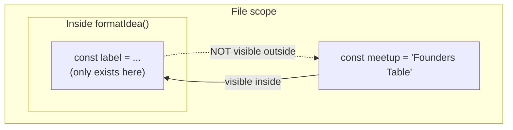

# Signature Moves: Functions and Scope

If you're landing here first: **Nate** is a self-taught builder with a folder full of projects nobody ever used. **Kai** writes grants in Fairview and started coding a month ago. They met at the Fairview Founders Table — a monthly builder meetup in the back room of Grindstone Coffee — and are building an idea tracker for that meetup, due at Demo Night, which is now nine days out.

Sunday. Nate had brought two breakfast burritos and eaten one and a half of them before he opened the laptop. Kai was reading his code with the specific flat expression of a person who has reviewed a lot of documents.

"You've written this same block six times."

"It's three lines."

"It's three lines six times, and in two of them the spacing is different, and in one of them you spelled it `SHORTLST`." She turned the screen. "Which one is right?"

Nate looked at it for a while.

"...The one with the spacing I like."

"Then that one should exist once," Kai said, "and everything else should use it. That's not a coding thing. That's how you write anything. You don't retype the boilerplate on every grant application — you keep one version and you fix *that*."

That's a function. She described it before she knew the word for it, which happens a lot.

## Coder's Corner: Declaring a Function

A **function** is a piece of logic you write once, give a name, and call on demand — with different inputs, forever, without rebuilding it.

```js
function triageLabel(votes) {
  if (votes >= 4) return "BUILD";
  if (votes >= 2) return "SHORTLIST";
  return "ASK";
}
```

Piece by piece:

- `function` tells JavaScript you're defining one.
- `triageLabel` is the **name** — how you call it later.
- `votes` inside the parentheses is a **parameter** — a placeholder for whatever value gets handed in.
- `return` hands a result back out to whoever called it, and immediately stops the function. Nothing after a `return` in the same path ever runs.

You **call** (or "invoke") it by writing its name with parentheses and a real value inside:

```js
console.log(triageLabel(4));   // "BUILD"
console.log(triageLabel(2));   // "SHORTLIST"
console.log(triageLabel(0));   // "ASK"
```

That `4` is an **argument** — the actual value you're handing to the `votes` parameter. Parameter is the slot; argument is what you put in it.

Notice there's no `else` in that function. Because `return` exits immediately, if `votes >= 4` was true you already left — the next line can't run. Early returns like that flatten a nested `if/else` chain into something you can read straight down.

## Where the Value Went

Kai's first attempt to use it did not work, and the reason is the single most common thing that trips people up in this chapter.

Nate had written his version like this:

```js
// the broken version
function triageLabel(votes) {
  if (votes >= 4) {
    console.log("BUILD");
  } else if (votes >= 2) {
    console.log("SHORTLIST");
  } else {
    console.log("ASK");
  }
}

const label = triageLabel(4);
console.log(`${label} — Youth program signups`);
```

Output:

```
BUILD
undefined — Youth program signups
```

"It printed BUILD," Kai said. "And then it printed `undefined`. It knows the answer and it won't tell me the answer."

**Q16.** This one is real and Nate had absolutely been papering over it for years by just... logging things where he needed them.

`console.log()` and `return` are not the same and are not related. `console.log()` **prints text to your terminal** — it's for you, the human, looking at the screen. `return` **hands a value back to the code that called the function** — it's for the program.

And here's the part that makes it confusing: **every function returns something.** If you don't write a `return`, the function returns `undefined`. Silently. It doesn't warn you, because a function that only does something (rather than computes something) is perfectly legitimate.

So the broken version printed "BUILD" to the screen — visible, reassuring, useless — and then handed back `undefined`, which is what landed in `label`.

```js
function loud(x)  { console.log(x); }      // returns undefined
function useful(x) { return x; }           // returns x

console.log(loud("hi"));    // prints "hi", then prints undefined
console.log(useful("hi"));  // prints "hi"
```

Rule of thumb: **if you want to use the answer, `return` it. If you want to see the answer, log it.** You can do both, but they're separate acts.

"So all your functions print instead of returning."

"A lot of my functions print instead of returning," Nate said.

"How do you use their answers?"

"...I retype them."

Kai wrote **Q16: `console.log` shows you. `return` gives you.** and then, underneath, in smaller letters: *six times.*

## Building on It

Once one function is clean, build bigger things out of it.

```js
function formatIdea(idea) {
  const label = triageLabel(idea.votes);
  return `${label.padEnd(10)} ${idea.title} (${idea.owner}, ${idea.votes})`;
}
```

`padEnd(10)` pads a string with spaces on the right until it's at least 10 characters long, so the columns line up. It's a real string method and it's exactly the kind of thing you find once and use forever.

Now the whole file:

```js
// format.js
// One formatting rule. Written once. Used everywhere.

const ideas = [
  { title: "Youth program signups", owner: "Kai", votes: 4 },
  { title: "Tool library checkout", owner: "Marisol", votes: 3 },
  { title: "Restaurant supply co-op", owner: "Priya", votes: 2 },
  { title: "Founders Table RSVP", owner: "Nate", votes: 1 },
  { title: "Bus delay text alerts", owner: "Dev", votes: 0 },
];

function triageLabel(votes) {
  if (votes >= 4) return "BUILD";
  if (votes >= 2) return "SHORTLIST";
  return "ASK";
}

function formatIdea(idea) {
  const label = triageLabel(idea.votes);
  return `${label.padEnd(10)} ${idea.title} (${idea.owner}, ${idea.votes})`;
}

function renderBacklog(list) {
  return list.map(formatIdea).join("\n");
}

console.log(renderBacklog(ideas));
```

```bash
node format.js
```

```
BUILD      Youth program signups (Kai, 4)
SHORTLIST  Tool library checkout (Marisol, 3)
SHORTLIST  Restaurant supply co-op (Priya, 2)
ASK        Founders Table RSVP (Nate, 1)
ASK        Bus delay text alerts (Dev, 0)
```

Three functions, each one small enough to hold in your head, each one built out of the one below it. `.map()` runs a function once for every item in an array and collects the results into a new array. `.join("\n")` glues those results into one string with a line break between each. You don't need to memorize either today — just notice the shape: **small trustworthy piece, then a bigger piece made of those.**

Fix the spacing rule and all five lines change. Fix the `SHORTLST` typo once and it's fixed everywhere. That's the entire return on writing a function.

## Q17: The Columns Went Crooked

Then Nate got ambitious.

"What if the width is configurable." He added a second parameter with a **default value**:

```js
function formatIdea(idea, width = 10) {
  const label = triageLabel(idea.votes);
  return `${label.padEnd(width)} ${idea.title} (${idea.owner}, ${idea.votes})`;
}
```

Default parameters are a genuinely good feature: call `formatIdea(idea)` and `width` is `10`; call `formatIdea(idea, 20)` and it's 20. Nothing wrong with the function.

He reran `renderBacklog(ideas)`:

```
BUILD Youth program signups (Kai, 4)
SHORTLIST Tool library checkout (Marisol, 3)
SHORTLIST Restaurant supply co-op (Priya, 2)
ASK Founders Table RSVP (Nate, 1)
ASK  Bus delay text alerts (Dev, 0)
```

"The columns are gone."

"That's — the default is ten, it should still be ten, I didn't pass anything."

"You didn't pass anything," Kai said. "Did `.map` pass anything?"

It did. **`.map()` calls your function with three arguments, not one: the element, the index, and the whole array.** Most of the time you only use the first and never notice the other two exist. But `formatIdea` now has a second parameter — so `.map(formatIdea)` handed the *index* straight into `width`. Widths of `0`, `1`, `2`, `3`, `4`. The default never fired, because a default only applies when the argument is `undefined`, and the index is a perfectly real number.

This is a classic. The most famous version of it:

```js
console.log(["1", "2", "3"].map(parseInt));   // [1, NaN, NaN]
```

`parseInt` takes `(string, radix)`. `.map` feeds it the index as the radix. `parseInt("2", 1)` is nonsense — base 1 isn't a thing — so you get `NaN`.

The fix is to stop passing the function by name and wrap it, so you control exactly what goes in:

```js
function renderBacklog(list, width = 10) {
  return list.map((idea) => formatIdea(idea, width)).join("\n");
}
```

`(idea) => formatIdea(idea, width)` is an **arrow function** — a shorter way to write a small function inline. `(input) => result` is the whole shape. (Arrow functions also behave differently around a keyword called `this`, which you won't need for a while — just know that's the one real difference, not the syntax.)

"So passing a function by its name is a trap."

"Passing a function by its name is fine," Nate said, "as long as you actually know how many arguments the caller is going to hand it. Which I did not."

"Which nobody does, the first time."

"Which nobody does the first time," he agreed.

## Coder's Corner: Scope

Here's the thing that prevents your functions from stepping on each other: **a variable declared inside a function only exists inside that function.** That's **scope**. When the function finishes, that variable is gone, and the outside world never had access to it at all.



Prove it:

```js
// scope.js
const meetup = "Fairview Founders Table";

function describe(idea) {
  const line = `${idea.title} — pitched at ${meetup}`;   // ✅ can see meetup
  return line;
}

console.log(describe({ title: "Tool library checkout" }));
console.log(line);   // ❌ ReferenceError: line is not defined
```

Inside can see out. Outside cannot see in. That direction is the whole rule.

It means two functions can each have a variable called `label` and they will never collide:

```js
const owner = "the whole table";

function whoOwns(idea) {
  const owner = idea.owner;   // a different, separate `owner`
  return owner;
}

console.log(whoOwns({ owner: "Dev" }));   // "Dev"
console.log(owner);                        // "the whole table" — untouched
```

That's called **shadowing** — the inner `owner` hides the outer one for the length of the function, then the outer one is right where you left it. Not a bug. A guarantee.

Scope isn't only about functions. `let` and `const` are **block-scoped**, meaning they're confined to whatever pair of curly braces they were declared in — including an `if` or a `for`:

```js
if (true) {
  const secret = "only in here";
}
console.log(secret);   // ReferenceError: secret is not defined
```

And this is where the promise from chapter 02 comes due. `var` — the old keyword — is **not** block-scoped. It leaks:

```js
for (var i = 0; i < 3; i++) { /* ... */ }
console.log(i);   // 3   ← var escaped the loop it was declared in

for (let j = 0; j < 3; j++) { /* ... */ }
console.log(j);   // ReferenceError: j is not defined   ← correct behavior
```

That leaking `i` is the source of a whole genre of confusing bugs, especially in loops that schedule work to happen later. `let` and `const` were added in 2015 specifically to fix it. This is why "just use `const` and `let`" isn't style advice — it's a different set of rules that behaves the way you'd expect.

## Try It Yourself

Open `format.js` and:

1. Add a `hoursOld` field to a couple of ideas, then write a function `isStale(idea)` that returns `true` when an idea is older than 720 hours. Use it inside `formatIdea` to append `" [stale]"`.
2. Deliberately reintroduce the bug: change your new function back to `console.log` instead of `return`, and watch `undefined` reappear in the output. Then fix it. Doing this on purpose once means you'll recognize it instantly at 1am later.
3. Try to `console.log` the `label` variable from inside `formatIdea` at the bottom of the file. Read the `ReferenceError`. That error is scope working correctly, not scope failing.

## Sanity Checks

- **You're getting `undefined` where you expected a value.** The function is missing a `return`, or has a `return` on some paths and not others. Check every branch.
- **`ReferenceError: x is not defined`.** You're reaching for something declared inside a function or block from outside it. Move the declaration out, or return the value instead of reaching for it.
- **`TypeError: x is not a function`.** Usually a typo in the name, or you defined it *below* the point where you call it using `const fn = () => {}` (those aren't hoisted — `function name() {}` declarations are, arrow functions assigned to `const` are not).
- **A function works alone but misbehaves inside `.map()`.** Check its argument count. `.map`, `.filter`, and `.forEach` all pass `(element, index, array)`. Wrap it in an arrow function to control what it receives.
- **Your default parameter never kicks in.** Defaults only apply when the argument is `undefined`. Passing `null`, `0`, or `""` explicitly overrides the default with that value.
- **Nothing prints and nothing errors.** You defined a function and never called it. Adding `()` is required; `renderBacklog` on its own just references the function.

Nate finished the second burrito. "Overhand Right."

"What?"

"For the name. Overhand Right. Because it's the one move you throw the same way every time and it always—"

"No."

"Signature move! That's the whole—"

"I know what it is," Kai said. "It sounds like a boxing gym in a strip mall. What are the other options."

"Bagel Logic's still on the board."

Next chapter: nine days out, and their five ideas are still five loose objects in a file. Time to give the whole thing a shape — and, finally, a name.

Next: `05-objects-arrays-and-data-shapes.md` — The Playbook.
