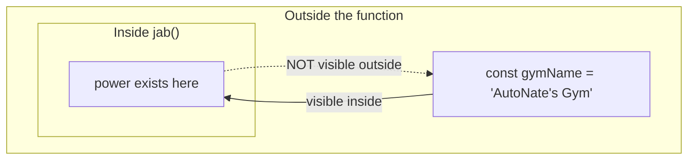

# Signature Moves: Functions and Scope

Every fighter worth watching has a move they can throw the exact same way, every single time, under any amount of pressure. It's not luck when it lands — it's repetition. They built it once, in the gym, until it was clean. Now they don't think about it. They just throw it, and it works, on command, whenever the moment calls for it.

That's exactly what a **function** is in JavaScript: a piece of logic you build once, give a name to, and can call on demand, forever, without rebuilding it from scratch every time. AutoNate's been writing code that runs top to bottom so far. Functions are the first real step toward writing code that's organized — code you can trust to behave the same way every time you call on it.

## Coder's Corner: Declaring a Function

Here's the anatomy of a function:

```js
function jab(power) {
  return `Jab thrown at ${power} power.`;
}
```

- `function` tells JavaScript you're defining a reusable move.
- `jab` is the name — how you'll call on it later.
- `power` inside the parentheses is a **parameter** — a placeholder for whatever value gets handed in when the function is actually used.
- `return` hands a result back out, so whatever called the function can use it.

You call — or "invoke" — a function by writing its name followed by parentheses, with the real value inside:

```js
console.log(jab(10));
// "Jab thrown at 10 power."
```

That `10` is called an **argument** — the real value you're handing to the `power` parameter. Same move, different power every time you throw it. That's the whole point.

## Combining Moves

Once you've got one clean move, you can build bigger moves out of it. Here's a function that throws `jab` multiple times in a row, once for every value in a list:

```js
function combo(moves) {
  return moves.map(jab).join(" -> ");
}

console.log(combo([5, 8, 10]));
// "Jab thrown at 5 power. -> Jab thrown at 8 power. -> Jab thrown at 10 power."
```

`.map()` is a method that runs a function once for every item in an array and collects the results — you'll see it constantly once you start working with lists of things, which in Screeps means lists of creeps, structures, and resources. Don't worry about memorizing it cold right now; just notice the shape: a function built out of a smaller function, doing more with less code written by hand.

```js
// moves.js
// A move you can throw the same way, every single time.

function jab(power) {
  return `Jab thrown at ${power} power.`;
}

function combo(moves) {
  return moves.map(jab).join(" -> ");
}

console.log(jab(10));
console.log(combo([5, 8, 10]));
```


## Coder's Corner: Scope

Here's something that trips people up if nobody explains it early: a variable declared **inside** a function only exists inside that function. That's called **scope**. Once the function finishes running, that variable is gone — the outside world never had access to it in the first place.



Think of it like the gym. What happens in the sparring room, stays in the sparring room — the front desk doesn't automatically know every detail of every round. But the sparring room can see the gym rules posted at the front, because those apply everywhere. Variables declared outside a function are visible inside it. Variables declared inside a function stay local to that function, and disappear once it's done running.

Why does this matter? Because it means your functions don't accidentally step on each other. You can name a variable `power` inside `jab` and a completely different variable `power` somewhere else in your code, and they will never collide. Every function gets its own clean space to work in. That's not a limitation — that's protection.

## Try It Yourself

Add a second move to `moves.js` — maybe a function called `hook` that takes a `power` parameter and returns a different message. Then add it into the `combo` list alongside `jab` and see how the output changes. Once you can build a second move and know exactly how it'll behave without guessing, you've got the real skill this chapter was about: writing logic you can trust, on command, every time.

Next chapter, AutoNate stops thinking in single moves and starts building the full playbook — the way real, organized information gets structured before it's ready for a real match.

Next: `05-objects-arrays-and-data-shapes.md` — The Playbook.
