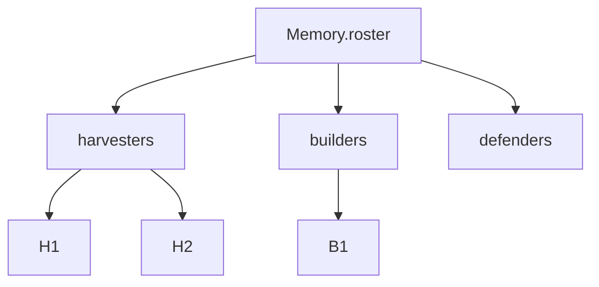

# The Playbook: Objects, Arrays, and Data Shapes

This is it — the last chapter before AutoNate stops training in the mirror and steps into an actual room. He's got his gear. He knows how to hold information and check what kind it is. He can read a situation and decide. He's got moves he trusts. What he needs now is a **playbook** — one organized place that holds everything he knows about his own squad, so he's not scrambling to remember it mid-match.

In JavaScript, that playbook is built out of the same two building blocks you've already met — objects and arrays — just combined and nested until they can hold something real. This is the exact skill that matters most once you step into Screeps, because Screeps hands your colony a giant, structured object called `Memory`, and your entire job is organizing what goes inside it.

## Coder's Corner: Nesting Objects and Arrays

You already know an object groups labeled facts, and an array holds an ordered list. The real power shows up when you put them inside each other.

```js
Memory.roster = {
  harvesters: ["H1", "H2"],
  builders: ["B1"],
  defenders: [],
};
```

Read that slowly. `Memory.roster` is an **object**. Inside it, each label — `harvesters`, `builders`, `defenders` — points to an **array** of names. That's a playbook: one structure, clearly labeled, holding everything you need to know about who's on the squad and what role they're playing. Notice `defenders` is an empty array, `[]` — that's not a mistake or a placeholder to delete later. It's AutoNate honestly saying "I don't have anyone on defense yet," which is exactly the kind of information a real system needs to know, not just the good news.

## Working With the Shape You Built

Once your data has a shape, you can write functions that work with that shape — same as any function you've written so far, just reaching into something more structured.

```js
function countSquad(roster) {
  return Object.values(roster).flat().length;
}

console.log(`Squad size: ${countSquad(Memory.roster)}`);
```

`Object.values(roster)` grabs every array inside the object — `["H1", "H2"]`, `["B1"]`, `[]` — as a list of lists. `.flat()` collapses that list of lists into one single flat list: `["H1", "H2", "B1"]`. `.length` counts how many names ended up in it. Three lines, and you've got a live headcount of your entire roster, no matter how it changes later. You don't have to memorize `Object.values` and `.flat()` today — just notice the pattern: once your data has a clear, consistent shape, you can write small functions that reliably work with that shape, every time, no matter how the details inside it change.

```js
// roster.js
// The playbook: every creep on the roster, organized by role.

Memory.roster = {
  harvesters: ["H1", "H2"],
  builders: ["B1"],
  defenders: [],
};

function countSquad(roster) {
  return Object.values(roster).flat().length;
}

console.log(`Squad size: ${countSquad(Memory.roster)}`);
```




That diagram is the actual shape of the object you just built — a tree, branching from one root down into clearly labeled groups. This is exactly what `Memory` looks like in a real Screeps colony, except instead of three roles and three names, a serious colony's `Memory` might track dozens of creeps, room plans, energy targets, and defense priorities, all nested the same way, all reachable the same way — one dot, one label, at a time.

## Why This Was the Whole Point

Every chapter in this pack was building toward this one moment, whether you noticed it or not. Variables taught you to hold a single fact. Types taught you to know what kind of fact it was. Conditionals and loops taught you to react and repeat. Functions taught you to package logic you trust. This chapter is where all of it comes together into something that can actually run a colony — organized data, checked with conditionals, looped over, managed by functions you wrote yourself.

## Try It Yourself

Add a fourth role to `Memory.roster` — maybe `scouts: ["S1"]` — and run `countSquad` again. Confirm the number goes up by exactly one. That's not a toy exercise. That's the exact move you'll make constantly once you're building a real colony: extend the shape, trust the function still works, verify it did.

AutoNate's ready. Gear installed, language understood, decisions made, moves built, playbook organized. The Virtual Battle Bot League isn't a stream he's watching anymore — it's the arena he's about to walk into, and the game everyone actually calls it by is **Screeps**.

Next: head into the **Getting Started with Screeps** pack. Chapter 0 of that one starts the exact same way this one did — get your gear, then get in the room.
