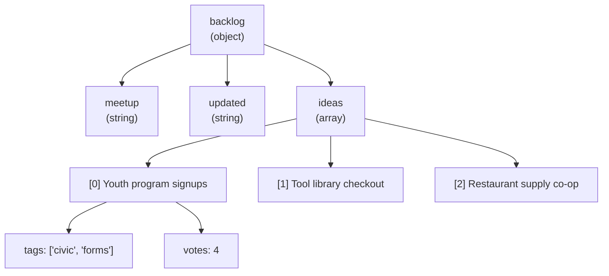

# The Playbook: Objects, Arrays, and Data Shapes

Last chapter of the pack, so: **Nate** is a self-taught builder whose `~/projects` folder holds fourteen unfinished things, eleven named after food. **Kai** writes grants in Fairview, started coding five weeks ago, and keeps a numbered list of questions on a yellow legal pad — she's on Q19. They met at the Fairview Founders Table, a monthly builder meetup in the back of Grindstone Coffee, and made a deal to build one real thing together. Demo Night is tomorrow. Eight minutes each. One VGA projector.

They have working code. What they don't have is a **shape** — one organized structure that holds everything the tracker knows, instead of five loose objects and three files that each assume something slightly different.

"If someone else picked this up," Kai said, "could they tell what the data is supposed to look like?"

Nate scrolled through `format.js`, then `triage.js`, then `backlog.js`, where the same five ideas existed in three subtly different formats.

"No."

"Then that's tonight."

## Coder's Corner: Nesting Objects and Arrays

You already know an object groups labeled facts and an array holds an ordered list. The real power shows up when you put them inside each other.

```js
const backlog = {
  meetup: "Fairview Founders Table",
  updated: "2026-03-15",
  ideas: [
    { title: "Youth program signups", owner: "Kai", votes: 4, tags: ["civic", "forms"] },
    { title: "Tool library checkout", owner: "Marisol", votes: 3, tags: ["inventory"] },
    { title: "Restaurant supply co-op", owner: "Priya", votes: 2, tags: ["ordering"] },
    { title: "Founders Table RSVP", owner: "Nate", votes: 1, tags: [] },
    { title: "Bus delay text alerts", owner: "Dev", votes: 0, tags: ["civic", "sms"] },
  ],
};
```

Read that structure top down. `backlog` is an **object**. Two of its fields are plain strings. The third, `ideas`, is an **array** — and every item in that array is itself an **object**, and one of *that* object's fields, `tags`, is another array.



That's a tree, and you walk it one step at a time, alternating dots for labels and brackets for positions:

```js
console.log(backlog.meetup);              // "Fairview Founders Table"
console.log(backlog.ideas.length);        // 5
console.log(backlog.ideas[0].title);      // "Youth program signups"
console.log(backlog.ideas[0].tags[1]);    // "forms"
console.log(backlog.ideas[4].tags);       // ["civic", "sms"]
```

**Dot for a name you know. Brackets for a position, or for a name you're holding in a variable:**

```js
const field = "owner";
console.log(backlog.ideas[0][field]);   // "Kai" — bracket notation with a variable
console.log(backlog.ideas[0].field);    // undefined — looked for a literal key "field"
```

Notice `tags: []` on the RSVP idea. That's not a placeholder to fill in later — it's the data honestly saying "this one has no tags," which is different from not knowing, and different from the field being missing. Same discipline as `votes: 0` and `builtBy: null`. **Empty on purpose is real information.**

And when you're not sure a branch exists at all, **optional chaining** keeps you from crashing:

```js
console.log(backlog.ideas[9]);           // undefined
console.log(backlog.ideas[9].title);     // ❌ TypeError: Cannot read properties of undefined
console.log(backlog.ideas[9]?.title);    // undefined — the ?. short-circuits safely
```

`?.` means "if the thing on the left is `null` or `undefined`, stop here and give me `undefined` instead of throwing." It's for the places where missing data is expected, not for papering over data you were supposed to have.

## Walking the Shape

Once your data has a consistent shape, you can write small functions that work on that shape and keep working as the details change.

```js
function totalVotes(list) {
  return list.reduce((sum, idea) => sum + idea.votes, 0);
}

function allTags(list) {
  return list.map((idea) => idea.tags).flat();
}

console.log(totalVotes(backlog.ideas));  // 10
console.log(allTags(backlog.ideas));     // ["civic","forms","inventory","ordering","civic","sms"]
```

`.reduce()` walks the array carrying a running value with it. That `0` at the end is the starting value; `sum` is what you had, `idea` is the current item, and whatever you return becomes the new `sum` for the next pass. It's the general-purpose "boil a list down to one thing" tool.

`.map((idea) => idea.tags)` produces an array of arrays — `[["civic","forms"], ["inventory"], ...]` — and `.flat()` collapses one level of that nesting into a single flat list. (Note the arrow function wrapper, for exactly the reason chapter 04 covered: `.map` passes three arguments, so passing a function bare can surprise you.)

`Object.keys()`, `Object.values()`, and `Object.entries()` do the same walking job for objects instead of arrays:

```js
const idea = backlog.ideas[0];

console.log(Object.keys(idea));     // ["title", "owner", "votes", "tags"]
console.log(Object.values(idea));   // ["Youth program signups", "Kai", 4, ["civic","forms"]]

for (const [field, value] of Object.entries(idea)) {
  console.log(`${field}: ${value}`);
}
```

`Object.entries()` gives you an array of `[key, value]` pairs, and `const [field, value]` pulls both out in one line — that's **destructuring**, and it shows up everywhere once you start reading real code.

## Reshaping the Data

The move you'll make constantly is turning one shape into a more useful shape. Grouping ideas by who pitched them:

```js
function groupByOwner(list) {
  const groups = {};
  for (const idea of list) {
    if (!groups[idea.owner]) {
      groups[idea.owner] = [];
    }
    groups[idea.owner].push(idea.title);
  }
  return groups;
}

console.log(groupByOwner(backlog.ideas));
// { Kai: ["Youth program signups"], Marisol: [...], Priya: [...], ... }
```

**Q20**, and it's a good one: "That's a bare truthiness check. You told me those were a trap."

They are, in chapter 03, on counts. Here it's safe, and the reason is specific: `groups[idea.owner]` can only ever be one of two things — `undefined` (we haven't seen this person yet) or an array (we have). And **every array is truthy**, including an empty one. There is no falsy value this expression can legitimately produce, so the check can't eat real data.

That's the actual rule, stated properly: a bare truthiness check is fine when the value's *possible* range doesn't include a meaningful falsy value, and dangerous the moment it does. Not "never use it." "Know what can be in there."

"Fine," Kai said, and wrote it down anyway, because "fine" and "documented" are not in conflict for her.

## The One That Almost Broke the Handout

Kai wanted two things printed for Demo Night: a **top three** by votes, and the **full list in pitch order**, because Dev pitched last and she was not letting the ordering erase him twice.

Nate wrote the top three in about eleven seconds:

```js
function topThree(list) {
  return list.sort((a, b) => b.votes - a.votes).slice(0, 3);
}

console.log(topThree(backlog.ideas));
console.log(renderBacklog(backlog.ideas));   // the full list, pitch order
```

The top three came out perfect. The full list came out sorted by votes.

"That's not pitch order."

"I didn't sort that one. I sorted a copy."

"Where's that from?"

He said "because functions get a copy," and then he heard himself say it, and this is the one that actually mattered.

**Objects and arrays are handed to functions by reference, not by copy.** When you pass `backlog.ideas` into `topThree`, the parameter `list` is not a duplicate of the array — it's a second name pointing at the exact same array in memory. Anything the function does to it, it does to the original.

And `.sort()` **sorts in place**. It rearranges the array you gave it and returns *that same array*, which is why it feels like it made a copy — you get an array back, so it looks like a new one. It isn't.

```js
const nums = [3, 1, 2];
const sorted = nums.sort();

console.log(sorted);           // [1, 2, 3]
console.log(nums);             // [1, 2, 3]   ← the original changed too
console.log(sorted === nums);  // true        ← they are literally the same array
```

Some array methods mutate, some don't, and there's no hint in the name. Worth knowing cold:

| Returns a **new** array | **Mutates** the original |
| --- | --- |
| `.map()` | `.sort()` |
| `.filter()` | `.reverse()` |
| `.slice()` | `.splice()` |
| `.concat()` | `.push()` / `.pop()` |
| `[...spread]` | `.shift()` / `.unshift()` |

The fix is to copy first, with the **spread** operator:

```js
function topThree(list) {
  return [...list].sort((a, b) => b.votes - a.votes).slice(0, 3);
}
```

`[...list]` builds a brand new array containing the same items. `.sort()` then rearranges the copy and leaves the original alone.

One honest caveat, because it will bite you eventually: **that's a shallow copy.** The new array is new; the objects *inside* it are still the same objects. Reorder the copy all day, the original is fine. But `copy[0].votes = 99` changes the original idea too, because `copy[0]` and `list[0]` are the same object.

```js
const copy = [...backlog.ideas];
copy.sort((a, b) => b.votes - a.votes);
console.log(backlog.ideas[0].title);   // still "Youth program signups" ✅

copy[0].votes = 99;
console.log(backlog.ideas.find((i) => i.title === "Youth program signups").votes);
// 99  ← same object, reached by a different name
```

Kai read that twice. "So a copy of a list of things is a new list pointing at the old things."

"Yeah."

"That's a really important sentence and nobody says it."

Also worth knowing before it surprises you: **`.sort()` with no comparator sorts as text.**

```js
console.log([10, 9, 100].sort());              // [10, 100, 9]  ← alphabetical on "10","100","9"
console.log([10, 9, 100].sort((a, b) => a - b)); // [9, 10, 100] ← numeric
```

Always pass a comparator for numbers. `(a, b) => a - b` is ascending; `(a, b) => b - a` is descending.

## The Whole Thing

```js
// playbook.js
// One shape. Everything the tracker knows, in one place.

const backlog = {
  meetup: "Fairview Founders Table",
  updated: "2026-03-15",
  ideas: [
    { title: "Youth program signups", owner: "Kai", votes: 4, tags: ["civic", "forms"] },
    { title: "Tool library checkout", owner: "Marisol", votes: 3, tags: ["inventory"] },
    { title: "Restaurant supply co-op", owner: "Priya", votes: 2, tags: ["ordering"] },
    { title: "Founders Table RSVP", owner: "Nate", votes: 1, tags: [] },
    { title: "Bus delay text alerts", owner: "Dev", votes: 0, tags: ["civic", "sms"] },
  ],
};

function triageLabel(votes) {
  if (votes >= 4) return "BUILD";
  if (votes >= 2) return "SHORTLIST";
  return "ASK";
}

function formatIdea(idea) {
  return `${triageLabel(idea.votes).padEnd(10)} ${idea.title} (${idea.owner}, ${idea.votes})`;
}

function renderBacklog(list) {
  return list.map((idea) => formatIdea(idea)).join("\n");
}

function topThree(list) {
  return [...list].sort((a, b) => b.votes - a.votes).slice(0, 3);
}

function totalVotes(list) {
  return list.reduce((sum, idea) => sum + idea.votes, 0);
}

function byTag(list, tag) {
  return list.filter((idea) => idea.tags.includes(tag));
}

console.log(`${backlog.meetup} — updated ${backlog.updated}`);
console.log(`${backlog.ideas.length} ideas, ${totalVotes(backlog.ideas)} total votes\n`);

console.log("--- pitch order ---");
console.log(renderBacklog(backlog.ideas));

console.log("\n--- top three ---");
console.log(renderBacklog(topThree(backlog.ideas)));

console.log("\n--- civic ---");
console.log(renderBacklog(byTag(backlog.ideas, "civic")));
```

```bash
node playbook.js
```

Every chapter in this pack is in that file. Variables hold the facts. Types keep the vote counts as numbers instead of `"43"`. Conditionals decide the label, without eating the zero. Loops and `.map()` apply one rule to every item. Functions mean the formatting rule exists once. And the shape at the top is what makes all of it possible — you can write `byTag` in one line only because every idea reliably has a `tags` array.

That's the actual lesson of the pack, and it's why this chapter is last: **get the shape right and the code gets small.**

## Where the Name Came From

Eleven forty at night. Kai wanted one more thing: a function that takes the raw notes from a meetup — the sticky notes, the shorthand — and turns them into properly shaped idea objects, so next month nobody has to type this by hand.

"It automates the intake," Nate said, narrating himself, which he does. "Watch. This is the whole studio in one function."

```js
function autoNate(rawNotes) {
  return rawNotes.map((note) => ({
    title: note.text,
    owner: note.from,
    votes: Number(note.marks) || 0,
    tags: [],
  }));
}

const shaped = automate(meetupNotes);
```

```
ReferenceError: automate is not defined
```

"It's defined," Nate said. "It's right there."

Kai leaned in and read the definition out loud, one syllable at a time.

"`auto`. `Nate`."

Silence.

"That's a typo," Nate said.

"Where's that from?"

"It's a *typo*, my thumb—"

"AutoNate," Kai said, testing it. Then: "AutoNate AI."

"That's not—"

"It's the only one you didn't propose," she said. "That's how I know it's good."

He wanted to argue. He'd pitched Bagel Logic, Nitrocold, Chili Crisp Labs, Sheet Cake Studio, and Overhand Right, and she had vetoed every single one inside four seconds. This one she said twice.

He fixed the call to `autoNate(meetupNotes)` and it ran clean.

Then he sat there looking at the terminal for a second longer than he needed to. Fourteen projects in that folder. Not one of them had ever had a person on the other side who'd notice if it broke. Tomorrow there'd be fourteen people in the back room of a coffee shop, and one of them was Dev, whose idea had zero votes and was on the list anyway, in pitch order, because Kai went back and put it there.

"Okay," he said. "AutoNateAI."

"Write it on the board."

He wrote it on the whiteboard, under the permanent ghost of **IS THIS THING ON?**, which — for the first time in seven years — read like it was asking about something specific.

## Try It Yourself

Open `playbook.js` and:

1. Add a sixth idea with `votes: 0` and an empty `tags` array. Confirm it appears in pitch order under ASK, and that `totalVotes` is unchanged. Zero-vote ideas must never disappear — that's the rule this project earned the hard way.
2. Write `groupByOwner(backlog.ideas)` from earlier and log it. Then write `Object.keys(groupByOwner(backlog.ideas)).length` to count distinct people. One line, real answer.
3. Break `topThree` on purpose: remove the `[...]` spread, run it, then log the pitch-order list right after. Watch the original reorder itself. Put the spread back.
4. Add a `notes` field to one idea, and print it with `?.` on an idea that doesn't have one. Confirm you get `undefined` instead of a crash.

## Sanity Checks

- **`TypeError: Cannot read properties of undefined (reading 'title')`.** You walked one step too far — an index that doesn't exist, or a field that isn't there. Log the parent first: `console.log(backlog.ideas[9])`. If that's `undefined`, that's your step.
- **Your original array changed and you never touched it.** Something mutated it through a shared reference. Look for `.sort()`, `.reverse()`, `.splice()`, or `.push()` inside a function that received the array as a parameter. Copy with `[...list]` before mutating.
- **A copy changed the original's contents anyway.** Spread is a shallow copy — the objects inside are shared. If you need to edit them independently, copy each one too: `list.map((idea) => ({ ...idea }))`.
- **Numbers sort into a nonsense order.** You called `.sort()` without a comparator, so it sorted them as text. Pass `(a, b) => a - b`.
- **`.flat()` didn't flatten far enough.** It only collapses one level by default. `.flat(2)` goes two deep, `.flat(Infinity)` goes all the way.
- **A property is `undefined` and you're sure it's there.** Check the spelling against `Object.keys(theObject)`. JavaScript returns `undefined` for a missing key instead of erroring, which makes typos in property names extremely quiet.
- **You wrote `.map((x) => { title: x })` and got an array of `undefined`.** Curly braces after an arrow are read as a function body, not an object. Wrap the object in parentheses: `.map((x) => ({ title: x }))`. That's the same trick used in `autoNate` above.

---

You've got the whole toolkit now. Variables to hold a fact, types to know what kind of fact it is, conditionals to decide, loops to repeat, functions to package logic you trust, and data shapes to hold all of it in a form that doesn't fall apart when someone else opens the file.

Demo Night is tomorrow. Eight minutes, one VGA projector, fourteen people in a back room, and a program that finally has a name.

Next: head into the **Prompt & Context Engineering** pack — where hand-writing every line stops scaling, and Nate and Kai find out that an AI agent will answer confidently whether or not it actually knows.
