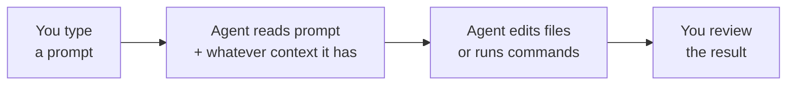

# Garbage In, Garbage Out: Why Prompting Is a Skill

Nate and Kai are two people in Fairview building a studio together — Nate self-taught and fast, Kai out of a decade of civic grant work and allergic to any claim without a receipt. They met at the Founders Table, a monthly builder meetup in the back room at Grindstone Coffee, and they've spent the last few weeks hand-writing every line of the thing they're building. Demo Night went fine. That's the problem.

Fine means nineteen people wrote their names on a paper signup sheet, and nineteen people are now sitting in a spreadsheet expecting to hear something back. Fine means four of those nineteen described a problem they'd pay to have solved. Fine means there are four weeks until the next Demo Night and a to-do list that Nate has estimated, out loud, twice, at "like a weekend," and Kai has estimated, silently, correctly, at three.

So on Monday night, at Kai's kitchen table, with a container of leftover birria between them and the laptop turned so they can both see it, they open a coding agent for the first time and actually mean it. Not autocomplete. Not a chatbot in a browser tab. The kind that sits in the editor and the terminal, reads their actual files, and writes and runs code on their say-so.

It goes badly for both of them. It goes badly in two completely different directions, which is somehow worse.

## 1. Nate Types Fast and Gets Nothing Good

Nate goes first, because Nate always goes first.

"Okay, okay — watch this," he says, and types: `clean up the codebase`. Enter. Four seconds of the agent thinking. Then a wall of green and red.

It rewrites about half of `index.js` in a style neither of them uses. It adds a file called `lib/scoreIdeas.js` that does, as far as Kai can tell by reading both files side by side, exactly what `lib/score.js` already did. And somewhere in the churn it quietly deletes a comment Nate had left himself three weeks ago:

```js
// TODO: this breaks if two people sign up with the same email
```

Nothing is broken, exactly. Nothing is better, either. It's just *different*, in ways he didn't ask for and can't fully account for.

"What did you tell it to do?" Kai asks.

"Clean up the codebase."

"Which part."

"...The codebase."

He tries again — `no, fix the scoring` — and the agent asks him which scoring, because there are now two files that could plausibly be it, one of which it created ninety seconds ago. Nate stares at the question like it's been rude to him.

```text
Nate: clean up the codebase

Agent: I've refactored index.js and extracted the scoring
logic into lib/scoreIdeas.js for clarity.

Nate: that's not what I wanted

Agent: Understood — what would you like me to change?

Nate: [closes laptop]
```

His conclusion, delivered while pulling the laptop back toward himself: it's a toy. He can write this by hand. He's *been* writing this by hand. He writes it by hand all weekend, and it's fine, and it takes fourteen hours, and Kai does not say anything about it until Wednesday.

## 2. Kai Believes the First Answer

Kai's turn goes differently, which is to say it goes badly for a full ninety minutes before anyone notices.

She asks a good question — genuinely good, better-formed than anything Nate typed: *what's the standard directory structure for a Node.js project?* Their repo, at this point, is nine files in a heap at the root plus a `lib/` folder Nate made because he liked the word.

The agent answers immediately and beautifully. `src/` for source. `bin/` for executables. `test/` for tests. `config/` for configuration. `docs/` for documentation. Clean prose, confident sentences, the phrase *"the standard Node.js project layout"* sitting right there in the second paragraph like a citation.

Kai — who has read enough RFPs to know that the word "standard" is load-bearing — moves every single file to match. It takes her an hour and a half. She's proud of it. She fixes eleven `require` paths by hand, learns what a relative path is on the way, and considers the evening a win right up until Nate pulls the repo and it doesn't start.

"Whose standard?" he says.

"It said it was the standard."

"Said where?"

And that's the moment, and she hears it, and it lands hard — because *where's that from* is her line. It's the thing she says. She has spent ten years catching people who wrote "studies show" without naming a study, "best practices indicate" without indicating anything. She can smell an unsourced claim in a forty-page PDF from across a room.

She has, it turns out, absolutely no reflexes for a `mkdir`.

Because here's the actual truth of it: **Node.js has no official project layout.** None. npm and Node care about exactly one file, `package.json`, and whether its `main` or `exports` field points at something real. Everything else — `src/`, `lib/`, `bin/` — is convention, and popular convention, and genuinely reasonable convention, but not a rule anybody enforces. The agent had seen a hundred thousand repos and described their average. Kai heard a standard because it was written in the voice a standard is written in.

"It didn't lie to me," she says.

"It kind of lied to you."

"It described a *tendency* in the tone of a *specification*." She writes that down. It ends up on the whiteboard.

## Coder's Corner: What Is an AI Coding Agent, Anyway?

Step out of the story for a second, because you're about to spend five chapters directing one of these things and it helps enormously to know what's actually happening under the hood.

An **agent** here isn't magic and it isn't a search engine. It's a **model** — a large language model, trained on an enormous pile of text and code — wired up to **tools**: the ability to read a file, edit a file, run a terminal command, and see what came back. You give it a **prompt**, which is just the instruction you type. It reads that prompt, reads whatever else has been put in front of it, and produces an action: an edit, a new file, a command to run.

What the model is fundamentally doing is predicting plausible continuations. That is not an insult — it's why it's good. Plausible continuations of "write me a function that dedupes a list" are usually correct functions, because correct functions are what that sentence is usually followed by in the real world. But it means fluency and accuracy are produced by the same machinery, and they come out sounding identical.

Here's the part that trips everyone up: **the model does not know your project.** It doesn't remember last week. It doesn't know `score-old.js` is the dead one and `lib/score.js` is live. It only knows what's sitting in front of it *right now* — your prompt, the files it's been pointed at, and whatever has already happened in this same conversation. Everything else is invisible to it, no matter how obvious it feels to you.



That loop only works if what goes in on the left is good, and if what comes out on the right actually gets reviewed. A vague prompt with no context produces a confident, fluent, completely wrong answer exactly as readily as it produces a great one. The agent does not hesitate differently in the two cases. There is no tell in the tone.

Which is the whole lesson of this pack: **garbage in, garbage out** isn't a complaint about the tool being bad. It's a warning about a skill you didn't know you were missing on both ends.

## 3. Name What Actually Went Wrong

Wednesday, back at the kitchen table, they do the postmortem properly — Kai's format, because Kai has run a lot of postmortems and Nate has run zero.

**Nate's failure was the ask.** He never said which file. He never said what "clean" meant — fewer lines? faster? better named? He never said what to leave alone. He assumed *it's smart, it'll figure out what I mean*, which is the same assumption that made him hate error messages for the first year he was learning to code. And then, having gotten a bad result from a bad ask, he concluded the tool was the problem and spent fourteen hours proving he didn't need it — which proved nothing, because he already knew he could write it by hand. That was never the question. Three weeks was the question.

**Kai's failure was the trust.** Her ask was fine. What she skipped was the step she never skips anywhere else: asking where the answer came from before acting on it. Code arrives looking like citation. It's specific, it's formatted, it has the confident flatness of documentation. Prose that's bluffing usually *feels* like prose that's bluffing. Code that's bluffing looks exactly like code.

"So mine is I don't ask well," Nate says.

"And mine is I don't check."

"And we both got the same bad Monday."

"Different bad Monday. Same root."

She writes two lines on the whiteboard, and they stay there for the rest of this pack:

```text
Say exactly what you want.
Then go find out if you got it.
```

## 4. Sanity Checks

If the agent changes files you didn't expect: you didn't scope the ask. Name the exact file, and say explicitly what's off-limits.

If it invents a function or module you never asked for: your prompt described a feeling ("clean," "better," "improved") instead of a task. Restate it as something you could grade pass or fail.

If you get a different answer every time you ask the same vague thing: that's not the agent being unreliable, that's you leaving it to guess. The fix is a sharper prompt, not a different tool.

If an answer contains the words "standard," "best practice," or "the recommended way": treat those as claims, not facts. Ask where it's from. Sometimes there's a real spec behind it. Often there's a popularity contest.

If you're tempted to just do it by hand instead: fair, and you probably can, and that's exactly the wall. Doing it by hand is a decision about *this* task. Learning to direct the tool is a decision about the next hundred.

Nate reopens the laptop that night more annoyed at himself than at the tool. Kai deletes `config/` and `docs/`, which were empty, and keeps `test/`, which she has decided to earn. Neither of them got burned by bad technology. One of them got burned by a bad ask and one of them got burned by free trust, and both of those are things a person can get better at.

Next: `01-give-it-the-room-not-just-the-ask.md` — what "context" actually means to an agent, and why it will happily explain a file it has never seen.
