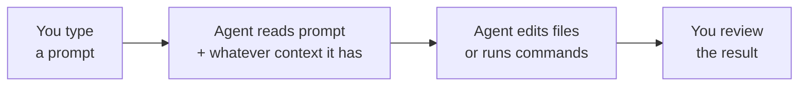

# Garbage In, Garbage Out: Why Prompting Is a Skill

AutoNate's colony held the line. Harvesters harvesting, haulers hauling, a tower that actually swings its aim at whatever crosses the wall, roads laid out like he planned them instead of like he panicked and slapped them down at 2am. The Virtual Battle Bot League is real now, not a rumor from a stream — it's a bracket with his name pending, and creeps that keep running whether he's watching or not. He should feel finished. He doesn't.

Because the second he opens a fresh room to start a second colony — stacking rooms is exactly what the league rewards — every single line of what got him this far has to get written again. Roles. Spawn logic. Defense. Except this time double it, because remote mining, room reservation, and a real defender rotation are things his current colony still doesn't have and desperately needs. Hand-typing every `if` statement that got him this far took weeks. He doesn't have weeks per room. He's got maybe a weekend before somebody else in the bracket claims the room he's eyeing.

That's the week AutoNate hears about coding agents — not autocomplete, not a chatbot in a browser tab, but something that sits right inside his editor and terminal, reads his actual files, and can write and run code on his say-so. People are calling it a superpower. His cousin's calling it "basically cheating." AutoNate, being AutoNate, opens it up that same night expecting to just tell it what he wants and watch a whole army of new roles appear.

It does not go that way.

## 1. Type Fast, Get Nothing Good

He types the first thing that comes to mind: "make my colony better." Hits enter. Watches the agent think for a few seconds, then confidently rewrite half his `main.js`, introduce a role called `upgrader2` that duplicates logic already sitting in `upgrader.js`, and delete a comment he'd left himself as a reminder about a CPU bug he hadn't fixed yet. Nothing's broken exactly. Nothing's better either. It's just... different, in ways he didn't ask for and can't fully explain.

He tries again: "no, fix the harvester." The agent asks which harvester — he's got three files with harvester logic scattered across three different weeks of learning. He didn't know that was a real question until it asked. He picks one. It "fixes" a bug that wasn't there and misses the one that is.

```text
AutoNate: make my colony better

Agent: I've updated main.js and added upgrader2.js with
an improved upgrade routine.

AutoNate: ...that's not what I wanted
```

## Coder's Corner: What Is an AI Coding Agent, Anyway?

Let's step out of the story for a second, because you're about to spend five chapters directing one of these things and it helps to know what's actually happening under the hood.

An **agent** here isn't magic and it isn't a search engine. It's a **model** — a large language model, trained on a huge pile of text and code — wired up to **tools**: the ability to read a file, edit a file, run a terminal command, and see the result. You give it a **prompt**, which is just the instruction you type. It reads that prompt, reads whatever else it's been given (more on that next chapter), and produces an action: an edit, a new file, a command to run.

Here's the part that trips people up: the model doesn't know your project. It doesn't remember your colony from last week. It doesn't know that `harvester.js` is the old one you stopped trusting and `harvester2.js` is the one that's live. It only knows what's sitting in front of it *right now* — the prompt, the files it's been pointed at, whatever's already happened in this same conversation. Everything else is invisible to it, no matter how obvious it feels to you.



That loop only works if what goes in on the left is actually good. A vague prompt with no context produces a confident, fluent, completely wrong answer just as easily as it produces a great one — the agent doesn't hesitate either way. That's the whole lesson of this pack: **garbage in, garbage out** isn't a warning about the agent being bad. It's a warning about you skipping a skill you didn't know you needed.

## 2. Name What Actually Went Wrong

AutoNate stops and looks at what actually happened. He didn't tell the agent which file. He didn't tell it what "better" meant — faster harvesting? fewer bugs? more roles? He didn't tell it what to leave alone. He assumed "it's smart, it'll figure out what I mean," the same way he once assumed the Screeps API would just know what he meant before he learned to read error codes instead of guessing.

Same lesson, new tool. Quick isn't the same as trained. He got fast at typing questions. He never got trained at asking them.

## 3. Sanity Checks

If the agent changes files you didn't expect: you didn't scope the ask — say exactly which file, and tell it explicitly not to touch the rest.

If it invents a role or function you never asked for: your prompt described a feeling ("better") instead of a task — restate it as something you could verify pass or fail.

If you get a different answer every time you ask the same vague thing: that's not the agent being unreliable, that's you leaving it to guess — the fix is a sharper prompt, not a different tool.

If you're tempted to just do it by hand instead: fair, but that's the wall you're trying to get past — the skill is learnable, and that's what the rest of this pack is for.

AutoNate closes his laptop that night more annoyed at himself than at the tool. He didn't get burned by bad tech. He got burned by a bad ask. Fine. If asking well is the skill, he'll train it like every other one.

Next: `01-give-it-the-room-not-just-the-ask.md` — what "context" actually means to an agent, and why you can't just dump everything and hope.
