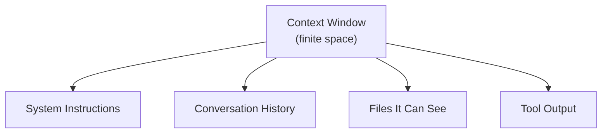

# Give It the Room, Not Just the Ask: What Context Really Means

AutoNate goes down a rabbit hole after last night's mess. Everyone posting good results with their agent keeps using this one word like it's the actual secret, not the prompt itself: **context**. He always figured context was just background info — the kind of thing you throw in if you're being polite about it. Turns out it's closer to what the agent is actually holding in its hands while it works, and it's got a limit, and every prompt he typed last night ignored that limit completely.

He starts picturing it like fight night. You don't bring your whole gym into the ring corner between rounds — you bring the mouthguard, the water, the one thing your coach needs to say in fifteen seconds. Everything else stays outside the ropes, even if it's useful, because it doesn't fit and it doesn't matter for this round. An agent's working memory for a given request behaves the same way: finite room, and everything sitting in it costs space, whether it's helping or not.

If that sounds like a technical detail you can skip past, it's not — it's the one idea the rest of this pack is built on. Get this chapter right and every prompt after it gets easier.

## Coder's Corner: What's Actually In the Context Window

Let's step out of the story for a second. This is the concept everything else in this pack leans on, so get it solid now.

Every time you send a message to an agent, it isn't just reading your latest sentence. It's re-reading a whole bundle of text at once, called the **context window** — the total amount the model can "see" and reason over for that one request. That bundle is built from four kinds of ingredients:

**System instructions** — background rules the agent's been given about how to behave, before you ever typed anything. You usually don't write these yourself, but they're in there shaping the whole conversation underneath everything you say.

**Conversation history** — everything you and the agent have already said to each other in this session. Ask it to "fix the same bug" ten messages later and it's leaning on this to know what "the same bug" even refers to.

**Files it can see** — whatever you've opened, pointed it at, or let it read through its tools. If a file's never been shown to it, it doesn't exist as far as the agent's concerned, no matter how central it is to your project.

**Tool output** — the result of anything the agent ran: a file it read, a command it executed, an error message it got back. This one sneaks up on people, because it fills up fast. Read one huge log file and suddenly most of your context window is spent on text nobody's ever going to look at again.



All four compete for the same limited room. That's the part AutoNate missed last night — he assumed the agent could just see his whole project because the project existed. It can't. It sees exactly what's inside that window, and nothing outside it, ever.

## 1. Stop Assuming It Can See Everything

AutoNate opens his colony's file tree — a dozen-plus files by now: roles, spawn logic, a tower controller, a couple of old experiments he never got around to deleting. He'd been typing prompts assuming the agent had already scanned the whole thing, the way he had over weeks of building it. It hadn't. It only had whatever he'd opened or pointed it at in that session. First fix, before anything about wording: know what's actually in the room before you start talking.

## 2. Don't Just Dump Everything In

His first instinct after learning this is to overcorrect — paste every file into the chat "just to be safe." Bad move, and not just because it's slow. A context window stuffed with fifteen files means the one line that actually matters is buried in noise, and the agent has to guess what's relevant same as it did when it had nothing at all. More context isn't automatically better context. It's a budget, not a bottomless bag.

## 3. Watch What Fills Up Without You Adding Anything

He runs a command through the agent that dumps a huge Screeps API error log, thinking it'll help it debug. It does — for that one message. But now a chunk of his context window is permanently spent on a wall of text he'll never need again, crowding out room for the rest of the conversation. Tool output counts against the same budget as everything else. He starts asking the agent to summarize long output for him instead of leaving the raw dump sitting in the window.

```js
// what AutoNate started asking for instead of a raw dump
// "Summarize this error log to just the lines mentioning
// my own files, then tell me the most likely cause."
```

## 4. Sanity Checks

If the agent seems to "forget" something from three messages ago: the conversation's gotten long enough that earlier context is getting crowded out — restate the important part instead of assuming it's still fully in view.

If it confidently answers about a file it's never actually seen: you assumed visibility that wasn't there — point it at the file directly, don't rely on the project existing.

If responses get slower or vaguer the longer a session runs: your context window's filling up with stale history and tool output — start a fresh session for a new task instead of dragging the old one along.

If you're not sure what's in its context right now: ask it. Literally asking "what files have you seen so far in this conversation" is a legitimate move, not a cheat.

AutoNate starts treating every prompt as two questions instead of one: what am I asking, and what does it actually need in the room to answer that well. Half the mess from last night wasn't a bad ask. It was an empty room.

Next: `02-structuring-the-ask.md` — turning a vague ask into one that gets it right the first time.
