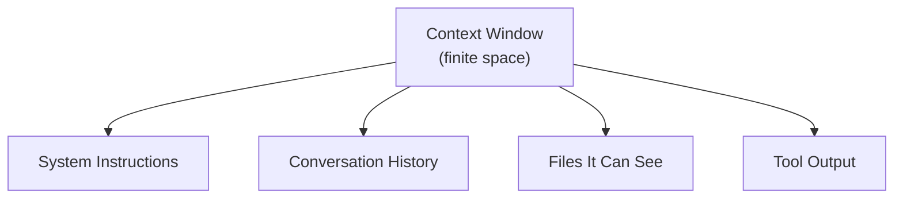

# Give It the Room, Not Just the Ask: What Context Really Means

Nate and Kai are building a studio together out of Fairview — he's self-taught and fast, she came out of civic grant work and does not accept an answer without a source. They've just started directing an AI coding agent at their real repo instead of hand-writing everything, and their first night with it went badly enough in two directions that they made a rule about it. Everyone posting good results with these tools keeps using one word like it's the actual secret, and it isn't the prompt: **context**.

Nate always figured context was background info. The stuff you throw in if you're being polite about it. It turns out to be closer to *what the agent is physically holding while it works* — and it has a hard limit, and every prompt either of them typed on Monday ignored that limit completely.

If that sounds like a technical footnote you can skim past, it isn't. It's the one idea the rest of this pack sits on. Get this chapter solid and every prompt after it gets easier.

## 1. The File It Had Never Seen

Thursday. Nate has a real bug and he is, to his credit, using the tool.

Their scoring module ranks the ideas people brought up at Founders Table so they can pick three to actually build. It's double-counting somebody. Nate types a genuinely decent question:

```text
Why is our scoring function double-counting ideas from the
same person?
```

The agent answers in about two seconds, and the answer is *gorgeous*:

```text
The issue is in lib/score.js. Your scoreIdea() function sums
the `votes` array before filtering by `submitterId`, so an
idea submitted by someone who also voted on it gets credited
twice. Move the filter above the reduce and the double-count
goes away.
```

Nate says "ohhh" out loud. He is already reaching for the file. It's a real explanation of a real class of bug, it names their actual function, it names a plausible field, it prescribes a specific one-line fix.

Kai, from the other side of the table, not even looking up: "Where's that from?"

"It's in `score.js`."

"Did you show it `score.js`?"

Pause. "It's... in the project."

"So is my grocery list." She turns the laptop. "Open the file."

They open the file. There is no `votes` array. There is no `submitterId`. There is no `reduce`. `lib/score.js` is forty lines of `if` statements Nate wrote at 2am in the JavaScript pack and never touched again, and the actual double-count is because he compares names with `==` on a field that sometimes has a trailing space.

The agent had never seen the file. Not once. It had been handed a sentence containing the words "scoring function" and "double-counting" and it wrote the most plausible bug in the world — a bug that lives in thousands of real codebases, described perfectly, in someone else's repo.

"It didn't read it," Nate says.

"It couldn't. You didn't give it to it."

"But it *answered*."

"That's the part you have to get used to."

## Coder's Corner: What's Actually In the Context Window

Step out of the story, because this is the concept everything else leans on.

Every time you send a message to an agent, it is not just reading your latest sentence. It re-reads a whole bundle of text at once, called the **context window** — the total amount the model can see and reason over for that single request. That bundle is assembled from four ingredients:

**System instructions** — background rules the agent was given about how to behave, before you typed anything. You usually don't write these, but they're in there, shaping everything underneath.

**Conversation history** — everything you and the agent have already said in this session. Ask it to "fix the same thing" ten messages later and this is what tells it what "the same thing" means.

**Files it can see** — whatever you opened, pointed it at, or let it read with its tools. If a file has never been shown to it, that file does not exist as far as the agent is concerned, no matter how central it is to your project. This is the one that got Nate.

**Tool output** — the result of anything the agent ran: a file it read, a command it executed, an error it got back. This one sneaks up on people, because it fills up fast and you didn't type any of it.



All four compete for the same finite room, and that room is measured in **tokens** — chunks of text roughly the size of a short word or a word fragment. A rough rule of thumb for English prose is about four characters per token; code, JSON, and log output usually run denser than that, so a file eats more of the window than its line count suggests.

The critical thing is that an empty slot doesn't fail loudly. When the agent has no information about `lib/score.js`, it doesn't say "I have not seen that file." It produces the most likely thing a file with that name would contain. Absence of context looks exactly like presence of context from where you're sitting.

## 2. Stop Assuming It Can See Everything

Kai's fix is procedural, which is how Kai fixes everything. Before you ask about a file, put the file in the room:

```bash
# point it at the actual file, don't gesture at the project
agent run "read lib/score.js, then explain why it double-counts
the same submitter"
```

Or, if your tool works off open editor tabs, open the tab. The mechanism varies. The rule doesn't: **the agent knows what it has been handed, and nothing else.**

They re-run it with the file actually in context. The answer this time is short, boring, and correct — the trailing-space comparison, line 22 — and it does not include the word `reduce` anywhere.

## 3. Don't Just Dump Everything In

Nate's instinct, immediately: paste in the whole repo. Every file, every time, just to be safe.

Bad move, and not just because it's slow. A context window stuffed with fifteen files means the one line that matters is buried in fourteen files of noise, and the agent has to guess what's relevant — which is the exact situation you were in when it had nothing. More context is not automatically better context.

It's a budget, not a bottomless bag. Kai gets this one immediately, because it's the same reason you don't attach every document you own to a grant application. Somebody has to read it, and they will read the wrong part.

## 4. Watch What Fills Up Without You Adding Anything

Friday, Nate has the agent run `npm install` plus their handful of tests to check a dependency issue. It works. It also dumps about nine hundred lines of install log, deprecation warnings, and funding solicitations straight into the conversation.

That output is now permanently sitting in the context window, crowding out room for everything after it, and neither of them will ever read a word of it again. Tool output counts against the same budget as everything else — and it's the sneakiest consumer, because you didn't type it and you don't see it as "context."

So he changes what he asks for:

```text
Run the tests. Don't paste the full output — give me only the
lines for failing tests, plus a one-sentence summary of what
failed and where.
```

Same information, a fraction of the room. This generalizes: any time you're about to have an agent read a huge log, a giant JSON blob, or a 6,000-line lockfile, ask for the filtered version instead of the whole thing.

## 5. Ask It What It Can Actually See

The last move is the cheapest and the least obvious: just ask.

```text
Before you answer: list every file you have actually read in
this conversation. If you have not read lib/score.js, say so
instead of guessing.
```

This is not a trick or a jailbreak, it's a legitimate diagnostic, and it converts the silent failure into a loud one. An agent that will happily invent `submitterId` when asked to explain a file will also, when asked directly, tell you it hasn't read anything. Nate now runs this as the first line of any session where he's confused about why the answers feel off.

Kai adds a second line to the whiteboard, under Monday's two:

```text
If it wasn't in the room, it didn't happen.
```

## 6. Sanity Checks

If the agent confidently describes a file it has never been shown: that's not a lie, that's an empty slot getting filled with plausible material. Hand it the file and ask again.

If it seems to "forget" something from ten messages ago: the conversation has grown long enough that earlier material is getting crowded out. Restate the important part instead of assuming it's still fully in view.

If responses get vaguer or slower the longer a session runs: your window is full of stale history and old tool output. Start a fresh session for a new task instead of dragging the old one along.

If a single command dumps a wall of text: ask for the filtered or summarized version next time. Raw output is the most expensive, least useful thing you can put in the room.

If you're not sure what it currently has: ask it to list what it's read. Ten seconds, and it turns a guess into a fact.

Nate stops treating a prompt as one question and starts treating it as two: *what am I asking*, and *what does it need in the room to answer that honestly*. Half of Monday's mess was never a bad ask. It was a good ask shouted into an empty room, and the room answered anyway.

Next: `02-structuring-the-ask.md` — Kai discovers she's been writing well-structured prompts for ten years and calling them something else.
