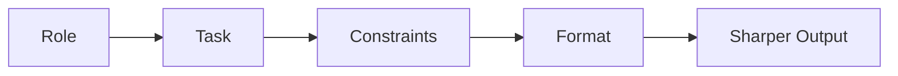

# Structuring the Ask: Role, Task, Constraints, Format

The context problem is mostly handled. AutoNate's learned to open exactly the files that matter and leave the rest closed, to summarize instead of dumping raw logs, to treat the agent's attention like a budget instead of something bottomless. So the next prompt should go fine, right?

He asks for a scout — a creep that checks out nearby rooms so he can plan a second colony without walking the map himself, room by room. Types: "add a scout that explores nearby rooms." The agent obliges immediately. Writes `scout.js`, wires it into the spawn logic, and within a few ticks he's got a creep wandering the map. Except that's exactly what it's doing — wandering. No route, no memory of where it's already been, no way to tell AutoNate what it found once it got there. It walked straight into a room with a hostile tower and died before it reported back a single useful thing.

Not garbage. Worse, almost — it's plausible. It runs, it doesn't error, and it does something in the general shape of what he asked for. That's the trap: a vague ask doesn't usually get you an obvious failure. It gets you something that looks close enough that you don't notice it's wrong until it's already cost you a creep.

He pulls the prompt back up and reads it the way his old boxing coach used to read back a bad combo: what did you actually tell it to do? "Explores nearby rooms." That's not a task. That's a vibe.

## Coder's Corner: Anatomy of a Prompt

Let's step out of the story for a second. There's a pattern good prompts share, and once you see it you'll notice every bad prompt is missing at least one piece of it.

**Role** — who the agent should act as for this task. You're not switching to a different program by saying this, you're aiming the one you've got. "Act like a careful Screeps engineer reviewing an existing codebase" pulls noticeably different behavior out of a model than saying nothing at all.

**Task** — the specific, checkable thing you want. Not "explores nearby rooms" — that's an outcome with no shape to it. "Visits each room adjacent to my colony exactly once, logs whether it has hostile structures, and returns home when done" — that's a task you can actually verify happened or didn't.

**Constraints** — the rules it has to work inside. Don't touch existing files. Stay under a CPU budget. Match the naming pattern already used in `roles/`. Constraints are what stop a technically-correct answer from being a practically-useless one.

**Format** — the shape you want the response back in. A new file, or a change to an existing one? Should it explain its plan before writing code, or just write it? Do you want the full file, or a description of the diff?

**Example** *(optional but strong)* — a small snippet showing what "right" looks like. Nothing narrows a guess faster than one concrete example sitting next to the ask.



None of this is exotic. You already do a version of it everywhere else in life — you don't ask a corner man to "make me better," you tell him what round it is, what you're worried about, and what you need to hear in the fifteen seconds you've got. Same move here.

## 1. Give It a Role

AutoNate's second try starts with a sentence he wouldn't have thought to write the day before:

```text
You're a careful Screeps engineer reviewing an existing
colony codebase. Don't rewrite working code — only add
what's asked.
```

Small thing. But it changes the agent's whole posture — less "let me improve everything I see," more "let me do exactly this and nothing else."

## 2. Name the Actual Task

Then the task, specific enough that he could check it himself:

```text
Add a new role, scout.js, following the pattern used in
harvester.js. It should visit each room adjacent to my
current room exactly once, log whether FIND_HOSTILE_STRUCTURES
returns anything, then return to my colony and stay idle.
```

## 3. Set the Constraints and the Format

```text
Constraints: don't modify any existing file. Keep CPU
usage low — no pathing recalculated every tick.
Format: give me the full new file, then a one-line summary
of how to spawn it from the console.
```

Same request, four sentences longer, and the difference in what comes back isn't subtle. The scout the agent writes this time has a route, a memory of visited rooms, and a `console.log` that actually tells AutoNate something useful when it gets home.

```js
// roles/scout.js
// What a scoped, structured prompt actually produced.
module.exports.run = function (creep) {
  if (!creep.memory.visited) creep.memory.visited = [];

  const target = Game.rooms[creep.memory.targetRoom];
  if (target && creep.room.name === creep.memory.targetRoom) {
    const hostiles = target.find(FIND_HOSTILE_STRUCTURES).length > 0;
    console.log(`AutoNate scout: ${creep.room.name} hostile structures: ${hostiles}`);
    creep.memory.visited.push(creep.room.name);
    creep.memory.targetRoom = null;
  }
};
```

## 4. Iterate Instead of Accepting the First Answer

It's not perfect yet — the first version reports hostile structures but not hostile creeps, which matters more for AutoNate's purposes right now. Old AutoNate would've either lived with it or scrapped the whole thing and started over. New move: treat the first output as a draft, not a verdict.

```text
Good start. Also log FIND_HOSTILE_CREEPS in each room,
same format as the structure check.
```

One more pass, and it's exactly what he needed. Iterating on a working draft is faster than re-explaining the whole task from zero every time something's slightly off — and it keeps the constraints from the first ask intact instead of risking them getting lost in a rewrite.

## 5. Sanity Checks

If the output "looks right" but does something different than you meant: your task was described as a feeling, not a checkable outcome — rewrite it as something you could grade pass or fail.

If the agent rewrites things you never asked it to touch: you skipped the role or constraints — tell it explicitly what's off-limits before it starts.

If you're not sure what shape the answer should come back in: you skipped format — say so up front, it costs one sentence and saves a rewrite.

If the first answer's close but not quite right: don't start over — tell it exactly what's off and let it revise. That's usually faster and safer than a fresh attempt from scratch.

AutoNate's scout comes home this time. Route walked, rooms logged, hostiles flagged, zero casualties. Four sentences of structure did what a whole evening of vague asks couldn't. He's starting to get why people call this a skill and not a trick.

Next: `03-feeding-it-the-right-files.md` — what to actually hand the agent, and what to leave out.
