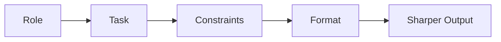

# Structuring the Ask: Role, Task, Constraints, Format

Nate and Kai are two people in Fairview building a studio together and learning, this month, to direct an AI coding agent at a real repo instead of hand-writing every line. He's self-taught and quick on the keyboard; she spent ten years writing grant proposals and program scopes for a mid-size city and cannot let an unsourced claim go by. They've got the context problem mostly handled now — open the files that matter, leave the rest closed, don't dump a nine-hundred-line install log into the room and call it help.

So the next one should go fine.

The job is real and it's overdue: nineteen people signed a paper sheet at Founders Table Demo Night, Kai typed them into a CSV, and every day they don't follow up is a day those nineteen people forget who they were talking to. They need a module that turns signups into draft emails. Nate types:

```text
add follow-up emails for the signup sheet
```

The agent obliges instantly. Writes a file. Wires it up. Nate runs it and nineteen drafts print to the terminal, formatted, addressed, grammatical.

And they're wrong in a way that takes a full minute to see. Every draft is identical except the name, so it reads like a mail merge from a dentist. It emails all nineteen, including the four people who explicitly did not check the contact box, which Kai points out is not a style problem, it's a *don't do that* problem. Nobody's actual idea appears anywhere. And it sends live — there is no dry-run, no preview, nothing between `node index.js` and nineteen real humans getting a real email.

Not garbage. Worse than garbage, almost. It's *plausible*. It runs, it doesn't error, and it does something in the general shape of what he asked for, which is exactly why he almost didn't look closely.

Kai reads the prompt off the screen out loud. "'Add follow-up emails for the signup sheet.'"

"Yeah."

"Nate, that's a wish."

She pulls her own laptop over, opens a folder she has not opened since she left her old job, and finds a scope of work she wrote for a city youth-programs contract in 2023. Sets it next to his one-line prompt.

"This is the same document," she says. "Yours is just missing everything."

## Coder's Corner: Anatomy of a Prompt

Step out of the story for a second. There's a pattern good prompts share, and once you can see it you'll notice that every bad prompt is missing at least one piece.

**Role** — who the agent should act as for this task. You are not switching to a different program by saying this; you're aiming the one you have. "Act as a careful engineer reviewing an existing codebase, not a rewriter" pulls measurably different behavior out of a model than saying nothing, because it changes what kind of text the response is a plausible continuation of.

**Task** — the specific, checkable thing you want. Not "add follow-up emails" — that's an outcome with no edges. "Given an array of signup objects, return an array of `{to, subject, body}` drafts, one per person who consented" is a task you can verify happened or didn't.

**Constraints** — the rules it has to work inside. Don't touch existing files. Don't add dependencies. Match the naming pattern already used in `lib/`. Constraints are what stop a technically-correct answer from being a practically-useless one.

**Format** — the shape you want back. A new file or a diff to an existing one? Should it explain its plan before writing code, or just write it? Full file or just the changed function?

**Example** *(optional but powerful)* — a small snippet showing what "right" looks like. Nothing collapses the space of guesses faster than one concrete sample sitting next to the ask.



Skip a row and the agent does not skip it. It fills it in silently, on its own terms, using the average of everything it has ever seen. Every unstated decision is still a decision — you just didn't make it.

## 1. Kai Teaches This One

This is the part where the person who has never shipped a line of production code turns out to have been doing this professionally for a decade.

"Every scope of work I ever wrote had the same five sections," Kai says, "because every one of them had to survive somebody hostile reading it later." She writes them on the whiteboard, in order, and draws an arrow from each one to the prompt anatomy next to it.

| Her old section | What it did | Prompt equivalent |
| --- | --- | --- |
| *Contractor Qualifications* | Who we're addressing and what stance we expect from them | **Role** |
| *Deliverables* | The concrete things that must exist at the end | **Task** |
| *Out of Scope* | What we are explicitly not paying for | **Constraints** |
| *Submission Requirements* | Page limits, section order, file format | **Format** |
| *Attachment A* | A sample of a past accepted response | **Example** |

"The section that saved me the most," she says, tapping the third row, "was never Deliverables. It was Out of Scope. Every single time. Because a vendor who doesn't know what they're not supposed to do will absolutely do it, invoice you for it, and be *correct*, because you never wrote it down."

Nate looks at his prompt. Then at `lib/`, which now contains a file the agent generated called `emailSender.js` that reaches out to the network at import time.

"I never told it not to send."

"You never told it there was such a thing as not sending."

He also, she notes, named his own draft of the module `lib/haymaker.js`, after a punch, for reasons he defends for ninety seconds and then abandons. That goes in Out of Scope too.

## 2. Build It Back, One Row at a Time

They rewrite the ask in front of each other, section by section. **Role** first:

```text
You're a careful Node.js engineer working inside an existing
small codebase. Prefer boring, readable code. Don't refactor
anything you weren't asked to touch.
```

Small thing. It changes the whole posture — less "let me improve everything I can see," more "let me do this one thing and stop."

Then **Task**, specific enough that either of them could grade it:

```text
Task: add lib/followups.js exporting one function,
draftFollowups(signups). It takes an array of signup objects
with fields firstName, email, idea, and consent. It returns an
array of { to, subject, body } objects — one per signup where
consent === 'yes' and email is non-empty. It does not send
anything.
```

Then **Constraints** and **Format**, which cost four sentences and prevent about four hours:

```text
Constraints: no new dependencies. No network calls anywhere in
this file — drafting only, sending is a separate concern. Pure
function: no reading files, no writing files, no console output.
Match the existing style in lib/ — CommonJS, module.exports at
the bottom, files named for what they do.

Format: give me the complete new file, then three bullets on
how you'd test it. No changes to any other file.
```

Same request. Four sentences longer. The difference in what comes back is not subtle:

```js
// lib/followups.js
// Produced by a structured ask: role, task, constraints, format.

const SUBJECT_PREFIX = 'Founders Table follow-up';

function buildBody(name, idea) {
  return (
    `Hey ${name} — Nate and Kai here, from Founders Table.\n\n` +
    `You mentioned ${idea}. We're picking three of these to actually ` +
    `build before next month's Demo Night, and yours is on the short list.\n\n` +
    `Worth twenty minutes on a call?\n\n— AutoNateAI`
  );
}

function draftFollowups(signups) {
  return signups
    .filter((s) => s.consent === 'yes' && s.email)
    .map((s) => ({
      to: s.email,
      subject: `${SUBJECT_PREFIX} — ${s.firstName}`,
      body: buildBody(s.firstName, s.idea),
    }));
}

module.exports = { draftFollowups };
```

Nineteen rows in, fifteen drafts out, four people who didn't consent quietly not in the list, and nothing anywhere in the file that can reach the internet.

## 3. Treat the First Answer as a Draft, Not a Verdict

It is still not right, and this is the step people skip.

Nate runs it against the real CSV and three of the drafts open with `Hey  —`. Two people wrote initials only. One wrote their company name in the first-name column. Kai's row has an idea field that's just the word "same," because she was writing fast at a folding table.

Old Nate would have either lived with it or thrown the whole thing out and started over from zero. The move is neither:

```text
Good — keep everything else exactly as is. Two fixes:
1. If firstName is missing or blank, use "there" instead, so
   the greeting reads "Hey there —".
2. If idea is missing, blank, or shorter than 4 characters,
   drop the sentence about it entirely rather than printing an
   empty one.
Show me only the changed function.
```

One pass. Done. Iterating on a working draft is faster than re-explaining the task from scratch, and — this is the real reason — it keeps the constraints from the first ask intact. Start over and "no network calls" is a coin flip again.

## 4. Say What "Done" Looks Like Before You Start

The last thing Kai adds is the one Nate never would have thought of, and it's straight out of a procurement document: acceptance criteria. Not "what should it do," but "what will I check to decide it's finished."

```text
Before you write anything, list the 3-5 checks you'd expect
this to pass. I'll confirm them, then you implement.
```

The agent comes back with: consented-only filtering, blank-name fallback, no I/O, stable output length, no mutation of the input array. Kai adds a sixth (emails must be trimmed and lowercased, because the CSV is full of human typing) and *then* lets it write.

Thirty seconds of agreement up front, and now "is it done" is a question with an answer instead of a vibe. This is also — though neither of them says it out loud — precisely how you evaluate a proposal.

## 5. Sanity Checks

If the output "looks right" but does something different from what you meant: your task was a feeling, not a checkable outcome. Rewrite it as something you could grade pass or fail.

If the agent does something destructive or irreversible you never asked for: you skipped constraints. The most valuable sentence in any prompt is usually the one about what *not* to do.

If it rewrites files you never mentioned: state the blast radius explicitly — "no changes to any other file" — before it starts, not after.

If you're not sure what shape the answer should come back in: that's format, and it costs one sentence. Say "full file" or "just the changed function" and stop getting the wrong one.

If the first answer is close but not quite: don't restart. Tell it exactly what's off and say "keep everything else the same." Restarting loses every constraint you already won.

If you can't write acceptance criteria for your own request: that's not a prompting problem, that's you not knowing what you want yet. Fix that first — it's cheaper in a sentence than in a file.

The follow-ups go out Thursday. Fifteen of them, personalized, from a function that structurally cannot send anything on its own. Four sentences of structure did what an entire evening of vague asking could not, and Nate spends the walk home slightly irritated that the best prompt engineer he knows learned it from bureaucratic PDFs.

"You know this is just RFP writing," he says.

"I know."

"Like exactly."

"I *know*, Nate."

Next: `03-feeding-it-the-right-files.md` — what to actually hand the agent, what to archive, and how to stop it copying from code you abandoned in March.
