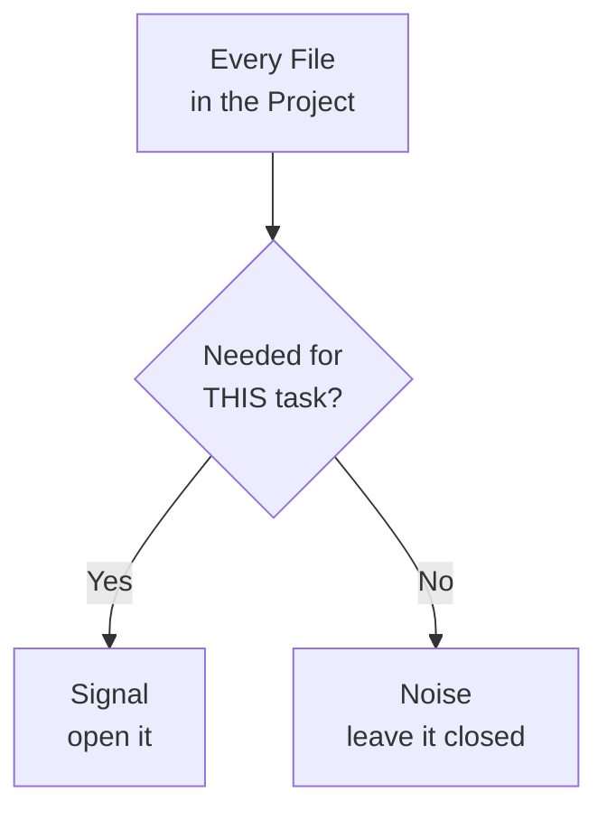

# Feeding It the Right Files: Practical Context Engineering

AutoNate's prompts are sharper now — role, task, constraints, format, and he doesn't flinch at asking for a second pass instead of a full restart. But the next job is bigger than one file. He wants remote mining: a hauler that leaves his colony, works a source in a neighboring room, and hauls energy home to fuel the second colony he's trying to stand up. That touches `spawnManager.js`, a brand-new `remoteHauler.js`, `roles/harvester.js` as a reference pattern, and probably how he's tracking memory for the remote room.

He doesn't know exactly which of those the agent needs, so he opens all of them — plus two old experiment files he forgot he still had lying around, plus a notes file from back when he was first learning `find()`. Figures more open tabs can't hurt.

It can. The agent doesn't error out, it just gets mushy. It half-updates `spawnManager.js` in a way that almost matches his real pattern, references a variable name from the dead experiment file like it's still live, and blends two different eras of his own coding style into one file that follows neither. He recognizes the shape of this mistake immediately — it's the same "stuff everything in and hope" move from the context chapter, just applied at the level of picking files instead of pasting text.

## Coder's Corner: Signal vs Noise in Context

Let's step out of the story for a second. Knowing that context is finite (last chapter) only gets you halfway. The actual skill is choosing what goes into that finite space — and that comes down to four ideas.

**Signal** — the information that actually changes what the agent should do. The pattern in `harvester.js` it should mimic. The naming convention already in use across `roles/`.

**Noise** — everything else sitting in the window that doesn't change the answer but still costs space and pulls attention. Old dead files. Unrelated roles. A notes file from three weeks ago.

**Relevance** — not "related to Screeps in general," but "actually needed for this specific task." A file can be genuinely part of your project and still be pure noise for the thing you're asking right now.

**Retrieval** — the actual skill here: picking exactly what's relevant instead of everything available. This is the real work of context engineering. Not writing more context. Choosing better context.



AutoNate's mistake wasn't opening too little. It was opening without asking that middle question first. Every file he adds to the conversation should earn its place, the same way every part on a creep's body has to earn its energy cost.

## 1. Point It at Only What the Task Touches

Second attempt, same remote mining task. He closes the dead experiments and the old notes file, and opens exactly three: `spawnManager.js` (where the new spawn logic goes), `roles/harvester.js` (the pattern to follow), and a new empty `roles/remoteHauler.js` (where the output goes). Nothing else. The agent's first draft this time matches his existing style on the first try — because the only style it could see was the real one.

## 2. Cut the Dead Weight Before You Start

That means actually deleting or archiving the old experiment files, not just ignoring them. A file sitting in the project is a file that might get opened by accident, referenced by a search, or pulled in "to be thorough." AutoNate starts keeping a `/archive` folder for anything he's not using but isn't ready to lose — out of the way, out of the context, still on disk if he ever wants it back.

```bash
mkdir archive
mv scout-v1.js upgrader-experiment.js archive/
```

## 3. Summarize Instead of Paste

Some files are too big to open in full and still leave room for anything else — a sprawling `main.js` that's grown for weeks, or a long console log from a bad tick. Instead of pasting the whole thing, he asks the agent to work from a summary first.

```text
Here's my main.js — it's long. Before we touch anything,
summarize what it currently does in six bullet points so
I can confirm you've got the right picture.
```

If the summary's wrong, he's caught a misunderstanding before it turns into a bad edit — for the cost of one extra message, not a rewritten file.

## 4. Let It Ask Instead of Guess

The other half of practical context engineering is admitting you don't always know what's relevant either. AutoNate starts adding one line to bigger asks:

```text
If you're missing a file you need to do this properly,
ask me for it before you start instead of guessing.
```

Small permission, big payoff. The agent that used to invent a variable name from a dead file now stops and asks which memory structure he's actually using for remote rooms — instead of assuming and getting it wrong three files deep.

## 5. Sanity Checks

If the agent blends old and new patterns in one file: it had too many examples open at once and couldn't tell which one was current — close everything but the real pattern and try again.

If it references something that doesn't exist in your live code: check what's still open in the conversation — a dead file's probably still sitting in context, feeding it stale information.

If a big file eats the whole conversation: don't paste it whole — ask for a summary first, then hand over only the section that's actually relevant.

If you genuinely don't know which file matters: say that out loud to the agent and let it ask you questions before it starts guessing on your behalf.

AutoNate's remote hauler ships clean on the second real attempt — three files open, the rest out of the room, one extra sentence giving the agent permission to ask instead of guess. The colony's building faster than he is now, which is exactly the point. It just took learning what to hand it, not just how much.

Next: `04-when-it-gets-it-wrong.md` — what to do when a good prompt with good context still comes back wrong.
