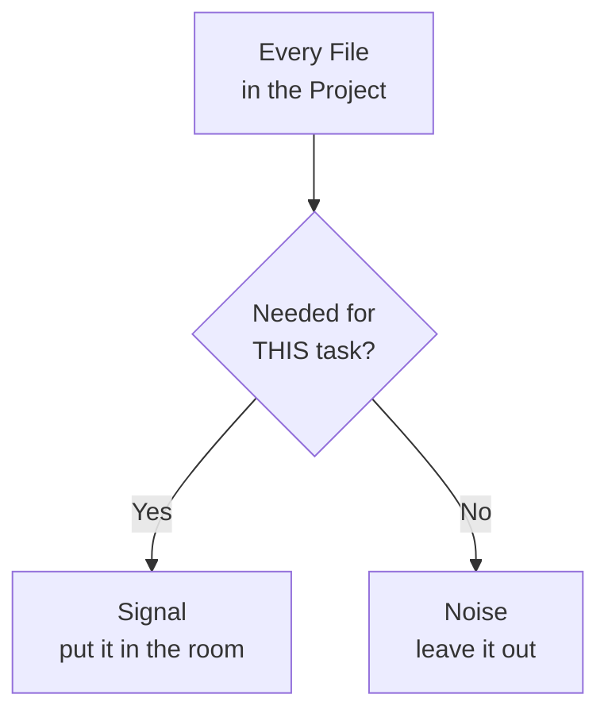

# Feeding It the Right Files: Practical Context Engineering

Nate and Kai are two people in Fairview building a studio, currently learning to direct an AI coding agent at their actual repo instead of hand-writing every line. He's self-taught and fast; she came out of a decade of civic grant work and treats every claim as unsourced until proven otherwise. Their prompts are sharp now — role, task, constraints, format, acceptance criteria before code — and they know context is a finite budget rather than a bottomless bag.

Knowing the budget is finite is the easy half. Choosing what goes in it is the actual job, and the next task is the first one big enough to punish them for getting it wrong.

They need to wire the follow-up drafter into the real program: read the Founders Table signup CSV off disk, run it through `draftFollowups()`, and print the results behind a `--dry-run` flag so nothing can go out by accident. That touches `index.js`, `lib/followups.js`, `lib/contacts.js`, and probably the CSV itself.

Nate isn't sure which of those the agent needs, so he opens all of them. Plus `lib/score.js`, because it's right there. Plus `score-old.js`, which he has not run since March. Plus `scratch.js`, a 200-line file he wrote at 2am during the JavaScript pack that contains four different attempts at the same loop. Plus `notes/demo-night.md`, plus the whole `data/` folder. Figures more open tabs can't hurt.

They can. The agent doesn't error — it gets *mushy*. It half-updates `index.js` in a shape that almost matches their real pattern. It imports `scoreIdeas()` from `score-old.js`, a function that has been dead for four months, as though it were live. It writes `lib/contacts.js` in the loose, comment-free, single-letter-variable style of `scratch.js`, because `scratch.js` was the largest JavaScript file in the room and it read like a style guide. And it invents a `config.contactsPath` setting because a line in `notes/demo-night.md` said *"figure out where contacts live — config?"*

Kai reads the diff. "It's writing like you at 2am."

"That's not—"

"It's `const d = c.map(x => x.e)`. That's a direct quote from `scratch.js`."

He recognizes the shape of this mistake immediately, because it's the same "stuff everything in and hope" move from two chapters ago, just moved up a level: instead of pasting too much text, he selected too many files.

## Coder's Corner: Signal vs Noise in Context

Step out of the story. Knowing context is finite only gets you halfway. The actual skill is choosing what occupies that finite space, and it reduces to four ideas.

**Signal** — information that changes what the agent should do. The pattern in `lib/followups.js` it should mimic. The exact shape of a row in the CSV. The one function it needs to call.

**Noise** — everything else in the window that doesn't change the answer but still costs room and pulls attention. Dead files. Unrelated modules. A notes file full of questions you already answered in your head.

**Relevance** — not "part of this project," but "needed for *this specific task*." A file can be genuinely load-bearing in production and still be pure noise for the thing you're asking right now.

**Retrieval** — the actual craft: picking exactly what's relevant instead of everything available. This is what "context engineering" means in practice. Not writing more context. Choosing better context.



And one non-obvious consequence: **dead code is worse than no code.** An empty room makes the agent invent something, which is bad. A room full of abandoned experiments makes it copy something that looks legitimate, is internally consistent, and is four months out of date — which is worse, because it doesn't look like a guess.

## 1. Point It at Only What the Task Touches

Second attempt, same job. They close everything and open exactly three files:

- `index.js` — where the new wiring goes
- `lib/followups.js` — the function being called, and the style to match
- `data/founders-table.csv` — the actual data shape, all nineteen rows of it

Nothing else. No `score.js`, no notes, no `scratch.js`. The first draft comes back matching their real conventions on the first pass — because the only conventions in the room were the real ones.

```js
// index.js
const { readFileSync } = require('node:fs');
const { draftFollowups } = require('./lib/followups');

const DRY_RUN = process.argv.includes('--dry-run');

function loadSignups(path) {
  const [header, ...rows] = readFileSync(path, 'utf8').trim().split('\n');
  const cols = header.split(',').map((c) => c.trim());
  return rows.map((line) => {
    const cells = line.split(',').map((c) => c.trim());
    return Object.fromEntries(cols.map((c, i) => [c, cells[i] ?? '']));
  });
}

const drafts = draftFollowups(loadSignups('./data/founders-table.csv'));

if (DRY_RUN) {
  console.log(`${drafts.length} drafts (dry run, nothing sent):\n`);
  for (const d of drafts) console.log(`→ ${d.to}\n  ${d.subject}\n`);
} else {
  console.error('Refusing to send. Sending is not implemented yet — use --dry-run.');
  process.exit(1);
}
```

Note what it *didn't* do: no `config.contactsPath`, no dead import, no single-letter variables. Same model, same task, same day. Different room.

## 2. Cut the Dead Weight Before You Start

Closing a file is a decision you have to make every single session. Archiving it is a decision you make once.

```bash
mkdir -p archive
git mv score-old.js scratch.js archive/
git commit -m "Archive dead experiments so they stop leaking into context"
```

They also check what else is quietly sitting around waiting to get pulled in:

```bash
# what's actually here, biggest first
ls -laS

# make sure the noisy stuff can never be committed or crawled
cat .gitignore
# node_modules/
# .env
# *.log
```

`node_modules/` and lockfiles are the classic ambush — a single `package-lock.json` is more tokens than every file either of them has ever written, and an agent that decides to "check the dependencies" can burn the whole window before it starts.

Kai's rule: if you're not willing to delete it, put it somewhere you'd never open by accident. `archive/` is not a graveyard, it's a quarantine.

## 3. Summarize Instead of Paste

Some files are too big to put in the room in full and still leave space for anything else. Instead of pasting, ask for a summary first and check it:

```text
notes/demo-night.md is long and mostly meeting scribbles.
Before we change anything: summarize what's in it in six
bullets, and flag anything that looks like a decision we
actually made versus a question we never answered.
```

If the summary is wrong, they've caught a misunderstanding for the price of one message instead of one bad edit three files deep. If it's right, the summary can stay in the room and the file itself can leave.

This works on logs too — the same move from the context chapter, applied deliberately instead of in a panic.

## 4. Let It Ask Instead of Guess

The other half of practical context engineering is admitting you don't always know what's relevant either. Nate starts appending one line to anything nontrivial:

```text
If you're missing a file you need to do this properly, ask me
for it before you start instead of guessing.
```

Small permission, disproportionate payoff. The agent that used to invent `config.contactsPath` now stops and asks whether email addresses are stored in the CSV or somewhere else — which is a question Nate could answer in four seconds and the agent could only answer wrong.

## 5. Write the Context Down Once Instead of Re-Explaining It

The last thing they add is the one that actually changes their week. Every session, they were re-typing the same five facts: it's CommonJS, `lib/` is pure functions, `index.js` is the only file that does I/O, don't touch `archive/`. So Kai does what Kai does and writes the standing instructions to a file at the repo root, where the agent can pick them up every time:

```md
# AutoNateAI — project context

- Node 22, CommonJS, zero build step. `npm start -- --dry-run` runs it.
- `lib/` holds pure functions only: no file I/O, no network, no console.
- `index.js` is the ONLY file allowed to touch disk, argv, or stdout.
- Files in `lib/` are named for what they do. Not after punches.
- `data/founders-table.csv` is nineteen real people. Nothing sends
  without an explicit flag, ever.
- `archive/` is dead code kept for sentiment. Never read it, never
  copy from it, never import from it.
- If you need a file you don't have, ask. Don't infer it.
```

Different tools look for this under different filenames — `AGENTS.md` and `CLAUDE.md` are the two you'll run into most — so check what yours reads and name it accordingly. The value isn't the filename. It's that the durable facts about your project stop living in Nate's head and start living somewhere the agent can be handed them for free, every session, without either of them remembering to.

Nate reads the last two lines twice. "'Never read it, never copy from it.' That's kind of dark for a folder."

"It earned that."

## 6. Sanity Checks

If the agent blends two eras of your own code style: too many examples were in the room and it couldn't tell which was current. Close everything but the one true pattern.

If it references a function or setting that doesn't exist in your live code: something stale is still in context. Check what's open, then archive what's dead — closing it this once won't help you next Tuesday.

If a single file eats the whole conversation: don't paste it whole. Ask for a summary, verify the summary, then hand over only the section that matters.

If you genuinely don't know which file is relevant: say that out loud and give it permission to ask. "Ask before guessing" is one sentence and it converts a silent wrong assumption into a question.

If you're re-explaining the same project facts every session: stop. Put them in a project context file at the repo root and let the tool load them for you.

If the agent starts reading `node_modules/`: interrupt it. Nothing good is in there, and it costs more room than your entire codebase.

The dry run prints fifteen drafts, in order, with a line at the top saying nothing has been sent. Three files in the room, two files in quarantine, one context file doing the work Nate's memory used to do badly. The studio is finally moving faster than either of them can type, which was the entire point.

It stays that way for about two days.

Next: `04-when-it-gets-it-wrong.md` — a good prompt, the right files, and a function that does not exist anywhere in the world.
