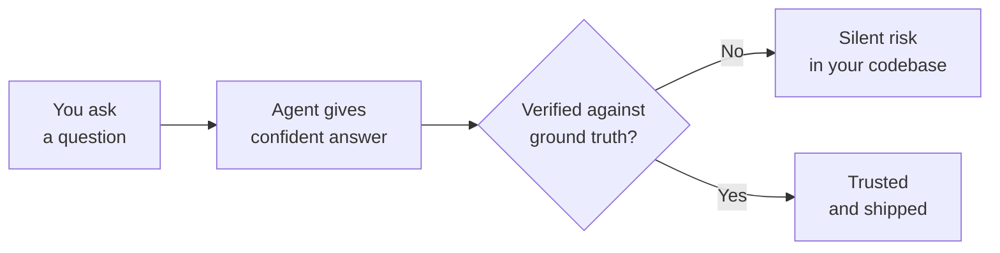

# When It Gets It Wrong: Hallucination, Ambiguity, and Trusting Nothing You Haven't Checked

AutoNate's good now. Genuinely — role, task, constraints, format, the right three files open and the dead ones archived, permission granted to ask instead of guess. His remote hauler's running, the scout's reporting clean, and for two straight days the agent's given him exactly what he asked for on close to the first try. He's starting to trust it the way he trusts a teammate who's been reliable for a while. That trust is about to get tested.

He asks it to help repair walls automatically when they drop below a threshold, keeping the same careful role-task-constraints structure he's been using all pack. The agent writes back clean, confident code, references a method called `room.getRemoteSources()` to find repair targets efficiently, and explains it like it's a well-known part of the Screeps API. AutoNate, trusting the pattern that's worked all week, drops it straight into `main.js` without reading it line by line. The game throws an error the second the code runs: that method doesn't exist. Never did. The agent didn't lie to him on purpose — it produced something that sounded exactly like every real API method he'd ever shown it, fluent and specific and completely made up.

That's a different failure than the ones from earlier chapters. This wasn't a vague prompt or a cluttered context window. He did everything right, and it still handed him something confidently wrong. Turns out that's not a bug he can prompt his way around entirely — it's a real, permanent property of the tool, and the last skill in this pack is learning to work with that instead of getting blindsided by it.

## Coder's Corner: Hallucination, Ambiguity, and Ground Truth

Let's step out of the story for a second, because this is the one failure mode that no amount of good prompting fully removes — it just gets rarer and easier to catch.

**Hallucination** is when a model states something false with the exact same fluent confidence it uses for something true. It's not guessing out loud, hedging, or flagging uncertainty — it sounds identical either way. `room.getRemoteSources()` reads exactly like a real Screeps method because the model has seen thousands of real methods shaped just like it, and it's pattern-matching the shape, not checking a real API reference against your actual game.

**Ambiguity** is different — it's not the agent being wrong, it's you leaving a decision open that it then has to make for you, silently. Ask it to "make the defender stronger" and it has to pick: more hit points? more damage? more defenders? better targeting logic? It'll pick something and commit to it without telling you there were four other reasonable answers.

**Ground truth** is the real, checkable state of the world — what the actual Screeps API supports, what your actual files actually contain, what actually happens when the code actually runs. The agent's output is a claim about ground truth, not ground truth itself. Confidence in the sentence is not evidence about the world.

**Verification** is the habit that closes the gap: treating every agent output as a claim to check, not a fact to accept, before it goes anywhere near your live colony.



The scary part isn't that hallucinations happen. It's that a hallucinated answer and a correct one look exactly the same from the outside. The only thing that tells them apart is you checking.

## 1. Spot the Confident Wrong Answer

The tell isn't tone — it's specificity dressed up as certainty with nothing backing it. `room.getRemoteSources()` sounded real because it was specific and matched the *shape* of real Screeps methods. AutoNate's new habit: any time the agent names a method, constant, or API call he doesn't personally recognize, he treats it as unverified until he's seen it in the actual docs or watched it run clean, not as a fact just because it was stated plainly.

## 2. Narrow the Ambiguity Before It Guesses For You

For the defender request, instead of "make the defender stronger," he learns to close the open questions himself first:

```text
Make the defender stronger by adding a second RANGED_ATTACK
part, staying within a 300-energy body cost. Don't change
its targeting logic — that part's already working.
```

Now there's nothing left for the agent to silently decide on his behalf. If he doesn't know which answer he wants yet, that's fine too — but then the move is asking the agent to list the options first, not letting it quietly pick one.

## 3. Verify Before You Trust

New rule, no exceptions: nothing goes live without AutoNate reading the actual diff and running it somewhere safe first.

```js
// roles/repairer.js
// AutoNate reads every line before this touches his real colony —
// including the ones that "sound right."
function findRepairTargets(room) {
  return room.find(FIND_STRUCTURES, {
    filter: (s) => s.hits < s.hitsMax * 0.5,
  });
}
```

This version uses `room.find()` with a real filter — plain, boring, and correct, because it's built out of API AutoNate already knows is real, not a method that merely sounded plausible.

## 4. Build the Verification Habit

He starts running the same three-question check on anything the agent hands him before it ships: Do I recognize every method and constant it used? Did I actually read the diff, not just skim the summary? Did I run or simulate it before trusting it against the real colony? Three questions, ten seconds, and it would have caught the fake method before it ever touched `main.js`.

## 5. Sanity Checks

If the agent names an API method you don't recognize: don't assume it's real because it sounds real — check the actual docs before it ships.

If a request has more than one reasonable interpretation: don't leave it open — decide and state it, or ask the agent to list the options instead of picking silently.

If code runs clean but does something slightly off from what you wanted: that's ambiguity that slipped through — the prompt was under-specified somewhere, go back and tighten it.

If you catch yourself pasting code straight in without reading it: stop. That's the exact habit that let `getRemoteSources()` through. Read the diff every time, no exceptions.

AutoNate fixes the wall-repair code with real API calls in ten minutes flat once he actually reads what's in front of him instead of trusting the confidence in the sentence. No damage done — one clean error message, caught before it hit anything real. He's not scared of the tool now. He's just done handing it his trust for free. Earned trust, checked every time, is a whole different thing — and it's the last piece he needed.

Next: `05-cheatsheet.md` — every pattern from this pack in one place, and where AutoNate takes it from here.
