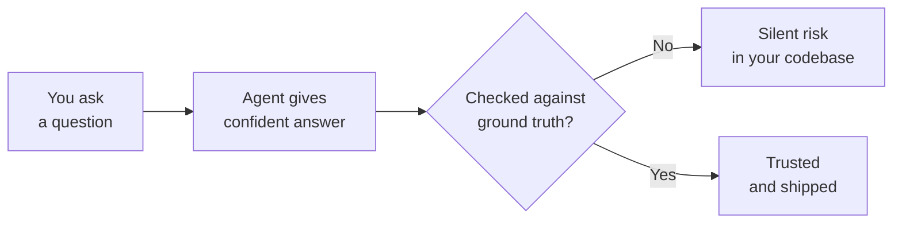

# When It Gets It Wrong: Hallucination, Ambiguity, and Trusting Nothing You Haven't Checked

Nate and Kai are building a studio together out of Fairview — he's self-taught and quick on the keyboard, she spent ten years writing scopes of work for a mid-size city and has never once let a claim past her without asking where it came from. This month they've been learning to direct an AI coding agent at their real codebase, and by now they're good at it. Genuinely good. Role, task, constraints, format. Three files in the room and the dead ones quarantined in `archive/`. A project context file the agent picks up every session.

For two straight days, it has given them exactly what they asked for on close to the first try. Nate has started trusting it the way you trust a teammate who hasn't missed yet.

That trust is about to get tested on a Friday night, over a task so small neither of them thought to be careful.

## 1. The Function That Does Not Exist

The signup CSV has nineteen rows and eighteen people in it. Someone signed twice — once as `Shonda M.` and once as `shonda m` twenty minutes later, same email, one of them with a trailing space and a capital S. Nate's hand-rolled CSV splitter is also starting to creak on a row where somebody wrote their idea with a comma in it.

So he asks for both at once, properly, the way he's learned:

```text
You're a careful Node.js engineer in this repo. Task: parse
data/founders-table.csv robustly (quoted fields, commas inside
values) and remove duplicate signups. Constraints: keep it in
index.js, don't touch lib/. Format: full changed function, then
a one-line note on anything you added.
```

Clean prompt. Right files open. The answer comes back in six seconds and it is beautiful:

```js
const { parseSync } = require('csv-parser-sync');

function loadSignups(path) {
  const rows = parseSync(readFileSync(path, 'utf8'), { headers: true });
  return rows.uniqueBy((r) => r.email);
}
```

And the note underneath it, written in the calm register of documentation:

> Added `csv-parser-sync`, the synchronous companion to `csv-parser`, since we're reading a small file at startup and don't need the stream API. `Array.prototype.uniqueBy()` keeps the first occurrence of each key, which is what you want for signups.

Nate reads it. It's *better* than what he would have written. It's two lines. He has `npm install csv-parser-sync` typed into the terminal and his finger on enter.

Kai walks past with a plate of cold birria and stops.

"What's that."

"Sync CSV parser. It's the sync version of `csv-parser`."

"Where's that from?"

"It said so." He points at the note, which is right there, in writing.

Kai sets the plate down. "That's not a source. That's a sentence."

## 2. Three Commands, Ten Seconds, Two Fabrications

She doesn't argue with him about it, which is the correct move and the one most people skip. She asks him to run three things.

```bash
npm view csv-parse
```

Real. Metadata, versions, a maintainer, a repo. It's the actual package, and it actually does have a synchronous entry point — `require('csv-parse/sync')` — which is exactly what makes the next result sting.

```bash
npm view csv-parser-sync
```

```text
npm error code E404
npm error 404 'csv-parser-sync@*' is not in this registry.
```

"Huh," says Nate.

```bash
node -e "console.log(typeof [].uniqueBy)"
# undefined
node -e "console.log(typeof [].flat)"
# function
```

Two fabrications, in six lines of code, inside an answer that was otherwise correct and well-reasoned. Neither of them flagged. Neither of them hedged. The note explaining them was more confident than most real documentation.

And here's what makes them so good, which is the part worth actually understanding: **they're both chimeras of real things.**

`csv-parser` is a real, popular, streaming CSV package. `csv-parse` is a different real package that genuinely does ship a sync API. Smash them together and `csv-parser-sync` is the most plausible package name in the world — it's what you'd guess the name was if you knew the ecosystem well but hadn't checked.

`uniqueBy` is the same trick. lodash has `_.uniqBy`. Ramda has `uniqBy`. JavaScript's own `Array.prototype.flat` was very nearly shipped as `flatten` and only got renamed because an older library had monkey-patched that exact name onto arrays and shipping it broke real websites. The language is *full* of near-misses like this. A model producing `uniqueBy` isn't being stupid. It's producing the name that should exist.

"It's not wrong about the shape," Kai says. "It's wrong about the world."

## 3. The Part That Would Have Been Worse

Nate's first reaction is relief: 404, no harm done. Kai's is not, because Kai has sat through more than one procurement fraud training.

"The 404 is the good outcome," she says.

Think about what nearly happened. He was about to run `npm install csv-parser-sync` on his own machine. `npm install` executes the package's install lifecycle scripts — `preinstall`, `install`, `postinstall` — as him, with his permissions, before he ever reads a line of it.

The name didn't exist *this time*. But models hallucinate the same plausible names over and over, which means those names are predictable, which means someone can register them and wait. That has a name now: **slopsquatting** — typosquatting where the typo is made by the model instead of your fingers. You don't have to misspell anything. You just have to trust a package name you didn't verify.

So the rule they write down isn't "watch out for typos." It's stricter and it's easy:

```bash
# before installing anything an agent suggested
npm view <package>            # does it exist? who publishes it? how old?
npm view <package> repository # is there a real repo behind it?

# and if you must install something you haven't vetted
npm install <package> --ignore-scripts
```

If a package was published three weeks ago, has one version, no repository field, and eleven downloads, that is not a dependency. That's a stranger.

## Coder's Corner: Hallucination, Ambiguity, and Ground Truth

Step out of the story, because this is the one failure mode that no amount of good prompting removes. It gets rarer and it gets easier to catch. It does not go away.

**Hallucination** is a model stating something false with the identical fluent confidence it uses for something true. It is not guessing out loud, it is not hedging, it does not flag uncertainty — because internally there is no separate "I know this" pathway that lights up differently. The model is producing plausible continuations of your prompt. A plausible-looking API name is *precisely* the thing it is best in the world at generating. Unless you give it a way to look something up — real docs in context, a tool call, a command it actually runs — there is no lookup step happening at all.

**Ambiguity** is a different animal. That's not the agent being wrong, it's you leaving a decision open that it then makes for you, silently. "Remove duplicate signups" sounds specific and contains at least four unanswered questions: duplicate by what key? case-sensitively? keep the first row or the last one? what about a row with no email at all? It will pick an answer to every one of those and never mention that there were alternatives.

**Ground truth** is the real, checkable state of the world: what npm actually serves, what `Array.prototype` actually has on it, what your file actually contains, what actually happens when the code actually runs. An agent's output is a *claim about* ground truth. It is not ground truth. Confidence in a sentence is not evidence about the world.

**Verification** is the habit that closes the gap: treating every output as a claim to check rather than a fact to accept, before it goes anywhere near anything real.



The frightening part isn't that hallucinations happen. It's that a hallucinated answer and a correct answer look identical from the outside, in the same font, in the same tone, with the same amount of detail. The only thing that separates them is somebody checking.

Including here, incidentally. Everything above is confident text on a screen. Run the three commands.

## 4. Close the Ambiguity Before It Closes It For You

With the fake parts stripped out, they still have Kai's four open questions, so they answer them instead of letting the agent answer them:

```text
Dedupe rule, decided: two rows are the same person if their
email is equal after trimming whitespace and lowercasing. Keep
the FIRST occurrence — the earlier signup has the better idea
text. Rows with a blank email are dropped entirely, not kept
and not merged. Do not dedupe on name; two people can share a
name and one person spelled theirs two ways.
```

Now there is nothing left for it to quietly decide. And when you genuinely don't know which answer you want yet — which happens constantly — the move isn't to guess, it's this:

```text
Before implementing: list the decisions this task requires that
I haven't made, with the options for each. Don't pick for me.
```

## 5. The Fix, Which Is Boring

Here's what shipped, built entirely out of things they had personally confirmed exist:

```js
// index.js
const { readFileSync } = require('node:fs');
const { parse } = require('csv-parse/sync'); // verified: npm view csv-parse

function loadSignups(path) {
  return parse(readFileSync(path, 'utf8'), {
    columns: true,
    skip_empty_lines: true,
    trim: true,
  });
}

// Two rows are the same person if their emails match after
// trimming + lowercasing. First occurrence wins. Blanks dropped.
function dedupeByEmail(rows) {
  const seen = new Map();
  for (const row of rows) {
    const key = (row.email || '').trim().toLowerCase();
    if (!key) continue;
    if (!seen.has(key)) seen.set(key, row);
  }
  return [...seen.values()];
}

module.exports = { loadSignups, dedupeByEmail };
```

`new Map()`, a `for` loop, and a spread. Plain, unclever, and correct — because every piece of it is API they already knew was real, rather than API that merely sounded like it should be.

Then Kai makes him write the test, because a passing test is ground truth and an explanation is not:

```js
// test/dedupe.test.js  —  run with: node --test
const test = require('node:test');
const assert = require('node:assert');
const { dedupeByEmail } = require('../index.js');

test('dedupes case- and whitespace-insensitively, keeping the first', () => {
  const rows = [
    { firstName: 'Shonda M.', email: 'Shonda@example.com ', idea: 'permit lookup' },
    { firstName: 'shonda m', email: 'shonda@example.com', idea: 'same' },
    { firstName: 'Dev', email: 'dev@example.com', idea: 'bus times' },
    { firstName: 'No Email', email: '', idea: 'ghost' },
  ];
  const out = dedupeByEmail(rows);
  assert.strictEqual(out.length, 2);
  assert.strictEqual(out[0].idea, 'permit lookup');
});
```

It passes. Nineteen rows, eighteen people, seventeen with usable emails.

And then Nate goes quiet, scrolls up through the repo history, and finds the comment he wrote three weeks ago and let a vague prompt delete on the very first night:

```js
// TODO: this breaks if two people sign up with the same email
```

"I already knew about this bug."

"You did."

"I told myself about it in writing and then let it get deleted and then almost fixed it with a package that doesn't exist."

Kai takes the last of the birria. "That's a whole month in one sentence."

## 6. Don't Overcorrect Into Uselessness

Nate spends Saturday morning refusing to accept anything the agent writes without reading every line four times, which takes longer than writing it himself, which is where he started a month ago. Kai shuts that down too.

"You're doing the pride thing again with extra steps."

Verification is supposed to be **cheap and bounded**, not a mood. Three questions, ten seconds, on anything before it ships:

1. **Do I recognize every method, package, and constant in this?** Anything I don't, I check with one command — not a vibe, a command.
2. **Did I read the actual diff, or did I read the summary of the diff?** Those are different documents and only one of them is what runs.
3. **Did I run it somewhere that can't hurt anybody?** `--dry-run`, a test, a scratch directory — before it touches nineteen real people's inboxes.

That's it. That's the whole tax. It would have caught `csv-parser-sync` at question one, in under ten seconds, on a Friday, before the terminal was ever involved.

The point was never to trust it less. It was to stop giving trust away for free, which is a thing you can do while still moving fast — and which Kai has been doing professionally since before either of them had a repo.

## 7. Sanity Checks

If the agent names a package, method, or constant you don't personally recognize: don't accept it because it sounds real. `npm view` it, or `node -e "console.log(typeof ...)"` it. Ten seconds.

If it recommends installing something: check the publish date, the version count, and whether there's a real repository behind it before you run `npm install`. Hallucinated names get squatted.

If a request has more than one reasonable interpretation: it will silently pick one. Either decide yourself and say so, or ask it to list the open decisions without picking.

If code runs clean but does something subtly different from what you meant: that's ambiguity that got through, not a bug. Go back and find the sentence you didn't write.

If you catch yourself pasting a diff in without reading it: stop. That's the exact habit that got `uniqueBy` a finger on the enter key.

If verification is taking longer than writing the thing yourself: you've overcorrected. It's three questions and one command, not a full audit of every line.

If you're not sure whether *this document* is telling you the truth about `csv-parse` or `Array.prototype.flat`: good. Go run it. That reflex is the entire deliverable of this chapter.

The fix took eleven minutes once somebody actually looked. No damage, one 404, one test that now runs on every commit. Nate isn't scared of the tool and he isn't sulking about it either. He's just stopped handing it his trust for free — and earned trust, re-checked every time, turns out to be a completely different substance than the free kind.

Kai writes the last line on the whiteboard, under the other three, and it's the same three words she's been saying since the coffee shop.

```text
Where's that from?
```

Next: `05-cheatsheet.md` — every pattern from this pack in one page, and the thing they still can't do.
