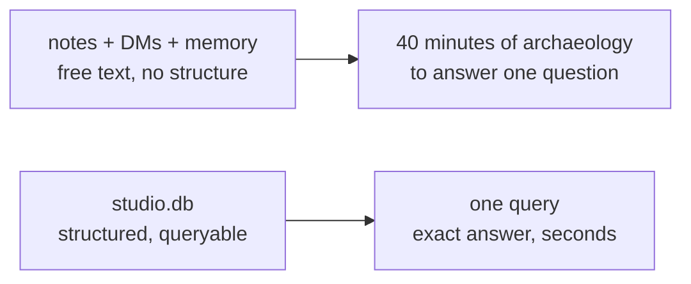

# The Missing Ledger: Why They Need a Scoreboard

Nate and Kai are two people building a studio called AutoNateAI out of a shared idea backlog and a monthly meetup, and on a Tuesday night in the back room of Grindstone Coffee they spent forty minutes trying to answer one question: at the last Founders Table, did anyone actually say they'd *use* the grant-deadline tracker, or did it just feel that way because the conversation was fun?

They had sources. That was the problem. Kai had a paper notebook with the meetup nights labeled by date. Nate had a phone note called `ideas`, another called `ideas2`, and a Slack DM to himself containing the single word "PRIYA????". Between them they had four screenshots, one voice memo neither of them wanted to listen back to, and two memories that had already started merging three different Tuesdays into one composite Tuesday that never happened.

"Okay," Nate said, scrolling. "Tomas said it. Tomas definitely said it."

"Which Tomas."

"There's one Tomas."

Kai turned the notebook around. There were two. `Tomas R. — co-op, wants deadline alerts` on one page, and `tomas reyes (instagram guy, no email)` on another, four weeks apart, in her own handwriting. Same person. Two entries. Neither of them knew that until right now, which meant every count they'd done in their heads all month had been quietly off by one, in a direction that flattered them.

That's the wall this pack is about. It isn't a coding wall — it's a bookkeeping wall, and it shows up the instant a project outgrows the amount of it you can hold in your head. Athletes keep game film. Grant programs keep a system of record, at least the ones that survive. Nate and Kai have a real studio now, with real contacts, a real backlog, and real feedback from real people who could actually be disappointed — and none of it lives anywhere it can be asked a question. This chapter is where they stop trusting recall and start building something that remembers precisely on their behalf.

## Coder's Corner: What a Database Actually Is

Before you build one, it's worth being clear about what a database gives you that the two easier options don't. Three choices, three very different deals:

- A **plain file** — Nate's `ideas.txt`, Kai's notebook — stores whatever you put in it, in whatever shape you last left it. Nothing stops you writing "Tomas R." one week and "tomas reyes" the next. There's no structure enforcing consistency and no way to ask it a question. You can only read it top to bottom and hope you spot the pattern yourself, which is exactly the thing human brains are worst at.
- An **in-memory object** — a JavaScript object living inside a running script, or a `data.json` a program reads on startup — is fast and structured, but it's fragile in ways that don't show up until they hurt. It exists as long as the process does. If two people write to the same JSON file, the second save silently erases the first. And nothing in it enforces that every entry has the same fields, so "structured" is a promise you're personally keeping, not one the tool is keeping for you.
- A **database** is software built for exactly one job: store structured, related information durably, and let you ask it precise questions. Not "read everything and eyeball it," but "give me every person who gave feedback on the grant tracker, who I met at Founders Table, sorted by how recently they said it." It enforces shape — every row of a given kind has the same fields, every time. It survives restarts. It handles two writers without one of them silently winning. And it is built from the ground up to be **queried**, in a language designed for nothing else.

That third thing is what they're missing. Not a tidier notebook. A system that remembers exactly, and answers back when asked.

Same information, two completely different relationships to it. One makes you do the remembering. The other does the remembering for you, so your time goes to the actual decision — which idea to build next — instead of the excavation required just to get back to the starting line.

## 1. Name the Real Cost

Before writing a line of anything, Kai made them count what the scattered notes were actually costing. Not in a dramatic way — nothing crashed, nothing turned red. It was slow bleed. Two entries for Tomas meant their informal tally of "people who want this" was inflated. A month-old conversation with someone at the library had produced a genuinely good objection that neither of them could now reconstruct past "she said something about seasonality." And twice they'd pitched the same idea to the same person and not realized until halfway through, which is a small, specific, memorable kind of embarrassing.

"That's the one that gets me," Kai said. "Not that we lost data. That we lost *credibility* and didn't find out for a month."

## 2. Rule Out the Easy Fixes

Nate's first instinct was the fast one. "We already have `ideas.json`. I'll just have the agent read it and write to it. Ten minutes."

"What happens when I edit it on my laptop and you edit it on yours in the same hour?"

"...One of us loses."

"And what happens when I want to know which ideas got positive feedback from someone who *isn't* one of our friends?"

Nate opened his mouth, closed it. The honest answer is that you read the entire file and count by hand, every single time, forever. A JSON file has no query language. Neither does a text file. That's not a small inconvenience — it's the whole difference.

The other tempting fix is a spreadsheet, and Kai shut that one down faster than Nate expected, because she'd already lived it. The one grant proposal she ever wrote that got fully funded ran its whole program on a shared spreadsheet with four tabs and eleven people typing into it. It broke roughly every six weeks — a dragged formula, a tab someone duplicated "just to be safe," a column that quietly became text instead of dates. Nobody in the room had software skills, so every break cost a week.

"Spreadsheets are fine," she said. "They're fine right up until two people need the truth at the same time, and then they're a rumor with gridlines."

Which is fair. A spreadsheet is a real improvement over chaos and genuinely enough for small things. But it can't enforce that a row is valid, can't stop a duplicate person, and can't answer a question that spans two tabs without a human doing the filtering by hand. A database makes that kind of question a one-line ask instead of a scavenger hunt.

## 3. Decide What the Scoreboard Needs to Hold

So they sketched what a real record of the studio would need to track, before touching any tooling. Three kinds of thing kept coming up, and they kept pointing at each other:

- **People** — everyone they've met at Founders Table and since. Name, what they do, how to reach them, when they first met.
- **Ideas** — the running backlog. What it is, what state it's in, when it landed.
- **Feedback** — what a specific person said about a specific idea, on a specific night. Not a vibe. A dated statement attached to a name.

Notice the shape of that last one. Feedback doesn't stand alone; it's meaningless without knowing *who* said it and *what about*. That web of related facts — separate kinds of thing, linked by which other thing they point at — is precisely the shape a **relational database** is built to hold.

Nate, already typing, proposed the filename. "`mango.db`. I'm eating mango sticky rice, it's right there."

"In six months neither of us will know what mango means."

"That's the fun part."

It became `studio.db`. Nate maintains, to this day, that `mango.db` was better.

## 4. Sanity Checks

- If you're not sure you need a database yet: ask whether you've ever re-derived something you already knew because you couldn't find where you wrote it down. If yes, you need one.
- If a spreadsheet feels like enough: it might be, for now. But the moment you want to ask a question spanning two tabs — "which ideas did people outside our circle react well to" — you've already outgrown it.
- If a JSON file feels like enough: check whether more than one person or process ever writes to it. Two writers and no coordination means silent data loss, and it never announces itself.
- If you spot the same real-world thing entered twice under different spellings: that's not a typo problem, that's a missing-identity problem, and it's the first thing the next chapter fixes.
- If this still feels abstract: it stops the moment you have one real table with real rows in it, which is exactly where this goes next.

Kai closed the notebook. Nate closed all four phone notes at once and didn't reopen them — not because what was in them stopped mattering, but because it was about to live somewhere that could answer him back.

Next: `01-tables-rows-and-relationships.md` — where the scoreboard gets an actual structure, and Nate's first key choice gets vetoed.
