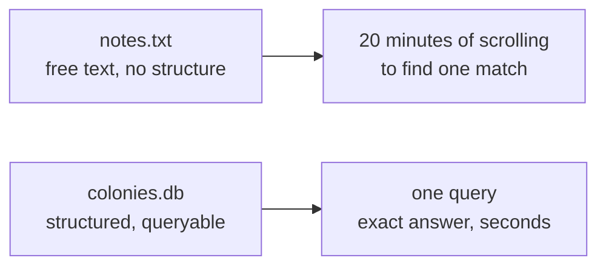

# The Missing Ledger: Why He Needs a Scoreboard

AutoNate opened four files trying to answer one question: did the three-harvester build actually beat the two-harvester-one-hauler build, or did it just look that way because the third match happened to be against a weaker opponent? He had `notes.txt`, a `matches-old.txt` he forgot he'd renamed, a Discord DM to himself with a screenshot of a scoreboard from two weeks back, and his own memory, which was already starting to blur three different Tuesday-night sessions into one. He knew the answer was in there somewhere. He just couldn't get to it without twenty minutes of archaeology first.

That's the wall this pack is about. Not a code wall — a bookkeeping wall. AutoNate can prompt an AI agent well now; he learned that the hard way, one bad handoff at a time, and it changed how fast he moves. He can spin up a new colony behavior, test it, tweak it, and try again in a fraction of the time it used to take. But speed without memory is just a faster way to forget things. He's rebuilding roles he already tried and abandoned. He's re-losing to opponent patterns he already beat once and never wrote down how. Every session starts a little bit blind, because nothing he learned last week survived past his own recall of it.

Here's the part that stings a little: this isn't a Screeps problem. This is every builder's problem, the second the project gets past "small enough to hold in your head." Athletes keep game film. Traders keep a ledger. Every serious operation, gaming or otherwise, ends up needing the same thing — a durable record of what happened, that you can actually ask questions of later. AutoNate doesn't have that yet. He has vibes and scattered text files. This chapter is where he stops trusting his memory and starts trusting a system built to remember for him.

## Coder's Corner: What a Database Actually Is

Before AutoNate builds anything, he needs to understand what he's about to build, and why a text file or an in-memory object won't cut it. Three options, three very different deals:

- A **plain file** — like his `notes.txt` — stores whatever text you put in it, in whatever shape you last left it in. Nothing stops you from writing "3 harvesters, won I think" one day and "harvesterx3 - W" the next. There's no structure enforcing consistency, and no way to ask it a question — you can only read it top to bottom and hope you spot the pattern yourself.
- An **in-memory object** — a JavaScript object living in `Memory` or a running script — is fast and structured, but it's temporary. It exists only while the program is running, or as long as whatever storage mechanism (like Screeps' `Memory`, which does persist between ticks but lives inside the game's own sandbox) keeps it around. It's not built for you to query from outside, sort by outcome, or connect to a match log spanning months.
- A **database** is software built specifically to store structured, related information permanently, and to let you ask precise questions of it — not "read everything and eyeball it," but "give me every match where the result was a loss and the opponent was named Vex-7." It enforces shape (every row of a given kind has the same fields), it survives restarts, and it's built from the ground up to be **queried** — asked questions of, in a language designed exactly for that.

That third option is what AutoNate's missing. Not a fancier notebook. A system that remembers precisely, and answers back when he asks it something.

Same information, two completely different relationships to it. One makes AutoNate do the remembering. The other does the remembering for him, so he can spend his time on the actual decision — which build to run next — instead of the archaeology required just to get back to square one.

## 1. Name the Real Cost

Before writing a line of database code, AutoNate sat down and counted what scattered notes were actually costing him. Every rebuild without a record meant re-testing something he'd already ruled out. Every League match without a logged result meant he couldn't say, with a straight face, whether his win rate was improving or he was just having a good week. The cost wasn't dramatic — no crash, no red error text — it was slow bleed. Time spent re-deriving conclusions he'd already earned once.

## 2. Rule Out the Easy Fixes

The tempting move is to "just organize the notes better." A cleaner text file. A spreadsheet, maybe, since at least that has columns. Both are real improvements over chaos, and worth using for genuinely small stuff. But neither one scales past a certain point, and both share the same core weakness: no real way to ask a precise, combined question — "show me every match this colony lost against a rusher opponent, sorted by tick count" — without a human doing the filtering by hand, every single time. A database exists specifically to make that kind of question a one-line ask instead of a scavenger hunt.

## 3. Decide What the Scoreboard Needs to Hold

AutoNate sketched what a real record of his work would need to track, before touching any tooling: which colony, which build was running, which match it played, what the result was, and what role composition was in the field when it happened. That list — a small set of related facts that all point back to each other — is the exact shape a **relational database** is built to hold. Colonies relate to matches. Matches relate to the roles that fought them. Nothing here is one flat list; it's a web of connected facts, and that's precisely the problem the next chapter solves.

## 4. Sanity Checks

- If you're not sure whether you actually need a database yet: ask whether you've ever re-derived something you already knew, because you couldn't find where you wrote it down. If yes, you need one.
- If a spreadsheet feels like enough: it might be, for now — but the moment you want to ask a question that spans two different sheets ("which matches used this build, and how did they do"), you've already outgrown it.
- If `Memory` in Screeps feels like it should be enough: remember it lives inside the game's sandbox, isn't built for outside querying, and isn't the tool for a running historical record across sessions and colonies.
- If this all feels abstract: it stops being abstract the moment you have your first real table with real rows in it, which is exactly what's next.

AutoNate closed the four files, all at once, and didn't reopen any of them. Not because the information in them stopped mattering — because it was about to live somewhere that could actually answer him back.

Next: `01-tables-rows-and-relationships.md` — where AutoNate builds the actual structure his scoreboard runs on.
