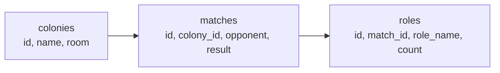

# The Blueprint: Tables, Rows, and Relationships

AutoNate grabbed a notebook — an actual paper one, which felt almost funny given what he was about to build — and started listing every fact he needed to remember about his colonies. Name. Which room it lived in. Every match it had played. Who it played against. Whether it won. What roles were on the field when it did. He kept writing "and it needs to connect back to—" over and over, and somewhere around the fifth line he realized he wasn't describing a list. He was describing a web of related facts, and no single flat list was going to hold all of it without repeating itself into a mess.

That's exactly the shape a relational database is built for. Not one giant list with every fact crammed into every row — a set of focused, separate tables, each one holding one kind of thing well, linked together by a shared piece of information. Colonies over here. Matches over there. A thread connecting them, so you can always walk from one to the other. This chapter is AutoNate building that structure for real, for the first time — not sketching it in a notebook, but writing it as actual SQL that a real database will hold onto.

## Coder's Corner: The Relational Model

A **relational database** stores information in **tables** — think of a table like a spreadsheet with strict rules about what goes in each column. Every table holds one kind of thing: a `colonies` table holds colonies, a `matches` table holds matches. Nothing gets mixed together.

Each individual entry in a table is called a **row** — one specific colony, one specific match. Each table has **columns**, and every row in that table has a value for every column, in the same shape every time. That consistency is the whole point: once you know the shape of a table, you know exactly what every row in it looks like.

Every table needs a **primary key** — a column (usually `id`) that uniquely identifies each row, so no two rows are ever confused for each other, even if every other column happens to match. Screeps has two creeps named "Bob" sometimes; a primary key never has that problem, because the database assigns it and guarantees it's unique.

The connective tissue is the **foreign key** — a column in one table that stores the primary key of a row in another table, creating a link between them. When a `matches` row has a `colony_id` column holding the value `3`, that's the database saying "this match belongs to the colony whose id is 3." That link is what turns a pile of separate tables into one connected system.

## 1. Design the `colonies` Table

Every match, every build, every role AutoNate tracks needs to trace back to a colony. So that's the table he built first — the anchor everything else points to.

```sql
CREATE TABLE colonies (
  id INTEGER PRIMARY KEY,
  name TEXT NOT NULL,
  room TEXT NOT NULL,
  created_at TEXT NOT NULL DEFAULT CURRENT_TIMESTAMP
);
```

`id` is the primary key — the database hands out a new one automatically every time a row is inserted, so AutoNate never has to invent one himself and never has to worry about a collision. `name` and `room` are `NOT NULL` on purpose: a colony with no name or no room isn't a real record, it's a mistake, and the database refuses to let a mistake in quietly.

## 2. Design the `matches` Table

A match doesn't exist on its own — it always belongs to a colony. That relationship gets encoded directly in the table, through a foreign key.

```sql
CREATE TABLE matches (
  id INTEGER PRIMARY KEY,
  colony_id INTEGER NOT NULL REFERENCES colonies(id),
  opponent TEXT NOT NULL,
  result TEXT NOT NULL CHECK (result IN ('win', 'loss')),
  ticks INTEGER,
  played_at TEXT NOT NULL DEFAULT CURRENT_TIMESTAMP
);
```

`colony_id REFERENCES colonies(id)` is the foreign key — it says "every value in this column must be a real id that exists in the `colonies` table." Try inserting a match with `colony_id = 99` when no colony `99` exists, and the database rejects it outright. That's not the database being difficult. That's the database refusing to let AutoNate's own data lie to him.

## 3. Design the `roles` Table and See the Pattern Repeat

A match, in turn, has roles fielded during it — how many harvesters, how many builders, what they actually did. Same pattern as before: a table that belongs to the table above it.

```sql
CREATE TABLE roles (
  id INTEGER PRIMARY KEY,
  match_id INTEGER NOT NULL REFERENCES matches(id),
  role_name TEXT NOT NULL,
  count INTEGER NOT NULL,
  energy_harvested INTEGER DEFAULT 0
);
```

Now step back and look at what got built: `colonies` → `matches` → `roles`, each one linked to the one before it by a foreign key. This is a **one-to-many relationship**, repeated twice: one colony can have many matches, and one match can have many role entries — but each match belongs to exactly one colony, and each role entry belongs to exactly one match. That "one parent, many children" pattern is the workhorse of relational design. Almost everything you'll ever model breaks down into some version of it.



Read that left to right and it tells the whole story: a colony has matches, a match has roles fielded in it. Every arrow is a foreign key. Follow the arrows backward from any `roles` row and you can answer "which colony was this, and did it win" without ever touching a text file again.

## 4. Sanity Checks

- If an insert gets rejected with a foreign key error: check that the id you're referencing actually exists in the parent table first — you likely tried to attach a match to a colony that was never created, or mistyped the id.
- If you're not sure whether something needs its own table or just another column: ask whether it can repeat. A colony has one name, so `name` is a column. A colony can have many matches, so `matches` needs its own table.
- If two rows look identical except you can't tell them apart: that's what the primary key is for — it's unique even when every other value matches exactly.
- If a query returns nothing when you expect rows: double-check the foreign key value you're filtering on actually matches what's stored — a `colony_id` of `3` and `"3"` are not automatically the same thing everywhere.

Three tables, two clean relationships, and for the first time AutoNate had a structure that couldn't quietly go inconsistent on him. The notebook stayed closed after that.

Next: `02-asking-questions-with-sql.md` — where those tables stop just sitting there and start answering questions.
