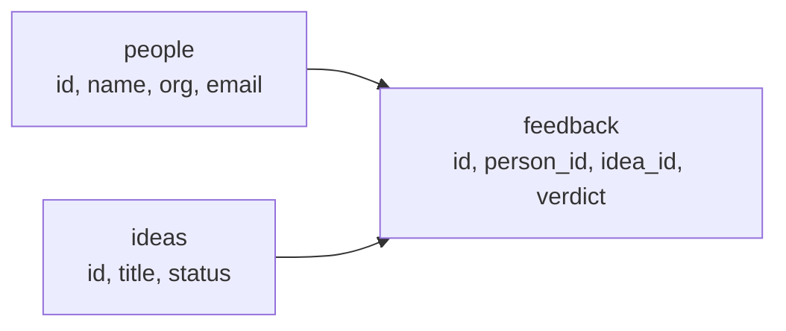

# The Blueprint: Tables, Rows, and Relationships

Nate and Kai run a two-person studio called AutoNateAI, and everything they know about their own business — who they've met at the Fairview Founders Table meetup, which ideas are still alive, what people actually said about them — currently lives across two phone notes, a paper notebook, and two unreliable memories. They've decided to fix that with a real database. This chapter is where the fixing starts, on a whiteboard, with a marker Kai will not let Nate hold.

She'd drawn three boxes. **PEOPLE. IDEAS. FEEDBACK.** Nate kept trying to add arrows between them and she kept capping the marker before he could.

"Finish the boxes first. What's inside people."

"Name, what they do, email, when we met." He counted on his fingers. "Oh — and every idea they gave feedback on."

"That's not inside the box. That's an arrow."

She was right, and that distinction is the entire relational model in one sentence. A fact that belongs to one thing goes in that thing's row. A fact that connects two things gets its own place to live. Cram the arrows into the boxes and you end up with a `people` row containing a column called `feedback_stuff` full of comma-separated text that no query will ever be able to read. This chapter is them building the boxes properly, as real SQL that a real database will hold onto and enforce.

## Coder's Corner: The Relational Model

A **relational database** stores information in **tables** — think of a table as a spreadsheet with strict, enforced rules about what goes in each column. Every table holds exactly one kind of thing: a `people` table holds people, an `ideas` table holds ideas. Nothing gets mixed together.

Each individual entry in a table is a **row** — one specific person, one specific idea. Each table has **columns**, and every row has a value for every column, in the same shape every time. That consistency is the point: once you know the shape of a table, you know exactly what every row in it looks like, forever, without opening it.

Every table needs a **primary key** — a column (conventionally `id`) that uniquely identifies each row so no two rows can ever be confused, even if every other column happens to match. Two different people named Tomas Reyes are still two different rows, because the key says so.

The connective tissue is the **foreign key** — a column in one table that holds the primary key of a row in another table, creating a real link between them. When a `feedback` row has `person_id = 3`, that's the database stating "this feedback came from the person whose id is 3." That link is what turns a pile of separate tables into one connected system you can walk across.

## 1. Design the `people` Table

Everything else in the studio's records eventually traces back to a person, so that's the anchor table.

Nate's opening move was confident and wrong. "Email's the primary key. It's already unique, everyone's got one, and then I never have to look up an id."

Kai didn't even argue the design point first. She just asked, "What's Tomas's email?"

Tomas Reyes does not have an email. Tomas has an Instagram handle he gave Kai on the back of a receipt. Under Nate's schema, Tomas cannot be entered into the database at all — a person who exists in real life is unrepresentable because a column he doesn't have is the thing that identifies him.

Then it got worse. Priya from the library had given Kai a work address in March and a personal one in June, because she changed jobs. Under an email primary key, "Priya changed her email" isn't an update — it's a new identity, and every row anywhere in the database that pointed at the old address is now pointing at a person who no longer exists.

That's the rule worth carrying out of this chapter: **don't use real-world data as a primary key.** Emails, phone numbers, usernames, company names — they all look unique right up until they change, get reused, or turn out not to apply. Use a **surrogate key** instead: a meaningless id the database invents and guarantees, whose only job is to be stable.

```sql
CREATE TABLE people (
  id INTEGER PRIMARY KEY,
  name TEXT NOT NULL,
  org TEXT,
  email TEXT UNIQUE,
  handle TEXT,
  first_met_at TEXT NOT NULL DEFAULT CURRENT_TIMESTAMP
);
```

`id INTEGER PRIMARY KEY` in SQLite means the database hands out a new id automatically on every insert — no collisions, no invention required. `name` is `NOT NULL` because a person with no name isn't a record, it's a mistake, and the database should refuse a mistake rather than accept it quietly. `org` and `handle` are nullable on purpose: plenty of real people don't have either, and forcing a value would just produce a table full of `"n/a"`.

Email still gets `UNIQUE`, which is the compromise that makes everyone happy. Two rows can't share an address — so the duplicate-Tomas problem gets caught the moment both entries have contact info — but email isn't carrying the weight of identity, so it's free to be missing or to change.

## 2. Design the `ideas` Table

The backlog is its own kind of thing, unrelated to any one person, so it gets its own box.

```sql
CREATE TABLE ideas (
  id INTEGER PRIMARY KEY,
  title TEXT NOT NULL,
  status TEXT NOT NULL DEFAULT 'backlog'
    CHECK (status IN ('backlog', 'exploring', 'building', 'shelved')),
  created_at TEXT NOT NULL DEFAULT CURRENT_TIMESTAMP
);
```

The `CHECK` constraint is doing quiet, important work. Without it, `status` accepts anything, and six months from now the table contains `building`, `Building`, `in progress`, and one row that just says `yes`. Every query filtering on status is then silently wrong, and nothing ever tells you. A `CHECK` turns "we agreed to only use these four words" from a shared intention into a rule the database enforces on both of you at 1am.

Nate wanted a fifth column called `vibe`. Kai asked what would ever be done with it. Nate said "you'd read it," and heard how that sounded halfway through the sentence.

## 3. Design the `feedback` Table and See the Arrows Appear

Feedback is the arrow Kai wouldn't let him draw yet, and now it gets to exist. A piece of feedback is meaningless on its own — it needs a person who said it and an idea it's about.

```sql
CREATE TABLE feedback (
  id INTEGER PRIMARY KEY,
  idea_id INTEGER NOT NULL REFERENCES ideas(id),
  person_id INTEGER NOT NULL REFERENCES people(id),
  verdict TEXT NOT NULL
    CHECK (verdict IN ('would_use', 'interesting', 'not_for_me')),
  note TEXT,
  given_at TEXT NOT NULL DEFAULT CURRENT_TIMESTAMP
);
```

`REFERENCES ideas(id)` and `REFERENCES people(id)` are the foreign keys. They declare that every value in those columns must be a real id that exists in the parent table.

Two relationships are visible here, and they're the same shape twice. One idea can have many pieces of feedback, but each piece of feedback is about exactly one idea. One person can give many pieces of feedback, but each piece came from exactly one person. That "one parent, many children" pattern is the **one-to-many relationship**, and it's the workhorse of relational design — most things you'll ever model decompose into some version of it.

There's a bonus in the shape, too. Because `feedback` points at both parents, it also connects them: through it, one person can be linked to many ideas *and* one idea to many people. A table that sits between two others like that is called a **junction** (or associative) table, and it's how relational databases express **many-to-many** relationships — never with a single column, always with a table in the middle.



Read the arrows and it tells the whole story: a person gives feedback, an idea receives feedback, and every arrow is a foreign key. Start at any `feedback` row and you can walk to exactly who said it and exactly what about, without opening a phone note ever again.

## 4. The Demo That Didn't Work

Nate wanted to show off the guardrail. "Watch — I'm gonna try to insert feedback from person 99, who doesn't exist, and it's gonna reject it. Instantly. Boom."

```sql
INSERT INTO feedback (idea_id, person_id, verdict)
VALUES (1, 99, 'would_use');
```

It inserted. No error, no complaint, one shiny new row of feedback from a person who has never existed.

Kai looked at it for a second. "You said it would refuse. Where's that from?"

It's from the documentation, and the documentation also has the part Nate skipped: **SQLite does not enforce foreign keys by default.** For backward-compatibility reasons the constraint is parsed, stored, and completely ignored unless you turn it on — and it's a per-connection setting, so it has to be turned on every single time you open the database, not once at creation.

```sql
PRAGMA foreign_keys = ON;
```

And from JavaScript, the same thing, on every connection:

```js
const Database = require('better-sqlite3');
const db = new Database('data/studio.db');
db.pragma('foreign_keys = ON');
```

With that on, the bad insert fails loudly, the way Nate promised it would. This is worth internalizing beyond SQLite specifically: a constraint you declared is not the same as a constraint that's running. The only way to know which one you have is to try to violate it on purpose and watch what happens.

They deleted the ghost row. Nate did not comment further on `mango.db`.

## 5. Sanity Checks

- If an insert gets rejected with a foreign key error: good — that's the constraint working. Check that the id you're referencing actually exists in the parent table; you probably attached feedback to an idea that was never created, or mistyped an id.
- If a *bad* insert gets accepted and you expected rejection: you almost certainly forgot `PRAGMA foreign_keys = ON` on this connection. Constraints declared and constraints enforced are two different things.
- If you're unsure whether something needs its own table or just another column: ask whether it can repeat. A person has one name, so `name` is a column. A person can give many pieces of feedback, so `feedback` needs its own table.
- If you're tempted to make an email, phone number, or username the primary key: assume it will change or be missing, because eventually it will be both. Use a surrogate `id` and put `UNIQUE` on the real-world value instead.
- If two rows look identical and you can't tell them apart: that's exactly what the primary key is for — it stays unique even when every other value matches.
- If a query returns nothing when you expect rows: confirm the foreign key value you're filtering on matches what's actually stored. `3` and `"3"` are not interchangeable everywhere.

Three tables, two clean one-to-many relationships, one junction in the middle, and — after the pragma — a structure that can't quietly go inconsistent on them. Kai capped the marker for the last time and put it in her bag, which Nate correctly interpreted as permanent.

Next: `02-asking-questions-with-sql.md` — where the tables stop just sitting there and start answering, and one of those answers turns out to be a lie.
