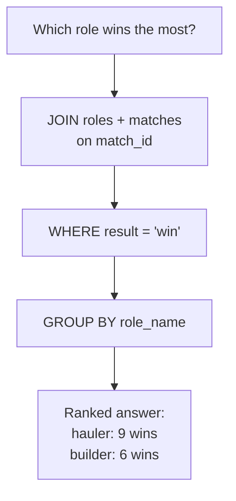

# Talking to the Data: Asking Questions with SQL

Tables built, first dozen matches logged in — and AutoNate hit the wall he honestly should have seen coming. He had the data now. He didn't have a way to ask it anything. Staring at three tables full of rows doesn't answer "which role wins the most" any better than staring at a text file did, unless you're willing to count by hand and hope you don't lose track around row forty. He'd fixed the storage problem in the last chapter. He hadn't touched the actual question he started this whole pack to answer.

That's what SQL is for. Not a separate skill bolted onto the database — the actual language the database speaks, built specifically for asking it precise questions and getting precise answers back. AutoNate already knew, from the last chapter, how his data was shaped: colonies, matches, roles, linked by foreign keys. Now he needed the vocabulary to reach into that shape and pull exact answers out of it. This chapter is him learning to talk to his own data.

## Coder's Corner: SQL as a Question-Asking Language

**SQL** (Structured Query Language) is how you talk to a relational database. It's not a general-purpose programming language like JavaScript — it doesn't have loops or functions in the way you're used to. It's built around one core idea: describe the data you want, and let the database figure out how to go get it.

Four pieces of vocabulary cover almost everything AutoNate needed:

- **SELECT** — which columns you want back. `SELECT name, room` gets you those two columns; `SELECT *` gets you every column.
- **WHERE** — which rows qualify. `WHERE result = 'loss'` filters down to only the rows matching that condition, exactly the way an `if` statement filters which lines of code run.
- **JOIN** — how to pull matching rows together from two different tables, using the foreign key link between them, so a query can reach across the whole structure instead of staying stuck in one table.
- **GROUP BY** — how to collapse many rows into one summary row per category, usually paired with a count or a sum, so you go from "every individual row" to "one number per group."

## 1. Start Simple: SELECT and WHERE

The most basic real question: show every match this specific colony has lost.

```sql
SELECT opponent, ticks, played_at
FROM matches
WHERE colony_id = 1 AND result = 'loss';
```

Read it the way you'd say it out loud: "give me the opponent, ticks, and date, from the matches table, where the colony is id 1 and the result is a loss." That's the whole mental model for `SELECT` and `WHERE` — pick your columns, then narrow your rows. No archaeology, no scrolling. The database does the filtering.

## 2. Reach Across Tables with JOIN

That query only touches `matches`. But AutoNate's real questions almost always span two tables — he needs the colony's name, which lives in `colonies`, attached to match results, which live in `matches`. That's exactly what `JOIN` is for.

```sql
SELECT colonies.name, matches.opponent, matches.result
FROM matches
JOIN colonies ON matches.colony_id = colonies.id
WHERE matches.result = 'win'
ORDER BY matches.played_at DESC;
```

`JOIN colonies ON matches.colony_id = colonies.id` is the database walking the foreign key link from the last chapter — matching every `matches` row to the one `colonies` row it belongs to, using the exact relationship that was built into the schema on purpose. Nothing about this query works if the foreign key wasn't there; the join has nothing to walk across.

## 3. Answer the Real Question with GROUP BY

Here's the question that started this whole pack: which role wins the most matches. Answering it means joining all three tables, filtering down to wins, and then collapsing everything into one summary row per role.

```sql
SELECT roles.role_name, COUNT(DISTINCT matches.id) AS wins
FROM roles
JOIN matches ON roles.match_id = matches.id
WHERE matches.result = 'win'
GROUP BY roles.role_name
ORDER BY wins DESC;
```

`GROUP BY roles.role_name` tells the database "stop giving me one row per match — give me one row per role instead, and roll everything else up underneath it." `COUNT(DISTINCT matches.id)` counts how many distinct winning matches each role showed up in. Run this and AutoNate doesn't get a hunch anymore — he gets an actual ranked answer, sourced straight from every match he's logged, not from whichever three sessions he happened to remember clearly.



Four small pieces of vocabulary, stacked in order, and a question that used to take twenty minutes of manual counting now takes one query and a fraction of a second.

## 4. Query It from a Script, Not Just a Terminal

The terminal's fine for exploring, but AutoNate wants this answer available from code, so it can eventually feed a real dashboard.

```js
// scripts/role-win-report.js
const Database = require('better-sqlite3');
const db = new Database('data/scoreboard.db');

const rows = db.prepare(`
  SELECT roles.role_name, COUNT(DISTINCT matches.id) AS wins
  FROM roles
  JOIN matches ON roles.match_id = matches.id
  WHERE matches.result = 'win'
  GROUP BY roles.role_name
  ORDER BY wins DESC
`).all();

console.log(rows);
```

Run it, same as everything else he's run all pack:

```bash
node scripts/role-win-report.js
```

Same SQL, just handed to the database from JavaScript instead of typed by hand — this is the bridge between "I can ask my data a question" and "my code can ask my data a question," which matters a lot once you get to the next chapter and beyond.

## 5. Sanity Checks

- If a `JOIN` returns fewer rows than expected: check that every `match_id` or `colony_id` you're joining on actually has a matching row on the other side — a mistyped or missing foreign key value silently drops that row from the results.
- If `GROUP BY` throws an error about a column not being in the group or an aggregate: every plain column in your `SELECT` needs to either be in the `GROUP BY` list or wrapped in an aggregate like `COUNT()` — SQL won't guess which row's value to show for an ungrouped column.
- If results seem to include duplicates you didn't expect: check whether a `JOIN` multiplied rows — a match with three role entries joined to one match row produces three result rows, which is correct, but easy to misread as a bug.
- If nothing comes back at all: run the query without the `WHERE` clause first, confirm rows exist, then add the filter back one condition at a time.

He ran that role report four times in a row just because he could. Haulers, it turned out, were quietly carrying his win rate the whole time — he never would have guessed that from memory.

Next: `03-when-relationships-get-tangled.md` — where a table stops being the right tool, and something else takes over.
