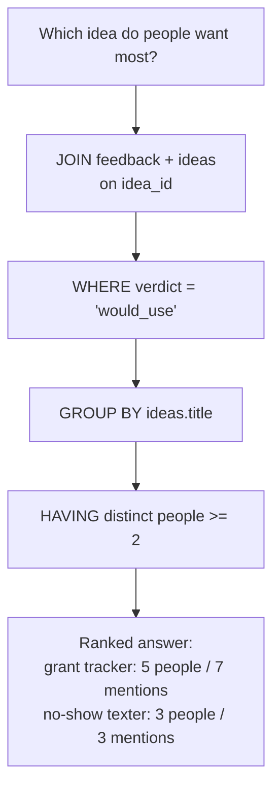

# Talking to the Data: Asking Questions with SQL

Nate and Kai are building a studio, AutoNateAI, and they've just finished putting their real operational records into a real database — three tables in a file called `studio.db`. `people` holds everyone they've met at the Fairview Founders Table meetup. `ideas` holds the running backlog. `feedback` holds what a specific person said about a specific idea, on a specific night, linked to both by foreign keys. Two weeks of back-filling later, they had about ninety rows of feedback in there.

And then they sat and looked at it, and Nate said the quiet part. "So... how do we find out which idea people actually want?"

Because having the data is not the same as being able to ask it anything. Ninety rows of feedback answers "which idea should we build" exactly as well as a phone note does, if the only tool you've got is scrolling and counting by hand and losing your place around row forty. The storage problem got fixed last chapter. The actual question — the one that started this whole thing — hadn't been touched.

That's what SQL is for. It isn't a separate skill bolted onto a database; it's the language the database speaks, built for precisely this. This chapter is the two of them learning to talk to their own records — and one of the first answers they get back is confidently, cleanly wrong in a way that would have been very easy to act on.

## Coder's Corner: SQL as a Question-Asking Language

**SQL** (Structured Query Language) is how you talk to a relational database. It's not a general-purpose language like JavaScript — no loops, no functions in the sense you're used to. It's built around one idea: *describe the data you want, and let the database work out how to go get it.*

Five pieces of vocabulary cover almost everything:

- **SELECT** — which columns come back. `SELECT name, org` gets those two; `SELECT *` gets every column.
- **WHERE** — which rows qualify. `WHERE verdict = 'would_use'` narrows to rows matching that condition, the same way an `if` narrows which lines of code run. `WHERE` runs *before* any grouping happens.
- **JOIN** — how to pull matching rows together across two tables using the foreign key between them, so a query can reach across the whole structure instead of being stuck in one table.
- **GROUP BY** — how to collapse many rows into one summary row per category, almost always paired with a count or a sum. You go from "every individual row" to "one number per group."
- **HAVING** — like `WHERE`, but it filters the *grouped* rows, after aggregation. `WHERE` can't see a `COUNT()` because the count doesn't exist yet when `WHERE` runs. `HAVING` can.

That last distinction trips up nearly everyone once. The order the database actually works in is: pick rows (`WHERE`) → group them (`GROUP BY`) → filter the groups (`HAVING`) → sort (`ORDER BY`).

## 1. Start Simple: SELECT and WHERE

The most basic real question: show everything one specific person has said, in their own words.

```sql
SELECT idea_id, verdict, note, given_at
FROM feedback
WHERE person_id = 4
ORDER BY given_at DESC;
```

Read it out loud the way you'd say it: "give me the idea, the verdict, the note, and the date, from the feedback table, where the person is id 4, newest first." That's the entire mental model for `SELECT` and `WHERE` — pick your columns, then narrow your rows. No scrolling, no archaeology. The database does the filtering.

It's also immediately annoying, because `person_id = 4` requires you to already know that 4 is Priya. Which is what the next piece is for.

## 2. Reach Across Tables with JOIN

Real questions almost always span tables. The names live in `people`, the titles live in `ideas`, and the opinions live in `feedback` — and a useful answer needs all three at once.

```sql
SELECT people.name, ideas.title, feedback.verdict, feedback.note
FROM feedback
JOIN people ON feedback.person_id = people.id
JOIN ideas  ON feedback.idea_id  = ideas.id
WHERE feedback.verdict = 'would_use'
ORDER BY feedback.given_at DESC;
```

Each `JOIN ... ON` is the database walking a foreign key from the last chapter — matching every `feedback` row to the one `people` row and the one `ideas` row it belongs to, using relationships that were designed into the schema on purpose. None of this works if the foreign keys aren't there; the join has nothing to walk across.

Nate ran it and read the output out loud, and it was the first time either of them had seen a month of scattered conversations lined up as one honest list. Priya Raghunathan, grant deadline tracker, *would_use*, "only if it handles rolling deadlines, most of ours aren't annual." Marcus Oyelaran, no-show texter, *would_use*, "I lose two chairs a week to this." Dana Whitfield, grant deadline tracker, *would_use*, "would pay."

"Okay," Nate said. "Okay okay okay. Watch THIS."

## 3. The Query That Lied

He wanted the headline number: which idea has the most people who'd use it.

```sql
-- Nate's version. Looks right. Is not right.
SELECT ideas.title, COUNT(*) AS people_who_want_it
FROM feedback
JOIN ideas ON feedback.idea_id = ideas.id
WHERE feedback.verdict = 'would_use'
GROUP BY ideas.title
ORDER BY people_who_want_it DESC;
```

Grant deadline tracker: **7**. Everything else in the single digits, well behind. Nate was already talking about what they'd build first.

Kai was still reading. "Seven people said they'd use it."

"Seven people said they'd use it."

"Name them."

He couldn't. He could name four. She pulled up the raw feedback rows for that idea and there it was: Dana had said *would_use* on it three separate times, at three separate Founders Tables, because she is enthusiastic and because Nate kept re-pitching it to her. Three rows. One human. The number wasn't seven people, it was seven *statements* — and the column he'd named `people_who_want_it` was a claim the query never actually made.

This is the most common silent bug in SQL, and it's silent precisely because nothing breaks. `COUNT(*)` counts rows. After a join and a filter, "rows" and "distinct real-world things" are not the same population, and the query has no idea which one you meant. It answered the question you typed. You just typed a different question than the one in your head.

```sql
-- what he actually meant
SELECT
  ideas.title,
  COUNT(DISTINCT feedback.person_id) AS people_who_want_it,
  COUNT(*) AS times_said
FROM feedback
JOIN ideas ON feedback.idea_id = ideas.id
WHERE feedback.verdict = 'would_use'
GROUP BY ideas.title
HAVING COUNT(DISTINCT feedback.person_id) >= 2
ORDER BY people_who_want_it DESC;
```

`GROUP BY ideas.title` tells the database "stop giving me one row per feedback; give me one row per idea, and roll everything else up underneath it." `COUNT(DISTINCT feedback.person_id)` counts unique humans. `COUNT(*)` is kept alongside it, honestly labeled, because *how often* people bring something up is genuinely useful — it just isn't the same fact. And `HAVING` drops any idea only one person ever endorsed, which cannot be done in `WHERE`, because at the time `WHERE` runs there is no count yet to compare against.

Grant deadline tracker, re-run: **5 people, 7 statements**. Still first. Still the right call. But five and seven are different numbers, and the version of Nate who never got asked to name them would have gone into the next month quoting seven.

"That," Kai said, "is the entire reason I ask where things are from."



Five small pieces of vocabulary, stacked in order, and a question that used to take an evening of arguing takes a fraction of a second — with the added benefit that the answer can be checked instead of believed.

## 4. Query It from a Script, Not Just a Terminal

The terminal is fine for exploring, but this answer needs to be available to code so it can eventually feed something they look at without typing.

```js
// scripts/idea-demand-report.js
const Database = require('better-sqlite3');
const db = new Database('data/studio.db');
db.pragma('foreign_keys = ON');

const rows = db.prepare(`
  SELECT
    ideas.title,
    COUNT(DISTINCT feedback.person_id) AS people_who_want_it,
    COUNT(*) AS times_said
  FROM feedback
  JOIN ideas ON feedback.idea_id = ideas.id
  WHERE feedback.verdict = ?
  GROUP BY ideas.title
  ORDER BY people_who_want_it DESC
`).all('would_use');

console.table(rows);
```

```bash
node scripts/idea-demand-report.js
```

Two things to notice. The `PRAGMA` is back, because foreign key enforcement in SQLite is per-connection — a new script is a new connection, and forgetting it here means this script happily tolerates data the other one would reject. And `verdict = ?` with the value passed to `.all()` is a **parameterized query**: the value travels separately from the SQL text, so it can never be interpreted as SQL. Build queries by pasting strings together and you've written a SQL injection bug. Use `?` and you haven't. There is no situation where the string-pasting version is worth it.

Nate named the file `haymaker.js` first. It survived nine minutes.

## 5. Sanity Checks

- If a count looks too high: check whether you're counting rows or counting things. `COUNT(*)` after a join counts joined rows — use `COUNT(DISTINCT some_id)` when you mean unique people, ideas, or events, and name the column after whatever you actually counted.
- If a `JOIN` returns fewer rows than expected: some rows on the left have no match on the right, and a plain (inner) `JOIN` drops them silently. If you want them kept with empty values, you want `LEFT JOIN` — which comes up in chapter 4.
- If `GROUP BY` errors about a column not being grouped or aggregated: every plain column in your `SELECT` must either appear in the `GROUP BY` list or be wrapped in an aggregate like `COUNT()`. SQL won't guess which row's value to show you.
- If you try to filter on a `COUNT()` inside `WHERE` and it fails: that's `HAVING`'s job. `WHERE` runs before grouping, so the aggregate doesn't exist yet.
- If results include duplicates you didn't expect: check whether a join multiplied rows. One idea with three feedback rows joined to one idea row produces three result rows — correct behavior, easy to misread as a bug, and the exact thing that inflated Nate's seven.
- If nothing comes back at all: drop the `WHERE` clause, confirm rows exist, then add conditions back one at a time.

They ran the corrected report four times in a row, mostly because they could. The grant deadline tracker held. Priya's note about rolling deadlines turned out to be the single most useful sentence anyone had said to them all year, and it had been sitting in a notebook for six weeks doing nothing.

Next: `03-when-relationships-get-tangled.md` — where Kai asks a question about her own contact list that tables genuinely cannot answer.
