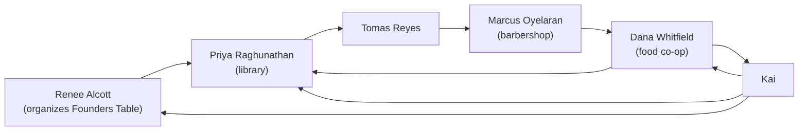

# The Web Under the Table: When Relationships Get Tangled

Nate and Kai run a two-person studio, AutoNateAI, and they've spent the last few chapters moving everything they know about it — the people they've met at the Fairview Founders Table meetup, their idea backlog, the feedback attached to both — out of phone notes and into a real database called `studio.db`. Three tables, clean foreign keys, SQL that answers in a fraction of a second. It has been working beautifully.

Then Kai asked a question about her own contact list, and it stopped working immediately.

"I want to reach whoever runs youth programs at Fairview Parks," she said. "I don't know her. Somebody we know knows her. Who's the shortest way in?"

Nate started typing before she finished the sentence, which is his whole personality. "Easy. I'll add an `introduced_by_id` column to `people` — points at whoever introduced us. Then I just follow it up the chain."

"Renee introduced me to Priya at the March meetup. Priya introduced me to Tomas. But Dana *also* introduced me to Priya, separately, two months earlier, and I'd forgotten until I saw both entries. Which one goes in the column?"

Nate stopped typing.

That's the moment tables stop being the right tool — not because SQL broke, but because the shape of the problem changed underneath it. Tables are built for clean hierarchies: one idea, many pieces of feedback; one person, many statements. Introductions aren't a hierarchy. Marcus can route you to Dana, Dana can route you to Renee, Renee can route you back to Marcus, and none of those is anybody's parent. It's a web. Force a web into strict rows and it fights you: single columns that can only hold one of several true answers, columns that reference the table they live in, queries that need five self-joins to answer something a human could sketch on a napkin. This chapter is them finding the right model instead.

## Coder's Corner: Nodes, Edges, and Graphs

A **graph**, in this sense, has nothing to do with bar charts. It's a way of modeling things and the connections between them without forcing those connections into a hierarchy.

- A **node** is a single thing — a person, an idea, an organization. Same idea as a row, minus the assumption that it belongs to exactly one parent.
- An **edge** is a connection between two nodes — "this person can introduce you to that person." Any node can connect to any number of others, in any pattern, including paths that loop back around to where they started.
- A **directed edge** points one way, and the direction carries meaning. Marcus being willing to introduce you to Dana does not imply Dana will introduce you to Marcus. Anyone who has ever asked for a favor knows this is not symmetric.
- A **traversal** is walking the graph: start at one node, follow edges outward, possibly several steps. Each step is a **hop**.
- A **cycle** is a path of edges that returns to where it started. Tables treat cycles as a bug to be prevented. Graphs treat them as Tuesday.

The difference that actually matters: a table assumes a predictable shape in advance — a piece of feedback belongs to exactly one idea, always, no exceptions. A graph assumes nothing. Any node, any number of edges, any direction. That flexibility is exactly what a tangle of introductions, dependencies, or referrals requires.

## 1. Spot When a Table Stops Working

The tell is almost always one of two things: you want a column that references the table it lives in, or you want a column to hold "several of these, and it could be any number."

Nate's `introduced_by_id` was both at once. It's a self-referencing foreign key, and it can hold exactly one value when the honest answer for Priya is two. He could have picked one arbitrarily — most people do — and the database would have accepted it happily, and from then on the studio's records would have contained a quiet, unfalsifiable lie about how Kai met Priya.

There's a second tell, subtler and worth naming: the relationship has **attributes of its own**. An introduction happened somewhere, on a date, with a reason. Where does the venue go? Not on `people` — the venue isn't a property of a person. It's a property of the *connection*. The instant a relationship has its own facts attached, it needs its own place to live.

When a relationship points at more of the same kind of thing, can repeat, can loop, and has properties of its own — that's a graph. Reach for nodes and edges, not another column.

## 2. Model It as a Graph

Here's the part that made Kai laugh, because it's almost free: **they already had a node table.** `people` is the nodes. Every person is a node, and has been since chapter 1. All that's missing is a place to put the edges.

```sql
CREATE TABLE intros (
  id INTEGER PRIMARY KEY,
  from_person_id INTEGER NOT NULL REFERENCES people(id),
  to_person_id   INTEGER NOT NULL REFERENCES people(id),
  venue TEXT,
  note TEXT,
  happened_at TEXT NOT NULL DEFAULT CURRENT_TIMESTAMP,
  CHECK (from_person_id <> to_person_id)
);

CREATE INDEX intros_from_idx ON intros(from_person_id);
CREATE INDEX intros_to_idx   ON intros(to_person_id);
```

One row in `intros` is one edge, and it means exactly one thing, stated plainly so nobody has to guess later: **`from_person_id` has made an introduction to `to_person_id`** — that person is a viable route to this other person. Both columns are foreign keys into the same table, which is fine and normal for an edge table; that's what makes it a graph rather than a hierarchy.

The `CHECK` stops the one edge that's always a mistake — nobody introduces themselves to themselves. The two indexes matter more than they look: every traversal query below repeatedly asks "give me all edges leaving this node" and "all edges arriving at it," and without indexes each hop is a full scan of the whole edge table. Graphs get slow in exactly this spot and nowhere else.

Kai's Priya problem now just... isn't a problem. Renee → Priya is one row. Dana → Priya is another row. Both are true, both are recorded, neither had to win.



Follow the arrows and the loops are right there — Dana routes to Priya, Priya to Tomas, Tomas to Marcus, Marcus back to Dana; and Kai routes to Dana, who routes straight back to Kai — drawn instead of fought. No column had to pretend this was a tree. The shape of the picture matches the shape of the actual problem, which is the whole test for whether a graph is the right call.

## 3. Traverse It: One Hop, Then Two

The payoff is that questions requiring a pile of self-joins in the column version become a plain walk across edges.

```sql
-- one hop: who can Kai reach directly?
SELECT dest.name, intros.venue, intros.note
FROM intros
JOIN people AS src  ON intros.from_person_id = src.id
JOIN people AS dest ON intros.to_person_id   = dest.id
WHERE src.name = 'Kai';
```

Note `people` appears twice with two different aliases, `src` and `dest`. That's a **self-join**, and it's mandatory here: both ends of the edge live in the same table, so the query needs two separate handles on it to tell "who introduced" apart from "who got introduced."

Then Nate went two hops out, looking for the way into Parks.

```sql
-- Nate's two-hop. Runs fine. Answer is nonsense.
SELECT dest.name AS two_hops_away, mid.name AS via
FROM intros AS hop1
JOIN intros AS hop2 ON hop1.to_person_id = hop2.from_person_id
JOIN people AS src  ON hop1.from_person_id = src.id
JOIN people AS mid  ON hop1.to_person_id   = mid.id
JOIN people AS dest ON hop2.to_person_id   = dest.id
WHERE src.name = 'Kai';
```

Four rows came back. Kai read them out. "Ask Renee to introduce me to Priya. Ask Dana to introduce me to Priya — that's the same Priya, listed twice, who I've known for six months. Ask Priya to introduce me to Tomas, fine, that one's real." She scrolled to the last row. "And — Nate. Ask Dana to introduce me to *me*."

She wasn't wrong on any of them. Kai → Dana → Priya is a genuine two-hop path; Priya is also a direct contact, so it's a correct answer to a question nobody wanted asked. Two separate paths reach her, so she's listed twice, which reads as "two people can get you there" if you're skimming. And because Dana has an edge back to Kai, a path walks right around to its own starting node. This is *the* graph gotcha, and it doesn't announce itself, because every row the query returned is technically a correct answer to what was typed. Traversals don't know where they came from. Unless you tell them, they will cheerfully route you to yourself.

Two guards fix it: exclude the origin, and exclude anyone already reachable in fewer hops.

```sql
SELECT DISTINCT dest.name AS two_hops_away, mid.name AS via
FROM intros AS hop1
JOIN intros AS hop2 ON hop1.to_person_id = hop2.from_person_id
JOIN people AS src  ON hop1.from_person_id = src.id
JOIN people AS mid  ON hop1.to_person_id   = mid.id
JOIN people AS dest ON hop2.to_person_id   = dest.id
WHERE src.name = 'Kai'
  AND dest.id <> src.id                       -- don't route me to myself
  AND NOT EXISTS (                            -- and skip people I already reach directly
    SELECT 1 FROM intros AS direct
    WHERE direct.from_person_id = src.id
      AND direct.to_person_id   = dest.id
  );
```

`DISTINCT` earns its place here too — it collapses the duplicate rows that multiple paths to the same person produce. Run the guarded version against the graph above and four rows become one: *Tomas, via Priya.* That's the only genuinely new person two hops out, and it's the answer the first query had buried under three pieces of noise it was completely convinced of.

## 4. Go Any Number of Hops with a Recursive Query

Two hops is a hand-written join. Three is worse. Four is unmaintainable, and you never know in advance how far away the person you need is. For arbitrary depth, SQL has **recursive common table expressions** — a query that repeatedly feeds its own output back into itself until nothing new comes out.

```sql
WITH RECURSIVE reach(person_id, hops, path) AS (
  -- start: Kai, zero hops in, path contains only her
  SELECT people.id, 0, ',' || people.id || ','
  FROM people
  WHERE people.name = 'Kai'

  UNION ALL

  -- step: from everyone reached so far, follow one more outgoing edge
  SELECT intros.to_person_id,
         reach.hops + 1,
         reach.path || intros.to_person_id || ','
  FROM reach
  JOIN intros ON intros.from_person_id = reach.person_id
  WHERE reach.hops < 4
    AND instr(reach.path, ',' || intros.to_person_id || ',') = 0
)
SELECT people.name, MIN(reach.hops) AS hops_away
FROM reach
JOIN people ON people.id = reach.person_id
WHERE reach.hops > 0
GROUP BY people.id, people.name
ORDER BY hops_away, people.name;
```

Two lines in there are load-bearing and both exist because of cycles. `reach.hops < 4` caps the depth. The `instr(...) = 0` check is a **visited set**: `path` accumulates the ids seen so far as `,3,7,12,`, and a node is only followed if its id isn't already in that string. Drop either guard on a graph with a loop and the query runs until something kills it. This is not a SQLite quirk — every graph traversal in every language needs a visited set. Breadth-first search in JavaScript needs the same thing; the `Set` you'd keep there is doing precisely this job.

`MIN(reach.hops)` gives the *shortest* path length to each person, which is the number Kai actually wanted: not "is there a way in," but "what's the fewest favors this costs."

The Parks director came back at three hops, through Renee, through a woman who runs the after-school program at the library. Kai wrote the name down. In the notebook, out of habit, and then laughed and put it in the database instead.

## 5. Sanity Checks

- If you're about to add a column that points at the same table it lives in: pause. That works only when each row has exactly one such link, forever. The moment it could be two, you need an edge table.
- If a relationship has its own facts — when it happened, where, why, how strong — it can't live in a column on either end. It needs its own row.
- If a traversal returns your starting point: your graph has a cycle and your query has no visited set. That's not a data bug, it's a missing guard.
- If a traversal returns people you already reach in one hop: filter them out explicitly with `NOT EXISTS`, or compare on shortest path length. Two-hop paths to one-hop contacts are real paths and useless answers.
- If a traversal returns duplicate rows: multiple distinct paths reach the same node. Use `DISTINCT`, or aggregate with `MIN(hops)` if you care about the shortest.
- If traversals get slow: index both edge columns. Every hop is a lookup on `from_person_id` or `to_person_id`, and an unindexed edge table means scanning all of it once per hop.
- If you routinely need more than four or five hops, or path-finding with weights: that's the point where a dedicated graph database earns its keep. At Founders Table scale — a few dozen people, a couple hundred edges — an edge table and a recursive CTE are genuinely plenty.

They didn't throw away the tables from the last two chapters. `people`, `ideas`, and `feedback` are still exactly the right shape for what they hold. They just stopped forcing every relationship into that shape and started picking per problem — which is the actual skill, and it survives whichever database you end up using.

Next: `04-building-the-monitor.md` — where all of it, tables and graph both, turns into one thing they actually look at.
