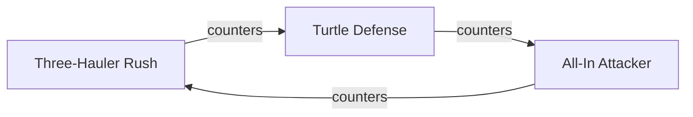

# The Web Under the Table: When Relationships Get Tangled

AutoNate tried to model something new: which builds beat which other builds. Not colonies, not matches — the actual strategies. His three-hauler rush build beat the turtle-defense build. The turtle-defense build beat the all-in-attacker build. And the all-in-attacker build, infuriatingly, beat the three-hauler rush build right back. He sat there staring at that for a solid minute, because his gut said "just add a `beats` column to the builds table," and his gut was wrong. A build doesn't beat one other build — it beats several, gets beaten by several others, and the whole thing loops back on itself. There's no clean "one parent, many children" shape here. It's a mess of everything pointing at everything.

That's the moment tables stop being the right tool. Not because SQL broke — because the shape of the problem changed. Tables are built for clean hierarchies: one colony, many matches; one match, many roles. But some relationships aren't hierarchies at all. They're webs. Teammates who've scrimmaged each other. Build strategies that counter each other in a loop, not a line. Skills that depend on other skills in ways that branch and reconnect. Forcing a web into strict rows and foreign keys works for a while and then starts fighting you — endless join tables, columns that reference the same table they live in, queries that need to hop five relationships deep just to answer something simple. AutoNate needed a different mental model, and this chapter is him finding it.

## Coder's Corner: Nodes, Edges, and Graphs

A **graph**, in this sense, has nothing to do with a bar chart. It's a way of modeling things and the connections between them, without forcing those connections into a strict hierarchy.

- A **node** is a single thing — a build, a colony, an opponent. Same idea as a row, just without the assumption that it only belongs to one parent.
- An **edge** is a connection between two nodes — "this build counters that build," "this colony scrimmaged that colony." Edges can point in a direction (build A beats build B doesn't automatically mean build B beats build A), and any node can connect to any number of other nodes, in any pattern, including loops back on itself.
- A **traversal** is the act of walking the graph — starting at one node and following edges outward to see what connects to what, possibly several steps deep. "What beats what beats this build" is a two-step traversal.

The difference that matters: a table assumes a predictable shape ahead of time — a match belongs to exactly one colony. A graph makes no such assumption. Any node can connect to any other node, however many times, in whatever direction. That flexibility is exactly what a tangled web of counters, teammates, or dependencies needs.

## 1. Spot When a Table Stops Working

The tell is almost always the same: you find yourself wanting to add a column that references the same table it's in, or you need a join table just to represent "this thing relates to several of these other things, which also relate back." AutoNate's `beats` idea was exactly that — a build relating to other rows in its own `builds` table, with no limit on how many, and no rule against cycles. That's the signal. When a relationship needs to point at more of the same kind of thing, in a loop, without a clean parent-child direction — reach for a graph model, not another foreign key.

## 2. Model It as a Graph

Instead of jamming the relationship into `builds`, AutoNate modeled it as two simple structures: nodes and edges, kept as their own tables purely because that's a convenient way to store a graph — the mental model is still nodes and edges, not parent-and-child rows.

```sql
CREATE TABLE build_nodes (
  id INTEGER PRIMARY KEY,
  build_name TEXT NOT NULL
);

CREATE TABLE counters_edges (
  id INTEGER PRIMARY KEY,
  from_build_id INTEGER NOT NULL REFERENCES build_nodes(id),
  to_build_id INTEGER NOT NULL REFERENCES build_nodes(id),
  note TEXT
);
```

Every row in `counters_edges` is one edge: "the build at `from_build_id` counters the build at `to_build_id`." Nothing stops `to_build_id` from eventually leading back around to `from_build_id` through other rows — the loop AutoNate ran into is just... allowed. That's the entire point.



Follow the arrows and the loop is right there, drawn instead of fought against. No column had to lie about being a clean hierarchy. The shape of the diagram matches the actual shape of the problem — which is the whole test for whether a graph is the right call.

## 3. Traverse It: Ask "What Beats What Beats Me"

The payoff of modeling it this way is that questions that would've needed a pile of self-joins in the table version become a straightforward walk across edges.

```sql
-- direct counters to the Rush build
SELECT to_build.build_name
FROM counters_edges
JOIN build_nodes AS from_build ON counters_edges.from_build_id = from_build.id
JOIN build_nodes AS to_build ON counters_edges.to_build_id = to_build.id
WHERE from_build.build_name = 'Three-Hauler Rush';

-- one step further: what counters what counters the Rush build
SELECT next_hop.build_name
FROM counters_edges AS hop1
JOIN counters_edges AS hop2 ON hop1.to_build_id = hop2.from_build_id
JOIN build_nodes AS next_hop ON hop2.to_build_id = next_hop.id
JOIN build_nodes AS start ON hop1.from_build_id = start.id
WHERE start.build_name = 'Three-Hauler Rush';
```

That second query is a two-step **traversal** — start at one node, follow an edge, then follow another edge from there. Dedicated graph databases have cleaner syntax for walking many steps like this, but the concept is identical no matter what tool you're in: start somewhere, follow the edges, see what you reach. For AutoNate's scale — a few dozen builds, a modest web of counters — plain SQL edges are plenty. He doesn't need new infrastructure. He needed a different way to think about the shape of the relationship, and that's what actually changed here.

## 4. Sanity Checks

- If you're building a join table with three or more foreign keys just to represent one relationship: stop and ask whether this is actually a web, not a hierarchy — that's usually the graph signal.
- If a relationship can legitimately loop back on itself (A relates to B relates to C relates to A): tables can technically store that, but a graph mental model makes it obvious instead of hidden in a self-referencing column.
- If a traversal query needs more than two or three hops: that's the point where a dedicated graph database or graph library starts paying for itself — plain SQL joins get unwieldy past a few hops deep.
- If you're not sure whether something is a graph problem or just a normal one-to-many: ask whether any node can connect to many others of the same kind, in multiple directions, without a natural "parent." If yes, it's a graph.

He didn't throw away the tables from the last two chapters — colonies and matches are still exactly the right shape for what they hold. He just stopped forcing every relationship into that same shape, and started picking the right one per problem. That distinction alone was worth the whole chapter.

Next: `04-building-the-monitor.md` — where all of this, tables and graph both, turns into something AutoNate actually looks at.
