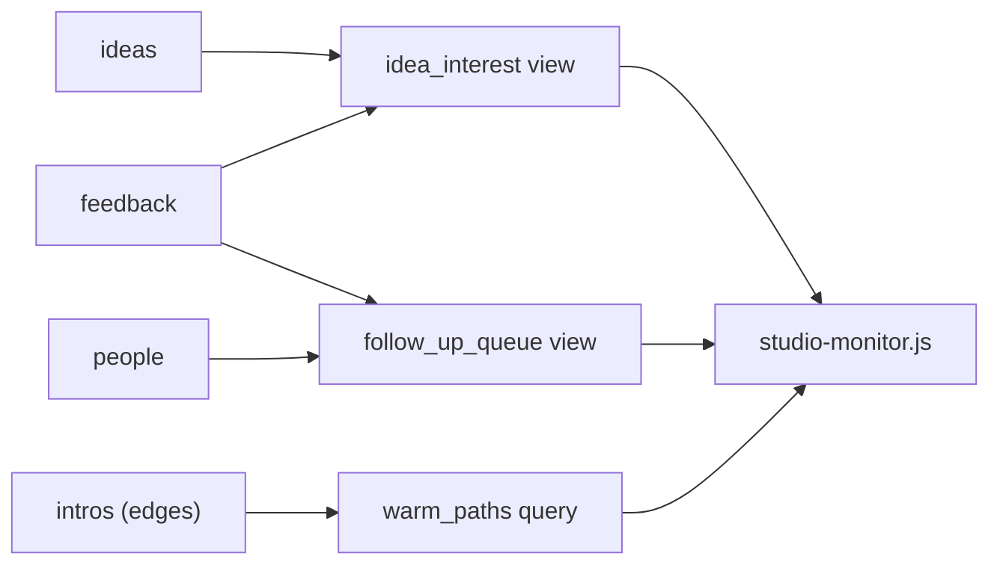

# The Scoreboard Comes Alive: Building the Monitor

Nate and Kai run a small studio called AutoNateAI, and over the last few chapters they've moved everything they know about it into a database: `people` for everyone they've met at the Fairview Founders Table meetup, `ideas` for the backlog, `feedback` for what specific people said about specific ideas, and `intros` — an edge table — for the tangle of who can introduce whom. It works. They can ask it anything.

Which turned out not to be the same as knowing anything.

"Founders Table is Tuesday," Kai said. "What do we lead with?"

Nate started running queries. The demand report. Then a variant of it. Then one he had to rewrite twice because he'd forgotten whether he was counting people or statements. Eleven minutes in he had four terminal windows open and had genuinely lost track of which number came from which query.

"Stop." Kai reached over and closed three of them. "You built a thing that answers questions and then made yourself the only interface to it."

That's the whole gap this chapter closes. There's a real difference between "I can query my data" and "I have a monitor." A monitor doesn't wait to be asked — it's already showing the answers to the questions you ask most, current, in one place, in a form a tired person can read at 9pm. This chapter takes every query from the last three chapters and turns it into exactly that.

## Coder's Corner: Views and Aggregation

Two ideas carry this chapter.

**Aggregation** is what `COUNT`, `SUM`, `MAX`, and `GROUP BY` were already doing back in chapter 2 — collapsing many rows into a smaller number of meaningful summary values. "How many distinct people endorsed this idea" is aggregation: dozens of individual rows boiled down to one number that means something.

A **view** is a saved query that behaves like a table you can `SELECT` from. You define the join, the filter, and the grouping once, and afterward you just ask the view for what you want, exactly the way you'd ask any table. Crucially, a view is not a copy of the data. It stores the *question*, not the answer, and re-runs it against whatever's currently in the real tables every single time you query it. Log a new piece of feedback and every view touching it is instantly correct, with zero maintenance and no chance of the two drifting apart.

That last property is why views beat the obvious alternative — a `totals` table you update by hand. A second copy of a number is a second thing that can be wrong, and it will be, silently, roughly four weeks after you stop thinking about it.

## 1. Turn a Query Into a View

The idea-demand query from chapter 2 was worth running constantly, so it became the first view. Nate wrote it while eating a breakfast burrito and named it `the_board`. Kai renamed it before the semicolon cooled.

```sql
CREATE VIEW idea_interest AS
SELECT
  ideas.id,
  ideas.title,
  ideas.status,
  COUNT(*) AS feedback_count,
  COUNT(DISTINCT feedback.person_id) AS people_count
FROM ideas
LEFT JOIN feedback ON feedback.idea_id = ideas.id
GROUP BY ideas.id, ideas.title, ideas.status;
```

The `LEFT JOIN` is deliberate and it's the important change from chapter 2. A plain inner `JOIN` only returns ideas that have at least one piece of feedback — which means the ideas nobody has ever reacted to *silently vanish from the report entirely*. Those are arguably the most important rows on the board. `LEFT JOIN` keeps every row from the left-hand table whether or not a match exists on the right, filling the missing side with `NULL`.

Nate ran it, and the receipt scanner — an idea they had written down once and never mentioned to another human being — came back with `feedback_count: 1`.

Kai read it twice. "One person gave feedback on the receipt scanner."

"Apparently."

"Nobody has ever heard of the receipt scanner. Where's that 1 from?"

## 2. Fix the Off-By-One That Isn't a Typo

It's from `COUNT(*)`, and this is the single most common bug in aggregate reporting.

`COUNT(*)` counts **rows**. After a `LEFT JOIN` with no match, there is still exactly one row — the idea, with every `feedback` column set to `NULL`. `COUNT(*)` sees a row, so it counts one. It is not wrong; it answered the question it was asked, which was "how many rows are in this group," not "how much feedback exists."

`COUNT(column)`, by contrast, **skips NULLs**. It counts how many rows have a non-null value in that column. On an unmatched `LEFT JOIN` row, `feedback.id` is `NULL`, so it counts zero — which is the truth.

```sql
DROP VIEW IF EXISTS idea_interest;

CREATE VIEW idea_interest AS
SELECT
  ideas.id,
  ideas.title,
  ideas.status,
  COUNT(feedback.id)                 AS feedback_count,
  COUNT(DISTINCT feedback.person_id) AS people_count,
  SUM(CASE WHEN feedback.verdict = 'would_use'  THEN 1 ELSE 0 END) AS would_use,
  SUM(CASE WHEN feedback.verdict = 'not_for_me' THEN 1 ELSE 0 END) AS not_for_me,
  ROUND(
    100.0 * SUM(CASE WHEN feedback.verdict = 'would_use' THEN 1 ELSE 0 END)
          / NULLIF(COUNT(feedback.id), 0),
    1
  ) AS would_use_pct,
  MAX(feedback.given_at) AS last_feedback_at
FROM ideas
LEFT JOIN feedback ON feedback.idea_id = ideas.id
GROUP BY ideas.id, ideas.title, ideas.status;
```

Three more details in there are worth stealing outright:

**`SUM(CASE WHEN ... THEN 1 ELSE 0 END)`** is conditional counting — "add one for each row matching this condition, otherwise add zero." It's how you get several different counts out of one pass over the data instead of running three separate queries and hoping they were filtered identically.

**`100.0 *`** — not `100 *`. Divide two integers in most databases and you get integer division: `3 / 7` is `0`, and your percentage column is a solid wall of zeroes that looks like a data problem rather than an arithmetic one. Multiplying by a float first forces the whole expression into floating point.

**`NULLIF(COUNT(feedback.id), 0)`** guards the divide-by-zero on ideas with no feedback at all. `NULLIF(x, 0)` returns `NULL` when `x` is zero, and anything divided by `NULL` is `NULL` — so those rows report "no data" instead of blowing up. SQLite happens to return `NULL` on division by zero anyway, but PostgreSQL raises a hard error, and a view you can't run on a real server later is a view with an expiry date on it.

Re-run: receipt scanner, `feedback_count: 0`, `would_use_pct: NULL`. Honest.

## 3. Build a Second View: Who They Owe a Reply

One view never tells the whole story. Kai wanted the other half — not "which idea is winning," but "who have we gone quiet on." Same tools, completely different question.

```sql
CREATE VIEW follow_up_queue AS
SELECT
  people.id,
  people.name,
  people.org,
  COUNT(feedback.id) AS times_they_weighed_in,
  COALESCE(MAX(feedback.given_at), people.first_met_at) AS last_touch,
  CAST(
    julianday('now') - julianday(COALESCE(MAX(feedback.given_at), people.first_met_at))
    AS INTEGER
  ) AS days_quiet
FROM people
LEFT JOIN feedback ON feedback.person_id = people.id
GROUP BY people.id, people.name, people.org, people.first_met_at;
```

`COALESCE(a, b)` returns the first argument that isn't `NULL`. Someone they met once and never got feedback from has no `MAX(feedback.given_at)` at all, so without `COALESCE` their `days_quiet` would be `NULL` and they'd sort straight to the bottom of the list — the people most likely to be forgotten, made invisible by the very report meant to catch them. Falling back to `first_met_at` means "we met you in March and never followed up" surfaces exactly as loudly as it should.

`julianday()` converts a date into a number of days, so subtracting two of them gives a plain day count.



Three questions, one set of underlying rows, zero duplicated logic scattered across a dozen ad-hoc queries in four terminal windows. That's the value of views in one picture: define the question once, reuse the answer everywhere.

## 4. Script the Monitor

The last piece makes it something they look at instead of something they perform.

```js
// scripts/studio-monitor.js
const Database = require('better-sqlite3');
const db = new Database('data/studio.db');
db.pragma('foreign_keys = ON');

console.log('\n=== IDEA INTEREST ===');
console.table(
  db.prepare(`
    SELECT title, status, people_count, would_use, would_use_pct, last_feedback_at
    FROM idea_interest
    ORDER BY people_count DESC, would_use DESC
  `).all()
);

console.log('\n=== GONE QUIET (30+ days) ===');
console.table(
  db.prepare(`
    SELECT name, org, times_they_weighed_in, days_quiet
    FROM follow_up_queue
    WHERE days_quiet >= ?
    ORDER BY days_quiet DESC
    LIMIT 10
  `).all(30)
);

console.log('\n=== NEVER HEARD FROM ===');
console.table(
  db.prepare(`
    SELECT title, status FROM idea_interest
    WHERE feedback_count = 0
    ORDER BY title
  `).all()
);
```

```bash
node scripts/studio-monitor.js
```

The `PRAGMA` line is there for the same reason it's in every other script in this pack: SQLite's foreign key enforcement is per-connection, and a new script is a new connection. The `?` placeholder passes `30` as a parameter rather than pasting it into the SQL string — same habit as chapter 2, same reason, and it costs nothing to keep.

One command, three tables printed, sourced from every conversation they've had since March. That's the scoreboard this pack is named after: not a metaphor, an actual file that runs in under a second.

## 5. Turn Numbers Into Insight

A monitor that only displays numbers is half a monitor. The value shows up in reading what the numbers are *telling* you.

"Never heard from" was the section that changed their Tuesday. Four ideas on the board had never been said out loud to a single person outside the two of them — including one Nate had quietly been treating as the obvious next build for six weeks. Not because it tested badly. Because it had never been tested at all, and enthusiasm inside a two-person studio is indistinguishable from evidence right up until you count.

"Gone quiet" was worse and more useful. Tomas Reyes: 41 days. Tomas gave them the sharpest objection anyone had raised all spring, and then nobody wrote back, because Tomas has no email address and lived in a DM thread that scrolled away. The database didn't know he was important. It just knew nobody had touched him in six weeks, and that turned out to be enough.

That's the real shape of what got built across these five chapters. Tables to hold the facts. SQL to interrogate them. A graph model for the relationships that were never going to fit in rows. And now views and a script that turn all of it into something checked out of habit — a place that remembers precisely, and hands back decisions instead of data.

## 6. Sanity Checks

- If a `LEFT JOIN` report shows `1` where the answer should be `0`: you used `COUNT(*)`. Switch to `COUNT(some_column_from_the_right_side)` — it skips `NULL`s, `COUNT(*)` counts the row that's there regardless.
- If rows disappear from a report entirely: you probably used an inner `JOIN` where you meant `LEFT JOIN`. Inner joins drop parents with no children, and the missing rows are often the ones that matter most.
- If a percentage column is all zeroes: integer division. Multiply by `100.0`, not `100`.
- If a percentage column errors or is `NULL` in odd places: check the denominator. `NULLIF(x, 0)` makes the zero-denominator case explicit and portable.
- If a date-based column sorts wrong or comes back `NULL`: check for missing values before comparing dates, and `COALESCE` to a sensible fallback. `NULL` doesn't sort where you expect and it never equals anything, including itself.
- If a view looks stale: it can't be — views re-run their query every time. If the numbers look wrong, the underlying rows are wrong. A view is only ever as honest as what's actually logged.
- If `CREATE VIEW` fails because it exists: views can't be edited in place, only replaced. `DROP VIEW IF EXISTS name;` then recreate.
- If a script throws "no such table": confirm it's pointing at the same database file the tables and views were created in. A typo'd path doesn't error — SQLite silently creates a brand new empty database and everything looks mysteriously deleted.
- If `console.table` renders badly: that's a narrow terminal, not a data problem. Widen it, or fall back to `console.log(rows)`.

Nate ran `node scripts/studio-monitor.js` before Founders Table on Tuesday, out of habit rather than obligation. Eight seconds, three tables, and for the first time he walked into that back room knowing what had actually been working instead of what he remembered working. He messaged Tomas from the parking lot.

Next: `05-cheatsheet.md` — the SQL and graph lookups they keep open in a tab, and a look back at how far the scoreboard came.
