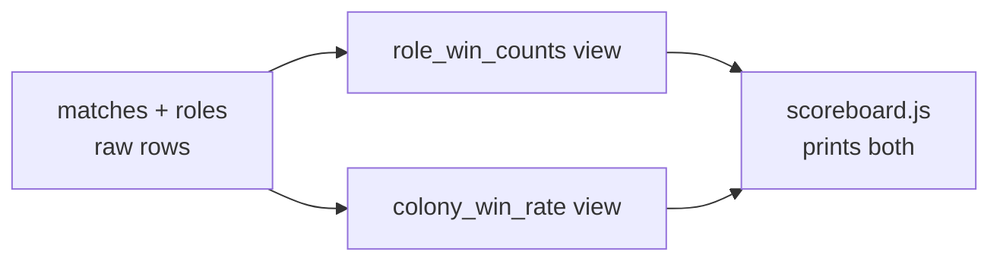

# The Scoreboard Comes Alive: Building the Monitor

AutoNate could ask his data anything now. That was real progress — three chapters ago he was losing time to scavenger hunts through text files, and now a single query could tell him which role won the most, which build countered which, all of it sourced and exact. But he noticed something: he was still the one typing every query, every time, whenever he wanted an answer. Before a League match, he'd run four or five SQL statements by hand just to get a feel for where he stood. That's better than guessing. It's still not what he actually wanted, which was to glance at one place and just know.

That's the difference between "I can query my data" and "I have a monitor." A monitor doesn't wait to be asked — it's already showing you the answers to the questions you ask most, updated, in one place. This chapter is AutoNate taking every query he's written so far and turning it into exactly that: a running scoreboard he can check in seconds, not a skill he has to perform every time he wants an answer.

## Coder's Corner: Views and Aggregation

Two ideas do almost all the work here.

**Aggregation** is what `COUNT`, `SUM`, and `GROUP BY` were already doing back in Chapter 2 — collapsing many rows down into a smaller number of meaningful summary values. A win rate is aggregation: dozens of individual match rows, boiled down to one percentage.

A **view** is a saved query that behaves like a table you can `SELECT` from directly, without retyping the underlying logic every time. You define it once — the join, the filter, the grouping — and afterward you just ask the view for what you want, the same way you'd ask any table. It's not a copy of the data; every time you query it, it re-runs the saved logic against whatever's currently in the real tables. That means a view is always current, automatically, with zero extra work on AutoNate's part.

## 1. Turn a Query Into a View

The role-win query from Chapter 2 was worth running over and over. So instead of retyping it, AutoNate saved it as a view.

```sql
CREATE VIEW role_win_counts AS
SELECT roles.role_name, COUNT(DISTINCT matches.id) AS wins
FROM roles
JOIN matches ON roles.match_id = matches.id
WHERE matches.result = 'win'
GROUP BY roles.role_name;
```

From here on, getting that answer is one line:

```sql
SELECT * FROM role_win_counts ORDER BY wins DESC;
```

No re-typed join, no re-typed filter. The logic lives in one place, defined once, and it's automatically up to date the moment a new match gets logged — because the view isn't storing an answer, it's storing the question, and re-asking it fresh every time.

## 2. Build a Second View for Colony Win Rate

One view rarely tells the whole story. AutoNate wanted overall win rate per colony, too — a genuinely different aggregation, but built the same way.

```sql
CREATE VIEW colony_win_rate AS
SELECT
  colonies.name,
  COUNT(matches.id) AS total_matches,
  SUM(CASE WHEN matches.result = 'win' THEN 1 ELSE 0 END) AS total_wins,
  ROUND(
    100.0 * SUM(CASE WHEN matches.result = 'win' THEN 1 ELSE 0 END) / COUNT(matches.id),
    1
  ) AS win_rate_pct
FROM colonies
JOIN matches ON matches.colony_id = colonies.id
GROUP BY colonies.name;
```

The `CASE WHEN` inside the `SUM` is just counting wins conditionally — "add one for each row where the result is a win, otherwise add zero" — which is a common trick for turning a category into a number you can aggregate. Now win rate, a number AutoNate used to estimate by vibe, is one query away and always accurate.



Two different aggregations, same underlying rows, no duplicated logic scattered across a dozen ad-hoc queries. That's the whole value of views: define the question once, reuse the answer everywhere.

## 3. Script the Monitor

The last piece is making this something AutoNate actually looks at, instead of something he has to remember to type.

```js
// scripts/scoreboard.js
const Database = require('better-sqlite3');
const db = new Database('data/scoreboard.db');

console.log('--- Role Win Counts ---');
console.table(db.prepare('SELECT * FROM role_win_counts ORDER BY wins DESC').all());

console.log('--- Colony Win Rate ---');
console.table(db.prepare('SELECT * FROM colony_win_rate ORDER BY win_rate_pct DESC').all());
```

```bash
node scripts/scoreboard.js
```

One command, two clean tables printed to the terminal, sourced from every match he's ever logged. That's the scoreboard this whole pack was named after — not a metaphor anymore, an actual running file he can pull up before every League match.

## 4. Turn Numbers Into Insight

A monitor that just displays numbers is still only half the job. The real value shows up when AutoNate reads what the numbers are telling him, not just what they say. Haulers winning more matches than any other role isn't just a fun fact — it's a signal to lean into hauler-heavy builds against opponents he hasn't scouted yet. A colony's win rate dipping after three matches isn't noise — it's a prompt to go check what changed in the build right before that dip started. This is the actual purpose behind everything in this pack: not data for its own sake, but a system that turns raw history into decisions he can act on with confidence, instead of a hunch he's hoping holds up.

That's the real shape of what he built across these five chapters — tables to hold the facts, SQL to ask them questions, a graph model for the relationships too tangled for rows and columns, and now views and a script that turn all of it into something he checks like a habit. A monitor. A tracker. A place that remembers so he doesn't have to, and hands him insight instead of just data.

## 5. Sanity Checks

- If a view returns stale-looking results: it shouldn't — views re-run their query every time. If numbers look wrong, check the underlying rows first; the view is only as accurate as what's actually logged.
- If `CREATE VIEW` fails because it already exists: drop it first with `DROP VIEW IF EXISTS role_win_counts;`, then recreate it — views can't be edited in place, only replaced.
- If `console.table` prints oddly in your terminal: it's a formatting quirk of narrow terminal windows, not a data problem — widen the window or fall back to `console.log(rows)`.
- If the scoreboard script throws a "no such table" error: confirm you're pointing at the same database file every table and view was created in — a typo'd path silently opens (or creates) a different, empty database.

AutoNate ran `node scripts/scoreboard.js` before his next League match out of habit, not obligation. Thirty seconds, two tables, and for the first time he walked into a match knowing exactly what had actually been working — not what he remembered working.

Next: `05-cheatsheet.md` — quick lookups for SQL and graph terms, and a look back at how far the scoreboard came.
